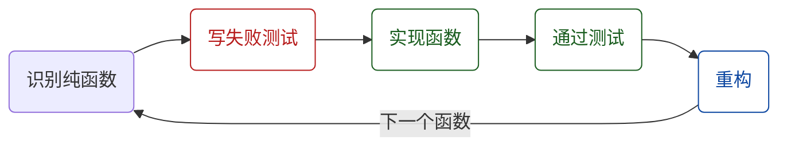

# Python → Go TDD 迁移工作流



## 前置条件

- Go 项目已初始化 `go-agent-v2/`、Python 源码可访问、`go test` 可运行

---

## Step 1 · 识别纯逻辑函数

从 Python 模块筛选**无外部依赖**的纯函数（无 DB / 网络 / LLM / async）。

```bash
grep -n "^def " <python_file>.py
```

---

## Step 2 · RED — 先写 Go 测试

创建 `<module>_test.go`，表驱动:

```go
func TestFunctionName(t *testing.T) {
    tests := []struct {
        name string
        in   <InputType>
        want <OutputType>
    }{
        {"case_description", input, expected},
    }
    for _, tt := range tests {
        t.Run(tt.name, func(t *testing.T) {
            got := FunctionName(tt.in)
            if got != tt.want {
                t.Errorf("FunctionName(%v) = %v, want %v",
                    tt.in, got, tt.want)
            }
        })
    }
}
```

// turbo
## Step 3 · 运行测试 — 期望 RED

```bash
cd go-agent-v2 && go test -v ./<package_path>/ 2>&1
```

---

## Step 4 · GREEN — 实现 Go 函数

创建 `<module>_logic.go`，只含纯函数。

> [!IMPORTANT]
> **实现对照表**
>
> | Python | Go |
> |---|---|
> | 中文字符串切片 | `[]rune` |
> | `re.compile(...)` | `regexp.MustCompile(...)` 包级变量 |
> | `threading.Lock` | `sync.Mutex` |
> | 函数签名 | 与 Python 1:1 对应 |

// turbo
## Step 5 · 运行测试 — 期望 GREEN

```bash
cd go-agent-v2 && go test -v ./<package_path>/ 2>&1
```

> [!WARNING]
> 失败时先判断根因 — **测试期望错误**修正测试；**实现 bug**修正代码（TDD 正常工作）。

---

## Step 6 · REFACTOR

- 提取公共 helper、去除重复、注释标注对应 Python 函数名

// turbo
## Step 7 · 全包验证 + 静态分析

```bash
cd go-agent-v2 && go test -race -count=1 ./... 2>&1
```

// turbo
```bash
cd go-agent-v2 && go vet ./... 2>&1
```

---

## Step 8 · 回到 Step 1，处理下一个模块

---

## 批次优先级

| 优先级 | 模块 | 原因 |
|:---:|---|---|
| 1 | store 层纯逻辑 | 底层基础 |
| 2 | monitor | 已实现，只需补测试 |
| 3 | orchestrator | 核心编排逻辑 |
| 4 | telegram | 桥接纯逻辑 |
| 5 | mcp | 工具路由 |
| 6 | config | 配置验证 |

## 不迁移（单独任务）

> [!CAUTION]
> 以下不在此工作流范围内:
> MCP 协议层 (mcp-go SDK) · iTerm 代码 · LLM 调用 (需 interface 设计) · Telegram Bot API · DB 集成测试 (需 testcontainers)
