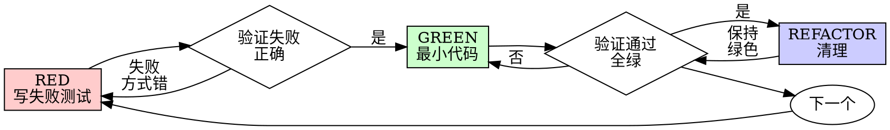

# 测试驱动开发 (TDD)

## 概述 (Overview)

先写测试。看它失败。写最小代码让它通过。

**核心原则 (Core principle):** 如果你没看到测试失败，你不知道它是否测对了东西。

**违反规则的字面意思就是违反规则的精神。(Violating the letter of the rules is violating the spirit of the rules.)**

## 何时使用 (When to Use)

**始终 (Always):**
- 新功能 (New features)
- Bug 修复 (Bug fixes)
- 重构 (Refactoring)
- 行为变更 (Behavior changes)

**例外（问你的伙伴）(Exceptions - ask your human partner):**
- 一次性原型 (Throwaway prototypes)
- 生成的代码 (Generated code)
- 配置文件 (Configuration files)

想着"就这一次跳过 TDD"？停下。那是自我欺骗 (rationalization)。

## 铁律 (The Iron Law)

```
NO PRODUCTION CODE WITHOUT A FAILING TEST FIRST
没有失败的测试，就没有生产代码
```

先写代码再写测试？删掉。重新来。

**无例外 (No exceptions):**
- 不要保留作为"参考" (Don't keep it as "reference")
- 不要写测试时"调整"它 (Don't "adapt" it while writing tests)
- 不要看它 (Don't look at it)
- 删除就是删除 (Delete means delete)

从测试开始全新实现。(Implement fresh from tests. Period.)

## 红-绿-重构 (Red-Green-Refactor)



### 红色 (RED) - 编写失败的测试

编写一个最小测试显示期望的行为。

**好的测试 (Good):**
```typescript
test('retries failed operations 3 times', async () => {
  let attempts = 0;
  const operation = () => {
    attempts++;
    if (attempts < 3) throw new Error('fail');
    return 'success';
  };

  const result = await retryOperation(operation);

  expect(result).toBe('success');
  expect(attempts).toBe(3);
});
```
清晰名称，测试真实行为，只测一件事

**坏的测试 (Bad):**
```typescript
test('retry works', async () => {
  const mock = jest.fn()
    .mockRejectedValueOnce(new Error())
    .mockRejectedValueOnce(new Error())
    .mockResolvedValueOnce('success');
  await retryOperation(mock);
  expect(mock).toHaveBeenCalledTimes(3);
});
```
模糊名称，测试 mock 而非代码

**要求 (Requirements):**
- 一个行为 (One behavior)
- 清晰名称 (Clear name)
- 真实代码 (Real code - no mocks unless unavoidable)

### 验证红色 (Verify RED) - 看它失败

**MANDATORY. Never skip. 必须。永不跳过。**

```bash
npm test path/to/test.test.ts
```

确认 (Confirm):
- 测试失败（不是报错）(Test fails - not errors)
- 失败信息符合预期 (Failure message is expected)
- 因为功能缺失而失败（不是拼写错误）(Fails because feature missing - not typos)

**测试通过了？** 你在测已有行为。修复测试。
**测试报错了？** 修复错误，重新运行直到正确失败。

### 绿色 (GREEN) - 最小代码

写最简单的代码让测试通过。

**好的 (Good):**
```typescript
async function retryOperation<T>(fn: () => Promise<T>): Promise<T> {
  for (let i = 0; i < 3; i++) {
    try {
      return await fn();
    } catch (e) {
      if (i === 2) throw e;
    }
  }
  throw new Error('unreachable');
}
```
刚好能通过 (Just enough to pass)

**坏的 (Bad):**
```typescript
async function retryOperation<T>(
  fn: () => Promise<T>,
  options?: {
    maxRetries?: number;
    backoff?: 'linear' | 'exponential';
    onRetry?: (attempt: number) => void;
  }
): Promise<T> {
  // YAGNI
}
```
过度设计 (Over-engineered)

不要添加功能，不要重构其他代码，不要超越测试"改进"。

### 验证绿色 (Verify GREEN) - 看它通过

**MANDATORY. 必须。**

```bash
npm test path/to/test.test.ts
```

确认 (Confirm):
- 测试通过 (Test passes)
- 其他测试仍然通过 (Other tests still pass)
- 输出干净（无错误、警告）(Output pristine - no errors, warnings)

**测试失败？** 修复代码，不是测试。(Fix code, not test.)
**其他测试失败？** 立即修复。(Fix now.)

### 重构 (REFACTOR) - 清理

只在全绿后 (After green only):
- 移除重复 (Remove duplication)
- 改进命名 (Improve names)
- 提取辅助函数 (Extract helpers)

保持测试绿色。不要添加行为。(Keep tests green. Don't add behavior.)

### 重复 (Repeat)

下一个失败的测试对应下一个功能。

## 好的测试 (Good Tests)

| 质量 (Quality) | 好的 (Good) | 坏的 (Bad) |
|----------------|-------------|------------|
| **最小 (Minimal)** | 只测一件事。名字有"和"？拆分。 | `test('validates email and domain and whitespace')` |
| **清晰 (Clear)** | 名称描述行为 | `test('test1')` |
| **显示意图 (Shows intent)** | 展示期望的 API | 模糊代码应该做什么 |

## 为什么顺序重要 (Why Order Matters)

**"我写完后写测试来验证它工作"**

后写的测试立即通过。立即通过证明不了什么：
- 可能测错东西 (Might test wrong thing)
- 可能测实现而非行为 (Might test implementation, not behavior)
- 可能漏掉你忘记的边界情况 (Might miss edge cases you forgot)
- 你从没看到它捕获 bug (You never saw it catch the bug)

先测强迫你看测试失败，证明它确实在测东西。

**"我已经手动测过所有边界情况了"**

手动测是随意的。你以为测了所有但：
- 没有记录你测了什么 (No record of what you tested)
- 代码变了不能重跑 (Can't re-run when code changes)
- 压力下容易忘记情况 (Easy to forget cases under pressure)
- "我试的时候行" ≠ 全面 ("It worked when I tried it" ≠ comprehensive)

自动化测试是系统的。每次相同方式运行。

**"删掉 X 小时工作太浪费了"**

沉没成本谬误 (Sunk cost fallacy)。时间已经没了。现在你的选择：
- 删除用 TDD 重写（多 X 小时，高信心）
- 保留并后加测试（30 分钟，低信心，可能有 bug）

"浪费"是保留你不能信任的代码。没真正测试的工作代码是技术债。

**"TDD 是教条，务实意味着变通"**

TDD 就是务实 (TDD IS pragmatic):
- 提交前找到 bug（比后面调试快）
- 防止回归（测试立即捕获破坏）
- 记录行为（测试展示如何用代码）
- 启用重构（自由修改，测试捕获破坏）

"务实"的捷径 = 生产环境调试 = 更慢。

**"后写测试能达到同样目的 - 是精神不是仪式"**

不。后测回答"这做了什么？"先测回答"这应该做什么？"

后测被你的实现偏见影响。你测的是你建的，不是需求。你验证的是记得的边界情况，不是发现的。

先测强迫实现前发现边界情况。后测验证你记得所有（你没有）。

30 分钟后测 ≠ TDD。你得到覆盖率，失去测试有效的证明。

## 常见借口 (Common Rationalizations)

| 借口 (Excuse) | 现实 (Reality) |
|---------------|----------------|
| "太简单不用测" (Too simple to test) | 简单代码也会坏。测试只需 30 秒。 |
| "我会后面写测试" (I'll test after) | 后写的测试立即通过啥也证明不了。 |
| "后写测试能达到同样目的" (Tests after achieve same goals) | 后写 = "这做了什么？" 先写 = "这应该做什么？" |
| "我已经手动测过了" (Already manually tested) | 随意测 ≠ 系统测。没记录，不能重跑。 |
| "删掉 X 小时工作太浪费" (Deleting X hours is wasteful) | 沉没成本谬误。保留未验证代码才是技术债。 |
| "保留作参考，先写测试" (Keep as reference, write tests first) | 你会调整它。那是后测。删除就是删除。 |
| "需要先探索" (Need to explore first) | 可以。扔掉探索，从 TDD 开始。 |
| "测试难写 = 设计不清" (Test hard = design unclear) | 听测试说话。难测试 = 难用。 |
| "TDD 会拖慢我" (TDD will slow me down) | TDD 比调试快。务实 = 测试先行。 |
| "手动测更快" (Manual test faster) | 手动不证明边界情况。每次变更你要重测。 |
| "现有代码没测试" (Existing code has no tests) | 你在改进它。为现有代码加测试。 |

## 危险信号 (Red Flags) - 停下来重新开始

- 代码比测试先写 (Code before test)
- 实现后才加测试 (Test after implementation)
- 测试立即通过 (Test passes immediately)
- 说不清测试为什么失败 (Can't explain why test failed)
- "以后"再加测试 (Tests added "later")
- 为"就这一次"找借口 (Rationalizing "just this once")
- "我已经手动测过了" ("I already manually tested it")
- "后写测试能达到同样目的" ("Tests after achieve the same purpose")
- "是精神不是仪式" ("It's about spirit not ritual")
- "保留作参考"或"调整现有代码" ("Keep as reference" or "adapt existing code")
- "已经花了 X 小时，删掉太浪费" ("Already spent X hours, deleting is wasteful")
- "TDD 是教条，我在务实" ("TDD is dogmatic, I'm being pragmatic")
- "这种情况不同因为..." ("This is different because...")

**所有这些都意味着：删除代码。从 TDD 重新开始。(Delete code. Start over with TDD.)**

## 示例：Bug 修复 (Example: Bug Fix)

**Bug:** 空邮箱被接受 (Empty email accepted)

**RED**
```typescript
test('rejects empty email', async () => {
  const result = await submitForm({ email: '' });
  expect(result.error).toBe('Email required');
});
```

**Verify RED**
```bash
$ npm test
FAIL: expected 'Email required', got undefined
```

**GREEN**
```typescript
function submitForm(data: FormData) {
  if (!data.email?.trim()) {
    return { error: 'Email required' };
  }
  // ...
}
```

**Verify GREEN**
```bash
$ npm test
PASS
```

**REFACTOR**
如需要为多个字段提取验证。

## Verification Checklist 完成前检查清单

- [ ] 每个新函数/方法都有测试 (Every new function/method has a test)
- [ ] 实现前看到每个测试失败 (Watched each test fail before implementing)
- [ ] 每个测试因预期原因失败 (Each test failed for expected reason)
- [ ] 每个测试只写最小代码让它通过 (Wrote minimal code to pass each test)
- [ ] 所有测试通过 (All tests pass)
- [ ] 输出干净（无错误、警告）(Output pristine)
- [ ] 测试用真实代码（mock 只在不可避免时）(Tests use real code)
- [ ] 覆盖边界情况和错误 (Edge cases and errors covered)

不能全部打勾？你跳过了 TDD。重新开始。(Can't check all boxes? You skipped TDD. Start over.)

## When Stuck 卡住时

| 问题 (Problem) | 解决方案 (Solution) |
|----------------|---------------------|
| 不知道怎么测 (Don't know how to test) | 写期望的 API。先写断言。问老公。 |
| 测试太复杂 (Test too complicated) | 设计太复杂。简化接口。 |
| 必须 mock 所有 (Must mock everything) | 代码耦合太紧。用依赖注入。 |
| 测试设置很大 (Test setup huge) | 提取辅助函数。还复杂？简化设计。 |

## Debugging Integration 调试集成

发现 bug？写失败的测试复现它。遵循 TDD 循环。测试证明修复并防止回归。

**永远不要没有测试就修 bug。(Never fix bugs without a test.)**

## Testing Anti-Patterns 测试反模式

添加 mock 或测试工具时，阅读相关反模式文档避免常见陷阱：
(When adding mocks or test utilities, read @testing-anti-patterns.md to avoid common pitfalls)

- 测试 mock 行为而非真实行为 (Testing mock behavior instead of real behavior)
- 给生产类添加仅测试的方法 (Adding test-only methods to production classes)
- 不理解依赖就 mock (Mocking without understanding dependencies)

## Final Rule 最终规则

```
Production code → test exists and failed first
生产代码 → 测试存在并先失败
Otherwise → not TDD
否则 → 不是 TDD
```

没有老公许可不能有例外。(No exceptions without your human partner's permission.)

**Period. 句号。**
