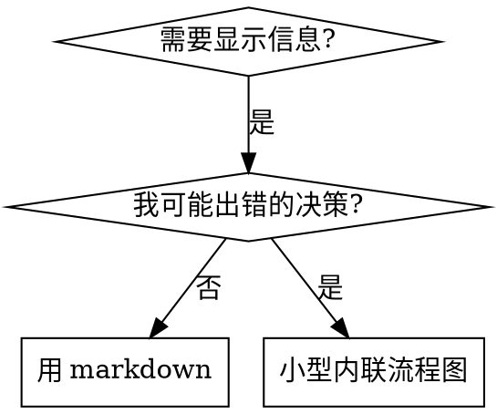

# 编写技能 (Writing Skills)

## 概述 (Overview)

**编写技能就是将测试驱动开发应用于流程文档。(Writing skills IS Test-Driven Development applied to process documentation.)**

**个人技能存放在代理特定目录（Claude Code 用 `~/.claude/skills`，Codex 用 `~/.codex/skills`，Antigravity 用 `~/.gemini/antigravity/skills`）**

你编写测试用例（子代理压力场景），观察它们失败（基线行为），编写技能（文档），观察测试通过（代理遵从），然后重构（堵住漏洞）。

**核心原则 (Core principle):** 如果你没看到代理在没有技能时失败，你不知道技能是否教对了东西。

**必需背景 (REQUIRED BACKGROUND):** 使用此技能前必须理解 `@TDD`。那个技能定义了基本的红-绿-重构循环。此技能将 TDD 适配到文档。

**官方指南 (Official guidance):** 关于官方技能编写最佳实践，请参阅 anthropic-best-practices.md。该文档提供了补充本技能 TDD 导向方法的额外模式和指南。

## 什么是技能？(What is a Skill?)

**技能**是经过验证的技术、模式或工具的参考指南。技能帮助未来的 Claude 实例找到并应用有效的方法。

**技能是：** 可重用的技术、模式、工具、参考指南

**技能不是：** 关于你如何解决过一个问题的叙事

## TDD 映射 (TDD Mapping for Skills)

| TDD 概念 | 技能创建 |
|----------|----------|
| **测试用例** | 子代理压力场景 |
| **生产代码** | 技能文档 (SKILL.md) |
| **测试失败 (RED)** | 代理在无技能时违反规则（基线） |
| **测试通过 (GREEN)** | 代理在有技能时遵从 |
| **重构** | 堵住漏洞同时保持合规 |
| **先写测试** | 写技能前先运行基线场景 |
| **看它失败** | 记录代理使用的具体借口 |
| **最小代码** | 编写针对那些具体违规的技能 |
| **看它通过** | 验证代理现在遵从 |
| **重构循环** | 发现新借口 → 堵住 → 重新验证 |

整个技能创建过程遵循红-绿-重构。

## 何时创建技能 (When to Create a Skill)

**创建当：**
- 技术对你来说不是直觉上显而易见的
- 你会跨项目再次引用它
- 模式广泛适用（不是项目特定的）
- 其他人会受益

**不要创建：**
- 一次性解决方案
- 其他地方有良好文档的标准实践
- 项目特定约定（放在 CLAUDE.md 或 .agent/config.md）
- 机械约束（如果能用正则/验证强制执行，就自动化——把文档留给判断性决策）

## 技能类型 (Skill Types)

### 技术 (Technique)
有步骤可遵循的具体方法（condition-based-waiting, root-cause-tracing）

### 模式 (Pattern)
思考问题的方式（flatten-with-flags, test-invariants）

### 参考 (Reference)
API 文档、语法指南、工具说明

## 目录结构 (Directory Structure)

```
skills/
  skill-name/
    SKILL.md              # 主参考（必需）
    supporting-file.*     # 仅在需要时
```

**扁平命名空间** - 所有技能在一个可搜索的命名空间中

**单独文件用于：**
1. **重型参考**（100+ 行）- API 文档、综合语法
2. **可重用工具** - 脚本、工具、模板

**保持内联：**
- 原则和概念
- 代码模式（< 50 行）
- 其他所有内容

## SKILL.md 结构 (SKILL.md Structure)

**前置元数据 (YAML):**
- 只支持两个字段：`name` 和 `description`
- 总共最多 1024 字符
- `name`：只用字母、数字和连字符（无括号、特殊字符）
- `description`：第三人称，只描述何时使用（不是做什么）
  - 以 "Use when..." 或 "...时使用" 开始，聚焦触发条件
  - 包括具体症状、情况和上下文
  - **永不总结技能的流程或工作流**（见 CSO 部分了解原因）
  - 如可能保持在 500 字符以下

```markdown
---
name: 技能名称用连字符
description: ...时使用 [具体触发条件和症状]
aliases: ["@中文别名", "@english-alias"]
---

# 技能名称

## 概述
这是什么？核心原则用 1-2 句话。

## 何时使用
[如果决策不明显用小型内联流程图]

带症状和用例的要点列表
何时不使用

## 核心模式（技术/模式类）
前后代码对比

## 快速参考
扫描常见操作的表格或要点

## 实现
简单模式用内联代码
重型参考或可重用工具链接到文件

## 常见错误
什么会出错 + 修复

## 实战影响（可选）
具体结果
```

## Claude 搜索优化 (CSO)

**发现的关键：** 未来的 Claude 需要能找到你的技能

### 1. 丰富的描述字段

**目的：** Claude 读取描述来决定为给定任务加载哪些技能。让它回答："我现在应该读这个技能吗？"

**格式：** 以 "Use when..." 或 "...时使用" 开始，聚焦触发条件

**关键：描述 = 何时使用，不是技能做什么**

描述应该只描述触发条件。不要在描述中总结技能的流程或工作流。

**为什么重要：** 测试发现，当描述总结技能的工作流时，Claude 可能会遵循描述而不是读取完整的技能内容。一个说"任务间代码审查"的描述导致 Claude 只做了一次审查，尽管技能的流程图清楚地显示了两次审查（规格合规然后代码质量）。

当描述改为只是"在当前会话中执行有独立任务的实现计划时使用"（无工作流摘要）时，Claude 正确地读取了流程图并遵循了两阶段审查过程。

**陷阱：** 总结工作流的描述创建了 Claude 会走的捷径。技能正文变成了 Claude 跳过的文档。

```yaml
# ❌ 坏：总结工作流 - Claude 可能遵循这个而不是读技能
description: 执行计划时使用 - 每任务派遣子代理并在任务间进行代码审查

# ❌ 坏：太多流程细节
description: TDD 使用 - 先写测试，看它失败，写最小代码，重构

# ✅ 好：只有触发条件，无工作流摘要
description: 在当前会话中执行有独立任务的实现计划时使用

# ✅ 好：只有触发条件
description: 实现任何功能或修复 bug 时使用，在编写实现代码之前
```

**内容：**
- 使用表明此技能适用的具体触发器、症状和情况
- 描述问题（竞态条件、不一致行为）而不是语言特定症状（setTimeout, sleep）
- 保持触发器技术无关，除非技能本身是技术特定的
- 如果技能是技术特定的，在触发器中明确说明
- 用第三人称写（注入系统提示）
- **永不总结技能的流程或工作流**

```yaml
# ❌ 坏：太抽象、模糊，不包括何时使用
description: 用于异步测试

# ❌ 坏：第一人称
description: 当测试不稳定时我可以帮你处理异步测试

# ❌ 坏：提到技术但技能不特定于它
description: 当测试使用 setTimeout/sleep 且不稳定时使用

# ✅ 好：以"使用"开始，描述问题，无工作流
description: 测试有竞态条件、时序依赖或通过/失败不一致时使用

# ✅ 好：技术特定的技能有明确触发器
description: 使用 React Router 处理认证重定向时使用
```

### 2. 关键词覆盖

使用 Claude 会搜索的词：
- 错误消息："Hook timed out"、"ENOTEMPTY"、"race condition"
- 症状："flaky"、"hanging"、"zombie"、"pollution"
- 同义词："timeout/hang/freeze"、"cleanup/teardown/afterEach"
- 工具：实际命令、库名、文件类型

### 3. 描述性命名

**使用主动语态，动词优先：**
- ✅ `creating-skills` 而不是 `skill-creation`
- ✅ `condition-based-waiting` 而不是 `async-test-helpers`

### 4. Token 效率（关键）

**问题：** getting-started 和频繁引用的技能加载到每个会话。每个 token 都重要。

**目标字数：**
- getting-started 工作流：每个 < 150 词
- 频繁加载的技能：总共 < 200 词
- 其他技能：< 500 词（仍要简洁）

**技术：**

**将细节移到工具帮助：**
```bash
# ❌ 坏：在 SKILL.md 中记录所有标志
search-conversations 支持 --text, --both, --after DATE, --before DATE, --limit N

# ✅ 好：引用 --help
search-conversations 支持多种模式和过滤器。运行 --help 查看详情。
```

**使用交叉引用：**
```markdown
# ❌ 坏：重复工作流细节
搜索时，用模板派遣子代理...
[20 行重复指令]

# ✅ 好：引用其他技能
总是使用子代理（50-100x 上下文节省）。必需：使用 @执行计划 获取工作流。
```

**压缩示例：**
```markdown
# ❌ 坏：冗长示例（42 词）
老公："我们之前在 React Router 中如何处理认证错误？"
你：我将搜索过去的会话以查找 React Router 认证模式。
[用搜索查询派遣子代理："React Router authentication error handling 401"]

# ✅ 好：最小示例（20 词）
老公："我们之前在 React Router 中如何处理认证错误？"
你：搜索中...
[派遣子代理 → 综合]
```

**消除冗余：**
- 不要重复交叉引用技能中的内容
- 不要解释命令中显而易见的内容
- 不要包括同一模式的多个示例

**验证：**
```bash
wc -w skills/path/SKILL.md
# getting-started 工作流：目标 < 150 每个
# 其他频繁加载的：目标 < 200 总共
```

**用你做什么或核心洞察命名：**
- ✅ `condition-based-waiting` > `async-test-helpers`
- ✅ `using-skills` 而不是 `skill-usage`
- ✅ `flatten-with-flags` > `data-structure-refactoring`
- ✅ `root-cause-tracing` > `debugging-techniques`

**动名词（-ing）适合过程：**
- `creating-skills`, `testing-skills`, `debugging-with-logs`
- 主动，描述你正在采取的行动

### 4. 交叉引用其他技能

**编写引用其他技能的文档时：**

只用技能名称，带明确的要求标记：
- ✅ 好：`**必需子技能：** 使用 @TDD`
- ✅ 好：`**必需背景：** 你必须理解 @系统性调试`
- ❌ 坏：`见 skills/testing/test-driven-development`（不清楚是否必需）
- ❌ 坏：`@skills/testing/test-driven-development/SKILL.md`（强制加载，消耗上下文）

**为什么不用 @ 链接：** `@` 语法立即强制加载文件，在你需要之前消耗 200k+ 上下文。

## 流程图使用 (Flowchart Usage)



**只在以下情况使用流程图：**
- 不明显的决策点
- 可能过早停止的流程循环
- "何时用 A vs B"的决策

**永不为以下使用流程图：**
- 参考材料 → 表格、列表
- 代码示例 → Markdown 代码块
- 线性指令 → 编号列表
- 无语义意义的标签（step1, helper2）

参阅 @graphviz-conventions.dot 获取 graphviz 样式规则。

**为老公可视化展示：** 使用此目录中的 `render-graphs.js` 将技能的流程图渲染为 SVG：
```bash
./render-graphs.js ../some-skill           # 每个图单独
./render-graphs.js ../some-skill --combine # 所有图合并为一个 SVG
```

## 代码示例 (Code Examples)

**一个优秀的示例胜过许多平庸的**

选择最相关的语言：
- 测试技术 → TypeScript/JavaScript
- 系统调试 → Shell/Python
- 数据处理 → Python

**好的示例：**
- 完整且可运行
- 有良好注释解释为什么
- 来自真实场景
- 清晰展示模式
- 准备好适配（不是通用模板）

**不要：**
- 用 5+ 语言实现
- 创建填空模板
- 写做作的示例

你擅长移植 - 一个优秀的示例就够了。

## 文件组织 (File Organization)

### 自包含技能
```
defense-in-depth/
  SKILL.md    # 所有内容内联
```
何时：所有内容适合，不需要重型参考

### 带可重用工具的技能
```
condition-based-waiting/
  SKILL.md    # 概述 + 模式
  example.ts  # 可适配的工作帮助器
```
何时：工具是可重用代码，不只是叙事

### 带重型参考的技能
```
pptx/
  SKILL.md       # 概述 + 工作流
  pptxgenjs.md   # 600 行 API 参考
  ooxml.md       # 500 行 XML 结构
  scripts/       # 可执行工具
```
何时：参考材料太大无法内联

## 铁律（与 TDD 相同）(The Iron Law)

```
没有先失败的测试，就没有技能
NO SKILL WITHOUT A FAILING TEST FIRST
```

这适用于新技能和对现有技能的编辑。

先写技能再测试？删除它。重新开始。
编辑技能不测试？同样违规。

**无例外：**
- 不适用于"简单添加"
- 不适用于"只是添加一个部分"
- 不适用于"文档更新"
- 不要保留未测试的更改作为"参考"
- 不要在运行测试时"适配"
- 删除意味着删除

**必需背景：** `@TDD` 技能解释了为什么这很重要。同样的原则适用于文档。

## 测试所有技能类型 (Testing All Skill Types)

不同的技能类型需要不同的测试方法：

### 纪律执行技能（规则/要求）

**示例：** TDD、完成前验证、编码前设计

**测试方式：**
- 学术问题：他们理解规则吗？
- 压力场景：他们在压力下遵从吗？
- 多重压力组合：时间 + 沉没成本 + 疲惫
- 识别借口并添加明确的反驳

**成功标准：** 代理在最大压力下遵循规则

### 技术技能（操作指南）

**示例：** condition-based-waiting、root-cause-tracing、defensive-programming

**测试方式：**
- 应用场景：他们能正确应用技术吗？
- 变化场景：他们处理边缘情况吗？
- 缺失信息测试：指令有空白吗？

**成功标准：** 代理成功将技术应用于新场景

### 模式技能（心智模型）

**示例：** reducing-complexity、information-hiding 概念

**测试方式：**
- 识别场景：他们识别模式何时适用吗？
- 应用场景：他们能使用心智模型吗？
- 反例：他们知道何时不适用吗？

**成功标准：** 代理正确识别何时/如何应用模式

### 参考技能（文档/API）

**示例：** API 文档、命令参考、库指南

**测试方式：**
- 检索场景：他们能找到正确的信息吗？
- 应用场景：他们能正确使用找到的内容吗？
- 空白测试：常见用例是否涵盖？

**成功标准：** 代理找到并正确应用参考信息

## 跳过测试的常见借口 (Common Rationalizations for Skipping Testing)

| 借口 | 现实 |
|------|------|
| "技能显然清楚" | 对你清楚 ≠ 对其他代理清楚。测试它。 |
| "这只是参考" | 参考可能有空白、不清楚的部分。测试检索。 |
| "测试太过了" | 未测试的技能有问题。永远如此。15 分钟测试节省数小时。 |
| "如果问题出现我再测试" | 问题 = 代理无法使用技能。部署前测试。 |
| "测试太繁琐" | 测试比在生产中调试坏技能更不繁琐。 |
| "我有信心它很好" | 过度自信保证有问题。无论如何都要测试。 |
| "学术审查就够了" | 阅读 ≠ 使用。测试应用场景。 |
| "没时间测试" | 部署未测试的技能之后修复它浪费更多时间。 |

**所有这些意味着：部署前测试。无例外。**

## 防止技能被合理化绕过 (Bulletproofing Skills Against Rationalization)

执行纪律的技能（如 TDD）需要抵抗合理化。代理很聪明，在压力下会找到漏洞。

### 明确关闭每个漏洞

不要只陈述规则 - 禁止具体的变通方法：

❌ 坏：
```markdown
先写代码再写测试？删除它。
```

✅ 好：
```markdown
先写代码再写测试？删除它。重新开始。

**无例外：**
- 不要保留它作为"参考"
- 不要在写测试时"适配"它
- 不要看它
- 删除意味着删除
```

### 处理"精神 vs 字面"的论点

早期添加基础原则：

```markdown
**违反规则的字面意思就是违反规则的精神。**
```

这切断了整类"我在遵循精神"的合理化。

### 建立合理化表

从基线测试中捕获合理化（见下面的测试部分）。代理提出的每个借口都进入表：

```markdown
| 借口 | 现实 |
|------|------|
| "太简单不需要测试" | 简单代码也会崩溃。测试只需 30 秒。 |
| "我之后会测试" | 立即通过的测试什么都不证明。 |
| "之后测试达到相同目标" | 之后测试 = "这做什么？" 先测试 = "这应该做什么？" |
```

### 创建危险信号列表

让代理容易自我检查何时在合理化：

```markdown
## 危险信号 - 停下并重新开始

- 先写代码再写测试
- "我已经手动测试过了"
- "之后测试达到相同目的"
- "这是关于精神而不是仪式"
- "这不同因为..."

**所有这些意味着：删除代码。用 TDD 重新开始。**
```

### 更新 CSO 以包含违规症状

在描述中添加：你即将违反规则时的症状：

```yaml
description: 实现任何功能或修复 bug 时使用，在编写实现代码之前
```

## 技能的红-绿-重构 (RED-GREEN-REFACTOR for Skills)

遵循 TDD 循环：

### RED：写失败的测试（基线）

在没有技能的情况下用子代理运行压力场景。记录确切的行为：
- 他们做了什么选择？
- 他们使用了什么合理化（逐字）？
- 哪些压力触发了违规？

这是"看测试失败" - 你必须看到代理在写技能之前自然做什么。

### GREEN：写最小技能

编写针对那些具体合理化的技能。不要为假设的情况添加额外内容。

用技能运行相同场景。代理现在应该遵从。

### REFACTOR：关闭漏洞

代理找到新的合理化？添加明确的反驳。重新测试直到防弹。

**测试方法论 (Testing methodology):** 参阅 @testing-skills-with-subagents.md 获取完整测试方法论：
- 如何编写压力场景
- 压力类型（时间、沉没成本、权威、疲惫）
- 系统地堵住漏洞
- 元测试技术

## 反模式 (Anti-Patterns)

### ❌ 叙事示例
"在 2025-10-03 的会话中，我们发现空的 projectDir 导致了..."
**为什么坏：** 太具体，不可重用

### ❌ 多语言稀释
example-js.js, example-py.py, example-go.go
**为什么坏：** 质量平庸，维护负担

### ❌ 流程图中的代码
```dot
step1 [label="import fs"];
step2 [label="read file"];
```
**为什么坏：** 无法复制粘贴，难以阅读

### ❌ 通用标签
helper1, helper2, step3, pattern4
**为什么坏：** 标签应有语义意义

## 停止：移到下一个技能之前 (STOP: Before Moving to Next Skill)

**编写完任何技能后，你必须停下并完成部署流程。**

**不要：**
- 批量创建多个技能而不测试每个
- 在当前技能验证前移到下一个
- 因为"批处理更高效"而跳过测试

**下面的部署清单对每个技能是强制性的。**

部署未测试的技能 = 部署未测试的代码。这违反质量标准。

## 技能创建清单（TDD 适配）(Skill Creation Checklist)

**重要：为下面的每个清单项创建待办事项。**

**RED 阶段 - 写失败的测试：**
- [ ] 创建压力场景（纪律技能需 3+ 组合压力）
- [ ] 在无技能情况下运行场景 - 逐字记录基线行为
- [ ] 识别合理化/失败的模式

**GREEN 阶段 - 写最小技能：**
- [ ] 名称只用字母、数字、连字符（无括号/特殊字符）
- [ ] YAML 前置元数据只有 name 和 description（最多 1024 字符）
- [ ] 描述以"...时使用"开始并包括具体触发器/症状
- [ ] 描述用第三人称写
- [ ] 全文包含搜索关键词（错误、症状、工具）
- [ ] 清晰的概述和核心原则
- [ ] 解决 RED 中识别的具体基线失败
- [ ] 代码内联或链接到单独文件
- [ ] 一个优秀的示例（不是多语言）
- [ ] 用技能运行场景 - 验证代理现在遵从

**REFACTOR 阶段 - 关闭漏洞：**
- [ ] 从测试中识别新合理化
- [ ] 添加明确反驳（如果是纪律技能）
- [ ] 从所有测试迭代建立合理化表
- [ ] 创建危险信号列表
- [ ] 重新测试直到防弹

**质量检查：**
- [ ] 只在决策不明显时用小流程图
- [ ] 快速参考表
- [ ] 常见错误部分
- [ ] 无叙事故事讲述
- [ ] 支持文件只用于工具或重型参考

**部署：**
- [ ] 将技能提交到 git 并推送到你的 fork（如果配置了）
- [ ] 考虑通过 PR 贡献回来（如果广泛有用）

## 发现工作流 (Discovery Workflow)

未来的 Claude 如何找到你的技能：

1. **遇到问题**（"测试不稳定"）
2. **找到技能**（描述匹配）
3. **扫描概述**（这相关吗？）
4. **阅读模式**（快速参考表）
5. **加载示例**（只在实现时）

**为此流程优化** - 尽早且经常放置可搜索的词。

## 底线 (The Bottom Line)

**创建技能就是流程文档的 TDD。**

同样的铁律：没有先失败的测试就没有技能。
同样的循环：RED（基线）→ GREEN（写技能）→ REFACTOR（关闭漏洞）。
同样的好处：更好的质量、更少的意外、防弹的结果。

如果你对代码遵循 TDD，就对技能遵循它。这是应用于文档的同样的纪律。


