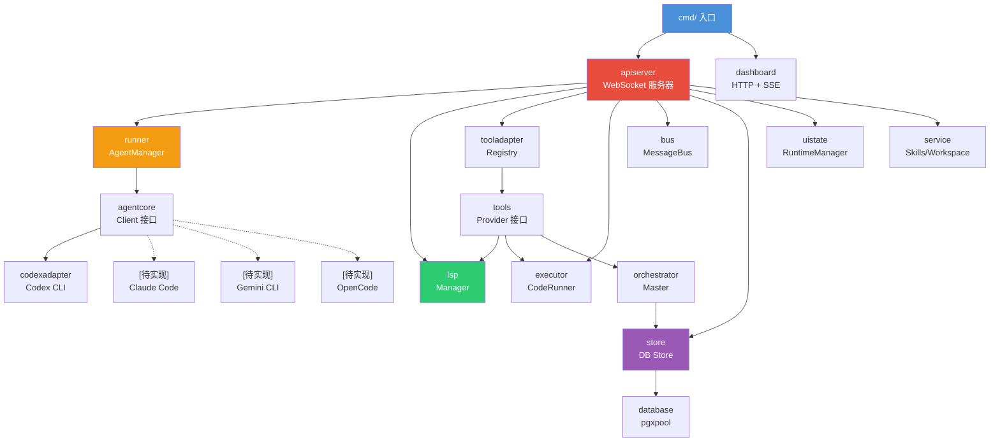

# 系统架构总览

> 本系统通过 `agentcore.Client` 抽象接口实现 CLI 无关的 Agent 管理，当前已实现 Codex 适配器，架构设计支持扩展接入 Claude Code、Gemini CLI、OpenCode 等多种 CLI 后端。

## 1. 分层架构

```
┌──────────────────────────────────────────────────────────────────┐
│                           入口层 (cmd/)                          │
│  agent-terminal │ app-server │ mcp-server │ migrate │ server     │
├──────────────────────────────────────────────────────────────────┤
│                       API / 协议层                               │
│  apiserver (WebSocket 服务器)                                    │
│  dashboard (HTTP REST + SSE)                                     │
│  dashrpc   (Dashboard ←→ API 桥接)                               │
├──────────────────────────────────────────────────────────────────┤
│                        业务编排层                                │
│  orchestrator (Master 状态机)                                    │
│  runner       (Agent 进程管理)                                   │
│  bus          (消息总线 / 事件路由)                                │
│  skills       (技能管理)                                         │
│  executor     (代码执行 / 命令卡)                                 │
├──────────────────────────────────────────────────────────────────┤
│                        工具 / 智能层                             │
│  lsp         (Language Server Protocol 集成)                     │
│  mcp         (Model Context Protocol 服务)                       │
│  tools       (动态工具定义 & Provider 接口)                       │
│  tooladapter (工具注册中心 & 运行时分发)                           │
├──────────────────────────────────────────────────────────────────┤
│                 CLI 适配层 (Adapter Pattern)                     │
│  agentcore     (CLI 无关抽象接口: Client/Event/DynamicTool)      │
│  codexadapter  (Codex CLI 适配器 — 已实现)                      │
│  commonadapter (通用适配逻辑 — 跨 CLI 共享)                      │
│  [TODO]        Claude Code / Gemini CLI / OpenCode 适配器      │
├──────────────────────────────────────────────────────────────────┤
│                      基础设施层                                  │
│  config   (环境变量配置)          store    (数据库 Store)          │
│  database (连接池 / 迁移)         uistate  (UI 运行时状态)        │
│  codex    (Codex CLI 客户端)                                    │
│  service  (Skills/Workspace)     monitor  (Agent 巡检)           │
├──────────────────────────────────────────────────────────────────┤
│                       公共包 (pkg/)                               │
│  logger  (slog 结构化日志)                                       │
│  errors  (错误码定义)                                            │
│  util    (反射加载 / 通用工具)                                    │
└──────────────────────────────────────────────────────────────────┘
```

## 2. 入口程序

| 入口 | 路径 | 说明 |
| :--- | :--- | :--- |
| **agent-terminal** | `cmd/agent-terminal/` | Wails v3 桌面客户端，集成 WebView 前端 |
| **app-server** | `cmd/app-server/` | 独立 WebSocket 后端 (无 UI) |
| **server** | `cmd/server/` | 完整 app-server 启动入口 (`make run`) |
| **mcp-server** | `cmd/mcp-server/` | MCP 协议服务器 (工具注册/调用) |
| **migrate** | `cmd/migrate/` | PostgreSQL 数据库迁移工具 |

## 3. 核心设计原则

### 3.1 多 CLI 适配架构 (Adapter Pattern)

系统通过 `agentcore.Client` 接口抽象 CLI 差异，实现一套编排逻辑驱动多种 CLI 后端：

```go
// agentcore/client.go — CLI 无关的统一接口
type Client interface {
    SpawnAndConnect(ctx, prompt, cwd, model, instructions, dynamicTools) error
    Submit(prompt, images, files, outputSchema) error
    SendDynamicToolResult(callID, output, requestID) error
    Shutdown() error
    // ...
}

type ClientFactory func(port int, agentID string) Client
```

| 层次 | 包 | 状态 |
| :--- | :--- | :--- |
| 抽象接口 | `agentcore` | ✅ CLI 无关的 Client/Event/DynamicTool |
| Codex 适配 | `codexadapter` | ✅ 已实现 (JSON-RPC 2.0 over WebSocket) |
| 通用适配 | `commonadapter` | ✅ 跨 CLI 共享逻辑 |
| Claude Code | — | 📌 待实现 |
| Gemini CLI | — | 📌 待实现 |
| OpenCode | — | 📌 待实现 |

新增 CLI 后端只需：
1. 实现 `agentcore.Client` 接口
2. 提供 `ClientFactory`
3. 注册到 `runner.AgentManager.SetClientFactories()`

### 3.2 依赖注入 (DI)

Server 通过 `apiserver.Deps` 结构体注入所有运行时依赖：

```go
type Deps struct {
    Manager   *runner.AgentManager
    LSP       *lsp.Manager
    Config    *config.Config
    DB        *pgxpool.Pool
    SkillsDir string
}
```

所有 Store、Manager、Provider 均在 `New()` 构造函数中组装，避免全局变量。

### 3.3 接口隔离 (Provider Pattern)

`tools` 包定义了 6 个 Provider 接口，实现工具层与传输层解耦：

| Provider | 职责 |
| :--- | :--- |
| `LSPProvider` | LSP 服务器能力查询 |
| `CodeRunProvider` | 代码执行运行时 |
| `ApprovalProvider` | 审批流 (approve/deny) |
| `ResourceProvider` | 资源 Store 访问 (DAG/Card/File) |
| `OrchestrationProvider` | 编排运行时 (Launch/Report) |
| `AgentRuntimeProvider` | Agent 运行时状态 (WorkDir/Cancel) |

### 3.4 事件驱动

系统采用**消息总线 + 事件回调**双通道：

- **进程内**: `bus.MessageBus` — topic pub/sub，前缀匹配 + 广播
- **跨进程**: WebSocket notification 推送到前端 (各 CLI 适配器实现具体协议)

## 4. 核心依赖关系



## 5. 技术选型理由

| 决策 | 选择 | 理由 |
| :--- | :--- | :--- |
| CLI 抽象 | `agentcore.Client` 接口 | CLI 无关，支持多 CLI 后端热插拔 |
| 适配器模式 | codexadapter / commonadapter | 将 CLI 专属协议封装在适配器内，不污染核心逻辑 |
| 通信层 | WebSocket | 双向实时通信，支持事件推送 |
| 桌面框架 | Wails v3 | Go 原生，单二进制分发，WebView 渲染 |
| 数据库驱动 | pgx v5 | 高性能 PostgreSQL 驱动，连接池内建 |
| 代码智能 | LSP | 语言无关，标准协议，可扩展 |
| 编排模型 | for-select 状态机 | 替代 LangGraph，Go 原生并发，零外部依赖 |
| 配置管理 | struct tag 反射 | `env:"VAR" default:"val"` — 零样板代码 |
