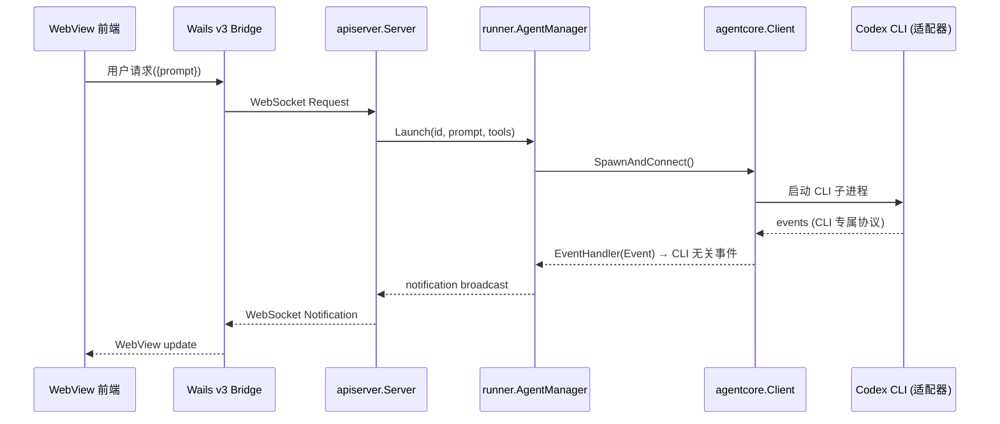
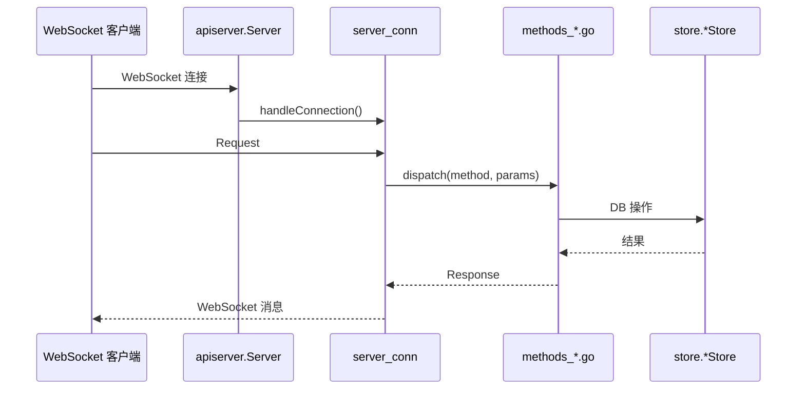
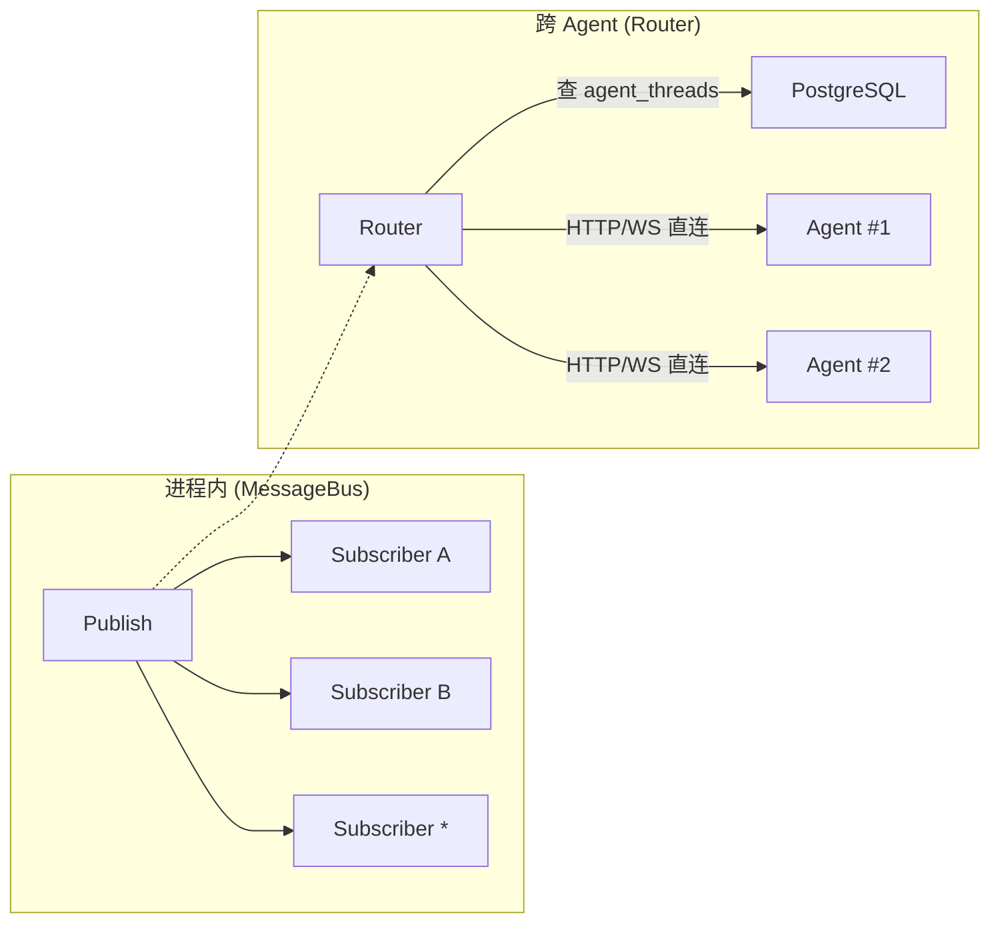
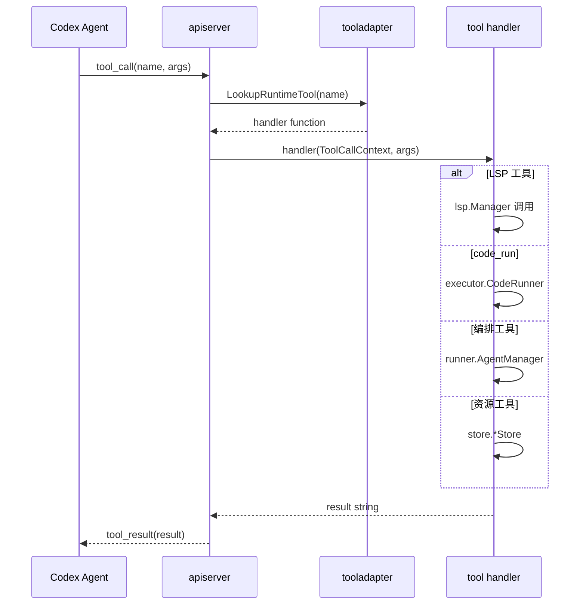
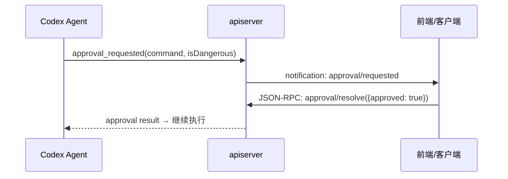
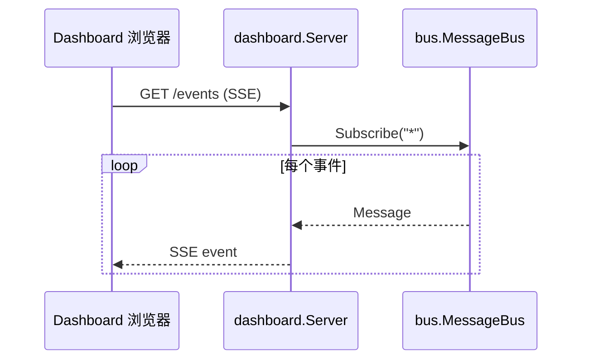

# 数据流与通信架构

## 1. 请求处理链路

### 1.1 桌面端 (agent-terminal) 完整链路

> 以 Codex CLI 为例 (其他 CLI 后端通过 `agentcore.Client` 接口适配)



### 1.2 app-server (WebSocket 客户端) 链路



---

## 2. 事件流架构

### 2.1 Agent 事件传播

```
CLI 子进程 (Codex / Claude Code / Gemini / OpenCode)
    │ 各 CLI 专属协议 (如 Codex 用 JSON-RPC 2.0)
    ▼
agentcore.Client 实现 (适配器)
    │ EventHandler → CLI 无关事件 (agentcore.Event)
    ▼
runner.AgentManager
    │ onEvent callback
    ▼
apiserver.Server
    │
    ├── uistate.RuntimeManager  → UI 状态更新
    │       │
    │       └── runtime_event_handlers.go → 事件规范化
    │
    ├── bus.MessageBus → 进程内发布
    │       │
    │       └── Subscriber channels → dashboard / orchestrator
    │
    └── WebSocket connections → 广播 JSON-RPC Notification
            │
            └── 前端 WebView / 外部客户端
```

### 2.2 事件类型

| 事件类型 | 来源 | 说明 |
| :--- | :--- | :--- |
| `agent_message_delta` | Codex CLI | LLM 流式输出片段 |
| `agent_reasoning_delta` | Codex CLI | 推理过程 |
| `agent_tool_call` | Codex CLI | 工具调用请求 |
| `agent_tool_result` | 动态工具 | 工具执行结果返回 |
| `approval_requested` | Codex CLI | 命令审批请求 |
| `turn_complete` | Codex CLI | 轮次完成 |
| `ui/state/changed` | uistate | UI 状态变更 (节流 500ms) |

---

## 3. 消息总线 (bus)

### 3.1 Topic 路由

```
发布消息 topic = "agent.a0.output"

匹配规则 (前缀匹配):
  ✓ 订阅 "agent.a0"     → 匹配 (前缀)
  ✓ 订阅 "agent."       → 匹配 (前缀)
  ✓ 订阅 "*"            → 匹配 (广播)
  ✗ 订阅 "agent.a1"     → 不匹配
  ✗ 订阅 "system"       → 不匹配
```

### 3.2 两层通信架构



---

## 4. 动态工具调度流



---

## 5. 审批流



---

## 6. Dashboard SSE 推送



Dashboard 同步间隔由 `DASHBOARD_SSE_SYNC_SEC` 控制 (默认 5 秒)。
