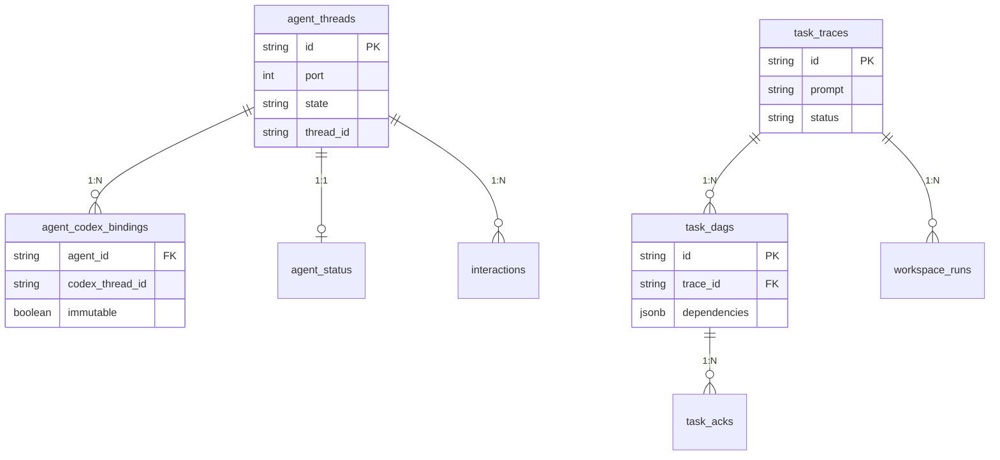

# 数据库 Schema 与 Store 层设计

## 1. 迁移策略

采用**顺序 SQL 迁移**，文件位于 `migrations/` 目录：

```
migrations/
├── 0001_initial_schema.sql              # 初始表结构
├── 0003_task_trace_prompt_versions.sql   # 任务追踪 + 模板版本
├── 0004_ack_dag.sql                     # ACK + DAG 表
├── 0005_command_card_versions.sql        # 命令卡版本字段
├── 0006_agent_status.sql                # Agent 状态表
├── 0006_workspace_runs.sql              # 工作区运行记录
├── 0007_bus_exception_logs.sql          # 总线异常日志
├── 0009_system_logs_v2.sql              # 系统日志 V2
├── 0010_ui_preferences.sql              # UI 偏好设置
├── 0012_agent_threads.sql               # Agent 线程
├── 0013_agent_codex_binding.sql         # Agent ↔ Codex 绑定
├── 0014_drop_agent_messages.sql         # 删除废弃表
├── 0015_thread_list_indexes.sql         # 线程列表索引
└── 0016_agent_codex_binding_immutable.sql # 绑定不可变约束
```

执行方式：

```bash
go run ./cmd/migrate/
```

`database.Migrator` 通过文件名排序顺序执行，已执行的迁移记录在 `schema_migrations` 表中。

---

## 2. 数据库表一览

### 2.1 核心业务表

| 表名 | Store | 说明 |
| :--- | :--- | :--- |
| `agent_threads` | `AgentThreadStore` | Agent 线程记录 (port, 状态) |
| `agent_codex_bindings` | `AgentCodexBindingStore` | Agent ↔ Codex 线程绑定关系 |
| `agent_status` | `AgentStatusStore` | Agent 实时运行状态 |
| `interactions` | `InteractionStore` | Agent 交互记录 |

### 2.2 任务编排表

| 表名 | Store | 说明 |
| :--- | :--- | :--- |
| `task_traces` | `TaskTraceStore` | 任务执行追踪 (含 prompt 版本) |
| `task_dags` | `TaskDAGStore` | 任务 DAG 定义 (依赖关系) |
| `task_acks` | `TaskAckStore` | 任务确认状态 |
| `workspace_runs` | `WorkspaceRunStore` | 工作区执行记录 |

### 2.3 资源表

| 表名 | Store | 说明 |
| :--- | :--- | :--- |
| `command_cards` | `CommandCardStore` | 命令卡定义 (版本化) |
| `prompt_templates` | `PromptTemplateStore` | 提示词模板 |
| `shared_files` | `SharedFileStore` | 共享文件 (Agent 间) |

### 2.4 配置 & 偏好表

| 表名 | Store | 说明 |
| :--- | :--- | :--- |
| `ui_preferences` | `UIPreferenceStore` | UI 偏好 (主题/布局) |
| `topology_approvals` | `TopologyApprovalStore` | 拓扑变更审批 |

### 2.5 日志表

| 表名 | Store | 说明 |
| :--- | :--- | :--- |
| `ai_logs` | `AILogStore` | AI 请求/响应日志 |
| `audit_logs` | `AuditLogStore` | 审计事件日志 |
| `system_logs_v2` | `SystemLogStore` | 系统事件日志 |
| `bus_exception_logs` | `BusLogStore` | 总线异常日志 |

---

## 3. Store 层设计

### 3.1 设计原则

- **每个表对应一个 Store**: 职责单一，一个 Store 管理一张表
- **构造函数注入 DB**: `NewXxxStore(pool *pgxpool.Pool) *XxxStore`
- **Context 传递**: 所有方法接收 `context.Context` 参数
- **SQL 安全**: `sql_safety.go` 提供 SQL 注入检查

### 3.2 典型 Store 结构

```go
type AuditLogStore struct {
    pool *pgxpool.Pool
}

func NewAuditLogStore(pool *pgxpool.Pool) *AuditLogStore {
    return &AuditLogStore{pool: pool}
}

func (s *AuditLogStore) Insert(ctx context.Context, log *AuditLog) error {
    _, err := s.pool.Exec(ctx, `INSERT INTO audit_logs ...`, ...)
    return err
}

func (s *AuditLogStore) List(ctx context.Context, limit int) ([]AuditLog, error) {
    rows, err := s.pool.Query(ctx, `SELECT ... FROM audit_logs ...`)
    // ...
}
```

### 3.3 共享模型

`models.go` (16KB) 定义所有跨 Store 共享的数据模型：

- Agent 相关: `AgentInfo`, `AgentThread`, `AgentStatus`
- 任务相关: `TaskTrace`, `TaskDAG`, `TaskAck`
- 资源相关: `CommandCard`, `PromptTemplate`, `SharedFile`
- 日志相关: `AuditLog`, `AILog`, `SystemLog`

### 3.4 辅助功能

| 文件 | 功能 |
| :--- | :--- |
| `helpers.go` | 通用查询构建、分页、排序 (7KB) |
| `sql_safety.go` | SQL 注入检查、参数化查询辅助 (3KB) |
| `db_query.go` | 通用只读 SQL 查询 Store |

---

## 4. 连接池配置

| 参数 | 环境变量 | 默认值 |
| :--- | :--- | :--- |
| 最小连接数 | `POSTGRES_POOL_MIN_SIZE` | 1 |
| 最大连接数 | `POSTGRES_POOL_MAX_SIZE` | 10 |
| 连接超时 | `POSTGRES_POOL_TIMEOUT_SEC` | 10s |
| Schema | `POSTGRES_SCHEMA` | `public` |

---

## 5. ER 关系概览


