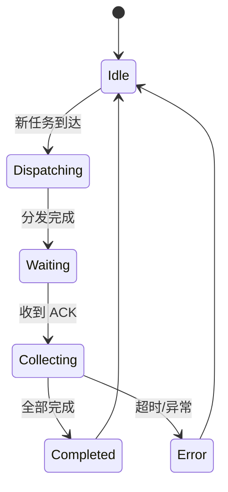

# 模块参考手册

> `internal/` 下所有子包的职责说明、核心类型与接口清单。

---

## 1. agentcore — CLI 无关抽象接口

**路径**: `internal/agentcore/`

定义 Agent 客户端的统一接口，使 `runner` 可以透明地管理不同 CLI 后端 (Codex / Claude Code / Gemini CLI / OpenCode 等)。

| 类型 | 说明 |
| :--- | :--- |
| `Client` | **CLI 无关**的 Agent 客户端接口 (Spawn/Submit/Shutdown 等) |
| `ClientFactory` | 客户端工厂函数 `func(port, agentID) Client` |
| `Event` | CLI 无关的事件信封 (所有 CLI 事件规范化为此格式) |
| `EventHandler` | 事件回调 `func(Event)` |
| `DynamicTool` | 动态工具 Schema (注入到 Agent) |

---

## 2. apiserver — WebSocket 服务器

**路径**: `internal/apiserver/`

核心服务器，处理前端/桌面端所有通信。通过 CLI 适配层 (`codexadapter`/`commonadapter`) 与不同 CLI 后端交互。

### 文件职责拆分

| 文件 | 职责 |
| :--- | :--- |
| `server.go` | `Server` 结构体、`New()`、`ListenAndServe()` |
| `server_conn.go` | WebSocket 连接管理、消息读写、心跳 |
| `server_payload.go` | 事件提取、通知广播、节流、UI 状态同步 |
| `server_approval.go` | 审批事件处理 (approve/deny) |
| `server_dynamic_tools.go` | 动态工具注册与调用分发 |
| `methods.go` | JSON-RPC 方法注册总表 |
| `methods_thread.go` | thread/start、thread/list 等线程管理 |
| `methods_turn.go` | turn/start、turn/cancel 等轮次控制 |
| `methods_config.go` | 配置读写方法 |
| `methods_skills_entry.go` | 技能列表/匹配方法 |
| `methods_ui_state.go` | UI 状态同步方法 |
| `notifications.go` | 通知事件定义与广播 |
| `protocol.go` | JSON-RPC 协议类型定义 |

### 子包

| 子包 | 说明 |
| :--- | :--- |
| `codexadapter/` | **Codex 专属适配层** (线程绑定、session 恢复、JSON-RPC 2.0 协议) — 25 个文件 |
| `commonadapter/` | **通用适配层** (跨 CLI 共享逻辑，新 CLI 接入时复用) |
| `contracts/` | Dashboard 视图合约接口 |

---

## 3. bus — 消息总线

**路径**: `internal/bus/`

进程内消息 pub/sub，支持 topic 前缀匹配和广播。

| 文件 | 职责 |
| :--- | :--- |
| `bus.go` | `MessageBus` — Publish/Subscribe/Unsubscribe |
| `router.go` | Agent 间路由 (查 `agent_threads` 表直连) |
| `orchestration.go` | 编排消息处理 |
| `resilient.go` | 弹性重连 / 错误恢复 |

### 消息类型

分为 6 大类：

1. **Agent 间通讯**: `task_delegate`, `task_result`, `agent_output`
2. **DAG 任务**: `task.assign`, `task.progress`, `task.complete`
3. **命令卡**: `command_card.exec`, `command_card.result`
4. **资源**: `shared_file.upsert`, `lock.acquire`
5. **心跳/健康**: `heartbeat.ping`, `heartbeat.timeout`
6. **调度**: `scheduler.enqueue`, `scheduler.preempt`

---

## 4. codex — Codex CLI 客户端

**路径**: `internal/codex/`

管理 Codex CLI 子进程，提供两种传输模式。

| 文件 | 职责 |
| :--- | :--- |
| `client.go` | REST 客户端 (Health/Thread CRUD) |
| `client_appserver.go` | AppServer JSON-RPC 2.0 客户端 (主路径) |
| `client_appserver_transport.go` | WebSocket 传输层 |
| `client_appserver_events.go` | 事件解析与分发 |
| `client_appserver_protocol.go` | JSON-RPC 协议编解码 |
| `events.go` | 事件类型定义 |
| `interface.go` | `agentcore.Client` 接口实现 |
| `rollout_reader.go` | Rollout 配置读取 |

---

## 5. config — 配置管理

**路径**: `internal/config/`

基于 struct tag 反射的零样板配置加载。

```go
type Config struct {
    LLMModel       string  `env:"LLM_MODEL" default:"gpt-4o"`
    LLMTemperature float64 `env:"LLM_TEMPERATURE" default:"0.7" min:"0"`
    // ... 60+ 配置项
}
```

配置分组：LLM、Gateway、PostgreSQL、Dashboard、Telegram、拓扑、日志、HTTP、运行时、编排工作区。

---

## 6. dashboard — Dashboard HTTP 服务

**路径**: `internal/dashboard/`

提供 REST API + SSE 实时推送。

| 文件 | 职责 |
| :--- | :--- |
| `server.go` | Gin 路由注册 |
| `handler.go` | HTTP 处理器 (审计日志、系统日志、Agent 列表) |
| `sse.go` | Server-Sent Events 推送 |

---

## 7. dashrpc — Dashboard RPC 桥接

**路径**: `internal/dashrpc/`

将 Dashboard 操作通过 JSON-RPC 分发到 apiserver。

| 文件 | 职责 |
| :--- | :--- |
| `register.go` | RPC 方法注册 |
| `types.go` | 请求/响应类型 |
| `ui.go` | UI 绑定 (Wails 桥接) |

---

## 8. database — 数据库基础设施

**路径**: `internal/database/`

| 文件 | 职责 |
| :--- | :--- |
| `pool.go` | pgxpool 连接池创建 |
| `migrator.go` | SQL 迁移执行器 (顺序执行 `migrations/*.sql`) |

---

## 9. executor — 代码执行引擎

**路径**: `internal/executor/`

| 文件 | 职责 |
| :--- | :--- |
| `code_runner.go` | `CodeRunner` — 安全沙箱执行代码片段 (20KB) |
| `command_card.go` | `CommandCardExecutor` — 命令卡执行 (17KB) |
| `status.go` | 执行状态常量 |

---

## 10. lsp — Language Server Protocol 集成

**路径**: `internal/lsp/`

35 个文件，提供完整的 LSP 客户端能力。

### 架构分层

```
lsp/
├── protocol.go           # LSP 协议类型 (TextDocumentIdentifier, Location 等)
├── protocol_ext_*.go     # 扩展协议 (Actions/Hierarchy/Semantic/XRef)
├── client.go             # LSP 客户端 (16KB, 单服务器连接)
├── client_*_tools.go     # 客户端工具方法
├── manager.go            # Manager — 多服务器管理 (13KB)
├── manager_bootstrap*.go # 自动发现 & 启动 LSP 服务器
├── cache_*.go            # Symbol 缓存
├── tool_handlers*.go     # 工具调用处理器 (Base/Actions/Hierarchy/Semantic/XRef)
└── tool_handlers_hints.go# 智能提示聚合
```

### 工具分类

| 分类 | 能力 |
| :--- | :--- |
| **Base** | 定义跳转、引用查找、悬停、补全、符号搜索 |
| **Actions** | 代码操作 (格式化、重命名、重构) |
| **Hierarchy** | 调用层次、类型层次 |
| **Semantic** | 语义高亮、折叠范围 |
| **XRef** | 交叉引用 (实现/类型定义) |

---

## 11. mcp — MCP 协议服务

**路径**: `internal/mcp/`

Model Context Protocol 服务端入口。

---

## 12. monitor — Agent 巡检

**路径**: `internal/monitor/`

Agent 存活检测与异常告警。

---

## 13. orchestrator — 编排器

**路径**: `internal/orchestrator/`

| 文件 | 职责 |
| :--- | :--- |
| `master.go` | `Master` — for-select 状态机 (Idle → Dispatching → Waiting → Collecting) |
| `master_logic.go` | 编排执行逻辑 (13KB) |

### 状态流转



---

## 14. runner — Agent 进程管理

**路径**: `internal/runner/`

| 类型 | 说明 |
| :--- | :--- |
| `AgentManager` | 管理多个 Agent 子进程 (Launch/Kill/GetReport) |
| `AgentProcess` | 单个 Agent 实例 (Port/State/Client) |
| `AgentState` | 状态枚举: Idle/Thinking/Running/Stopped/Error |
| `AgentInfo` | Agent 信息快照 (线程安全) |
| `AgentEvent` | Agent 事件包装 |

### 生命周期

```
findFreePort() → Spawn(codex app-server) → initialize(JSON-RPC) → thread/start → 事件监听
```

---

## 15. service — 业务服务

**路径**: `internal/service/`

| 文件 | 职责 |
| :--- | :--- |
| `skills.go` | 技能加载、匹配、内容读取 (26KB) |
| `workspace.go` | 编排工作区管理 (虚拟目录 + PG 状态, 27KB) |

---

## 16. skills — 技能方法

**路径**: `internal/skills/`

| 文件 | 职责 |
| :--- | :--- |
| `manager.go` | `SkillManager` — 技能生命周期管理 |
| `methods.go` | RPC 方法 (list/match/get/search, 14KB) |
| `helpers.go` | 技能解析工具函数 |

---

## 17. store — 数据库 Store 层

**路径**: `internal/store/`

22 个文件，覆盖所有持久化实体。

| Store | 对应表 | 说明 |
| :--- | :--- | :--- |
| `AgentCodexBindingStore` | `agent_codex_bindings` | Agent ↔ Codex 线程绑定 |
| `AgentStatusStore` | `agent_status` | Agent 运行状态 |
| `AgentThreadStore` | `agent_threads` | Agent 线程记录 |
| `AILogStore` | `ai_logs` | AI 请求/响应日志 |
| `AuditLogStore` | `audit_logs` | 审计事件日志 |
| `BusLogStore` | `bus_exception_logs` | 总线异常日志 |
| `CommandCardStore` | `command_cards` | 命令卡定义 |
| `InteractionStore` | `interactions` | 交互记录 |
| `PromptTemplateStore` | `prompt_templates` | 提示词模板 |
| `SharedFileStore` | `shared_files` | 共享文件 |
| `SystemLogStore` | `system_logs_v2` | 系统事件日志 |
| `TaskAckStore` | `task_acks` | 任务确认 |
| `TaskDAGStore` | `task_dags` | 任务 DAG 定义 |
| `TaskTraceStore` | `task_traces` | 任务执行追踪 |
| `TopologyApprovalStore` | `topology_approvals` | 拓扑审批 |
| `UIPreferenceStore` | `ui_preferences` | UI 偏好设置 |
| `WorkspaceRunStore` | `workspace_runs` | 工作区执行记录 |
| `DBQueryStore` | — | 通用只读 SQL 查询 |

辅助文件：`models.go` (16KB 共享模型), `helpers.go` (7KB 辅助函数), `sql_safety.go` (SQL 安全检查)

---

## 18. tooladapter — 工具注册中心

**路径**: `internal/tooladapter/`

统一的动态工具注册、Schema 构建与运行时分发。

| 类型 | 说明 |
| :--- | :--- |
| `RuntimeRegistry` | 工具运行时注册接口 |
| `RuntimeLookup` | 工具运行时查找接口 |
| `Providers` | 依赖聚合 (LSP/CodeRun/Approval/Resource/Orchestration) |
| `Register()` | 将所有工具注入注册中心 |
| `AllSchemas()` | 导出所有工具 Schema (注入 Agent) |

---

## 19. tools — 动态工具定义

**路径**: `internal/tools/`

| 文件 | 职责 |
| :--- | :--- |
| `providers.go` | Provider 接口定义 (6 个) |
| `lsp_tools.go` | LSP 工具 Schema 构建 |
| `code_run.go` | `code_run`/`code_run_test` 工具 |
| `orchestration.go` | 编排工具 (launch/report/workspace) |
| `resource.go` | 资源工具 (DAG/Card/File/SharedFile, 22KB) |
| `lsp_ext_*.go` | LSP 扩展工具 (Actions/Hierarchy/Semantic/XRef) |

---

## 20. uistate — UI 运行时状态

**路径**: `internal/uistate/`

管理 Agent 运行时 UI 状态 (Timeline/Token/Event)。

| 文件 | 职责 |
| :--- | :--- |
| `runtime_state.go` | `RuntimeManager` — 全局运行时状态 (17KB) |
| `runtime_event_handlers.go` | 事件处理器 (31KB) |
| `runtime_timeline.go` | 时间线管理 (18KB) |
| `runtime_types.go` | UI 状态类型定义 |
| `event_normalizer.go` | 事件规范化 (跨 CLI 兼容) |
| `timeline_tokens.go` | Token 计数 (9KB) |
| `uistate.go` | `PreferenceManager` (偏好设置) |

---

## 21. protocolsync — 协议同步

**路径**: `internal/protocolsync/`

确保 Go 侧 JSON-RPC 方法定义与 Codex CLI 协议保持一致。

---

## 22. discovery — 服务发现

**路径**: `internal/discovery/`

Agent 实例的自动发现机制。

---

## 23. skillutil — 技能工具

**路径**: `internal/skillutil/`

技能解析的底层工具函数。
