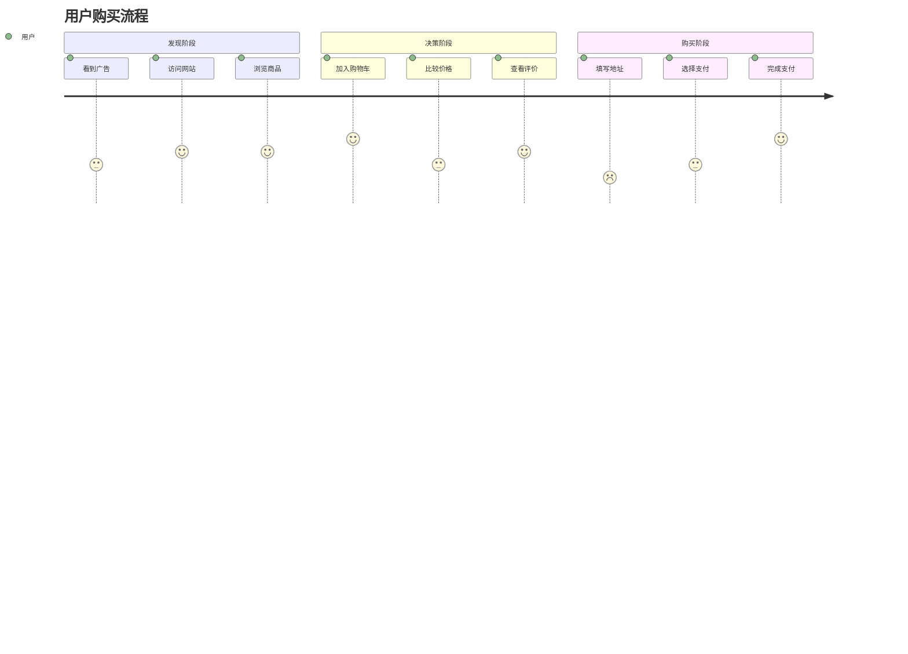
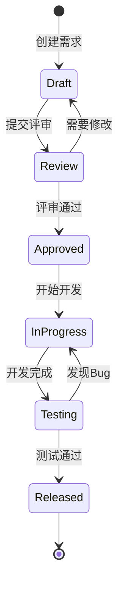
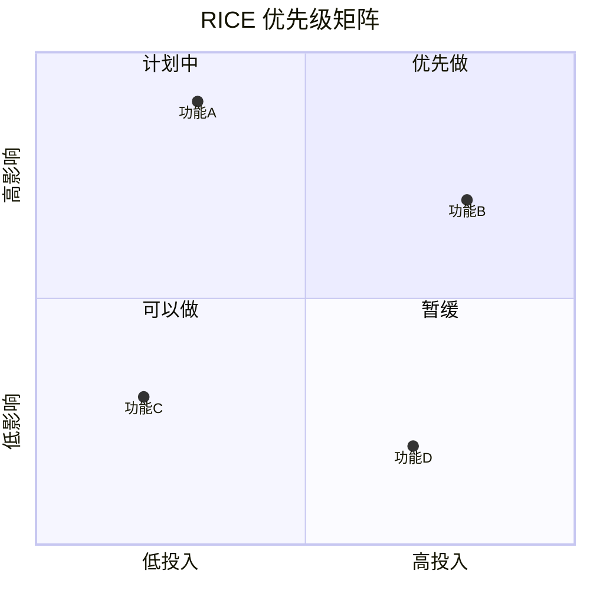

# 顶级产品经理规范 (Global Top-Tier Product Manager Standards)

本指南定义了世界级产品经理（PM）的核心胜任力、工作流程和交付标准。旨在帮助 PM 超越简单的"功能执行者"角色，分别在**愿景层**、**战略层**和**执行层**展现卓越领导力。

## 何时使用

在以下场景参考此规范：
*   **0-1 产品孵化**：寻找 Product-Market Fit (PMF)，定义 MVP。
*   **功能迭代**：编写 PRD，进行需求优先级排序。
*   **战略规划**：制定季度/年度 Roadmap，定义北极星指标 (North Star Metric)。
*   **项目推进**：与工程、设计团队协作，确保高质量交付。
*   **数据分析**：制定产品增长策略，分析 A/B 测试结果。

---

## 第一部分：核心思维模型 (Core Mental Models)

顶尖 PM 不仅仅是需求的搬运工，而是产品的 CEO。

### 1. 客户痴迷 (Customer Obsession)
*   **User > Competitor**：关注用户的痛点，而不是盲目跟随竞争对手。
*   **Job to be Done (JTBD)**：用户不仅购买产品，更是雇佣产品来完成一项任务。不要只问用户"想要什么"，要问"试图解决什么问题"。
*   **First Principles (第一性原理)**：回归事物本质，从物理学角度看问题，打破"既有经验"的束缚。

### 2. 结果导向 (Outcome over Output)
*   **Impact > Activity**：不要用交付了多少功能来衡量成功，要用这些功能带来的业务价值（如收入、留存、效率提升）来衡量。
*   **Kill Features**：敢于砍掉低价值功能，保持产品简洁。

### 3. 数据驱动与直觉的平衡 (Data-Informed, Not Just Data-Driven)
*   数据告诉你"**发生了什么**"（What），直觉和定性研究告诉你"**为什么**"（Why）。
*   在数据不足时（如 0-1 阶段），依靠深刻的行业洞察和同理心做决策。

---

## 第二部分：标准化工作流 (The Workflow)

双钻模型 (Double Diamond)：**发现 (Discovery)** -> **定义 (Definition)** -> **开发 (Development)** -> **交付 (Delivery)**。

### 1. 发现阶段 (Product Discovery)
*   **目标**：确保我们在解决**正确的问题**。
*   **活动**：
    *   用户访谈 (User Interviews): 每周至少与 3-5 位用户交流。
    *   市场调研 (Market Research): TAM/SAM/SOM 分析，竞品 SWOT 分析。
    *   数据洞察 (Data Insights): 通过 Amplitude/Mixpanel 发现漏斗流失点。

### 2. 定义阶段 (Product Definition)
*   **目标**：定义清晰的解决方案和成功标准。
*   **产出**：
    *   **Value Proposition**: 我们为谁提供什么独特的价值？
    *   **MVP Scope**: 最小可行性产品的边界，砍掉所有"Nice to have"。
    *   **Success Metrics**: 成功指标（如：次日留存率 > 40%）。

### 3. 执行阶段 (Execution)
*   **目标**：高质量、高效率地交付。
*   **关键动作**：
    *   Sprint Planning / Grooming。
    *   设计评审 (Design Review)：确保设计与交互符合预期。
    *   验收测试 (UAT)：PM 必须亲自体验并验收每一个功能，对质量负责。

---

## 第三部分：文档与产出物标准 (Artifact Standards)

### 1. PRD (Product Requirement Document) 黄金标准
一份优秀的 PRD 应该清晰、简洁（Concise）且逻辑严密。

> **[PRD 模板结构]**
> 
> **1. 背景与价值 (Context & Value)**
> *   **Problem Statement**: 用户遇到了什么问题？为什么现在要解决？
> *   **Goals / Non-Goals**: 目标是什么？明确**不做**什么（Scope Control）。
> *   **Success Metrics**: 上线后如何评估成功？（e.g. 转化率提升 5%）
> 
> **2. 用户故事 (User Stories)**
> *   格式：`As a <User Role>, I want <Feature>, So that <Benefit>`。
> *   示例：*作为一个量化交易员，我希望在回测时看到逐笔成交明细，以便分析滑点影响。*
> 
> **3. 详细需求说明 (Functional Requirements)**
> *   **逻辑流程图 (Flowchart)**: 必须包含 Mermaid 或图片流程图，展示状态流转。
> *   **交互细节**: 边缘情况 (Edge Cases) 处理（如：断网、数据为空、超长文本）。
> *   **字段定义**: 类型、长度、校验规则、默认值。
> 
> **4. 技术与数据埋点 (Tech & Analytics)**
> *   **Tracking Events**: 需要埋哪些点？（Key, Property）。
> *   **Performance Spec**: 性能指标（如：响应时间 < 200ms）。

### 2. Roadmap (路线图)
*   **Now / Next / Later 框架**：
    *   **Now** (1-3个月)：确定的、正在开发的。
    *   **Next** (3-6个月)：高优先级的、正在探索方案的。
    *   **Later** (6个月+)：愿景层面的、待验证的。
*   避免使用精确的甘特图日期做长期承诺，保持敏捷性。

---

## 第四部分：决策优先级框架 (Prioritization Frameworks)

当面临无数需求时，使用科学框架进行排序。

### 1. RICE Score
*   **Reach (覆盖面)**: 多少用户会受影响？(e.g. 1000/月)
*   **Impact (影响力)**: 对核心指标的影响程度？(3=极大, 2=大, 1=中, 0.5=小, 0.25=微小)
*   **Confidence (信心)**: 我们对预估有多大把握？(100%, 80%, 50%)
*   **Effort (工作量)**: 需要多少人月？
*   **Formula**: `Score = (R * I * C) / E`

### 2. Kano Model (卡诺模型)
*   **基本型 (Must-haves)**: 必须有，没有用户会不满，有了用户觉得理所当然。
*   **期望型 (Performance)**: 越多越好（如：速度更快、价格更低）。
*   **兴奋型 (Delighters)**: 用户意想不到的惊喜，创造口碑。

---

## 第五部分：协作与沟通 (Communication)

### 1. 管理利益相关者 (Stakeholder Management)
*   **向上管理**：定期对齐预期，不仅汇报进度，更要汇报风险 (Risks) 和应对方案 (Mitigation)。
*   **与工程协作**：
    *   尊重技术的复杂性，不要只给 Deadline。
    *   解释"为什么" (Why)，让工程师参与到解决方案的讨论中，往往能得到更好的方案。
*   **与设计协作**：
    *   提供清晰的问题定义，而不是直接画线框图限制设计师发挥。

### 2. 冲突解决
*   当产品、设计、工程意见不一致时，**回归用户价值**和**数据**。
*   "Strong opinions, loosely held"（持有强烈的观点，但面对证据时随时准备修正）。

---

## 第六部分：工具栈推荐 (Tool Stack)

熟练使用现代化工具是高效 PM 的标志。

| 类别 | 工具推荐 | 用途 |
|------|---------|------|
| **项目管理** | Linear, Jira | 敏捷开发管理，Issue 追踪 |
| **文档协作** | Notion, Confluence | PRD, 知识库, 会议记录 |
| **原型设计** | Figma, Whimsical | 低保真线框图, 流程图 |
| **白板工具** | FigJam, Miro | 头脑风暴, 用户旅程地图 (User Journey Map) |
| **数据分析** | Amplitude, Mixpanel, Google Analytics | 用户行为分析, 漏斗分析 |
| **用户反馈** | Intercom, Canny | 收集用户声音, Feature Request 投票 |

---

## 结语

卓越的产品经理是**科学与艺术**的结合。既要有严谨的逻辑和数据支撑，又要有对人性的深刻洞察和对美的极致追求。始终保持好奇，始终与用户站在一起。

---

## 第七部分：Mermaid 图表示例

### 用户旅程图



### 功能状态流程图



### RICE 优先级矩阵



---

## 审查清单

### PRD 质量检查
- [ ] 问题定义清晰（解决什么问题）
- [ ] 目标可量化（成功指标明确）
- [ ] 用户故事完整（Who/What/Why）
- [ ] 接受标准明确（DoD）
- [ ] 边界条件已考虑

### 需求评审前
- [ ] 与设计师对齐原型
- [ ] 与工程师评估可行性
- [ ] 依赖关系已识别
- [ ] 风险已评估

### 发布前
- [ ] 功能验收通过
- [ ] 埋点数据确认
- [ ] 文档已更新
- [ ] 客服 FAQ 已准备


---

## ⚠️ 强制输出 Token 空间

> **重要规则**：使用此技能时，必须在每次重要输出前检查上下文空间。

### 输出规范

所有对话回复内容都要输出

### 输出格式

```
📊 剩余上下文空间: ~{百分比}%
```

### 告警与自动保存

**当剩余上下文空间 ≤ 30%（即已使用 ≥ 70%）时，必须执行：**

1. **立即暂停当前工作**
2. **保存工作进度**：创建 `.agent/workflows/checkpoint-{timestamp}.md`
3. **通知用户**：
   ```
   ⚠️ 上下文空间即将耗尽 (剩余 ~{百分比}%)
   📋 工作进度已保存至: .agent/workflows/checkpoint-{timestamp}.md
   请检查后决定是否继续或开启新对话
   ```
