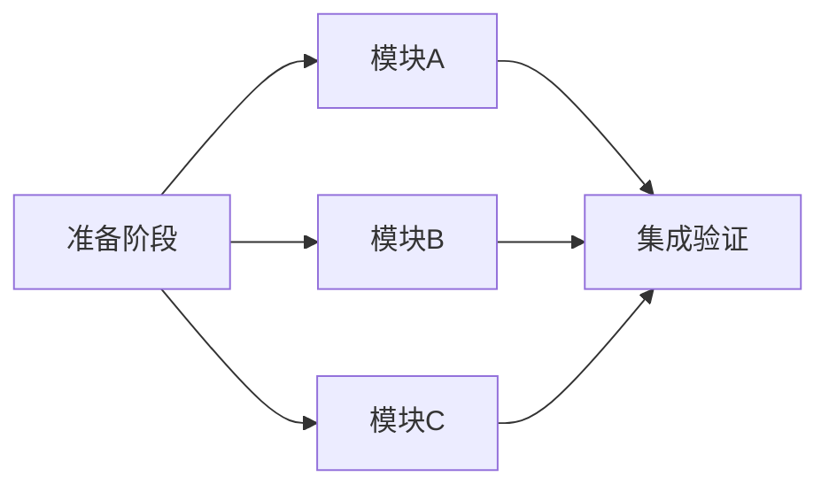

# 任务编排 Skill

将复杂任务按照清晰的步骤拆分，确保 **多个 Agent 可同时执行且不产生冲突**。生成标准化的任务工作流文档。

## 何时使用

在以下场景使用此技能：

- 大型功能开发需要多人/多 Agent 协作
- 重构任务涉及多个模块需并行推进
- 迁移工作需要分阶段并行执行
- 任何需要拆分成独立子任务的复杂工作

---

## 核心原则

### 1. 并行安全三原则

| 原则 | 说明 | 检查点 |
|------|------|--------|
| **文件隔离** | 每个并行任务操作不同的文件 | 无两个任务编辑同一文件 |
| **接口优先** | 先定义接口/契约，再并行实现 | 接口稳定后才分配实现任务 |
| **依赖明确** | 明确标注任务间的依赖关系 | 依赖任务必须先完成 |

### 2. 任务粒度标准

- **太小**：单个函数修改 → 合并到更大任务
- **合适**：一个完整模块/组件/功能点
- **太大**：需要 2 小时以上 → 继续拆分

### 3. 冲突预防策略

```
┌─────────────────────────────────────────────────────────┐
│                   Phase 0: 准备阶段                      │
│  - 创建共享接口/类型定义                                  │
│  - 确定目录结构                                          │
│  - 生成桩文件 (stub files)                               │
└─────────────────────────────────────────────────────────┘
                          ↓
┌─────────────┐   ┌─────────────┐   ┌─────────────┐
│  Agent P1   │   │  Agent P2   │   │  Agent P3   │
│  模块 A     │   │  模块 B     │   │  模块 C     │
│  独立文件集  │   │  独立文件集  │   │  独立文件集  │
└─────────────┘   └─────────────┘   └─────────────┘
                          ↓
┌─────────────────────────────────────────────────────────┐
│                   Phase N: 集成阶段                      │
│  - 连接各模块                                            │
│  - 集成测试                                              │
│  - 文档更新                                              │
└─────────────────────────────────────────────────────────┘
```

---

## 输出规范

### 目录结构

```
.agent/workflows/{任务概要}/
├── README.md              # 总览文档
├── p0-准备阶段.md          # 串行准备任务
├── p1-{模块A描述}.md       # 并行任务1
├── p2-{模块B描述}.md       # 并行任务2
├── p3-{模块C描述}.md       # 并行任务3
├── pN-集成验证.md          # 串行集成任务
└── summary.md             # 完成后总结
```

### README.md 模板

```markdown
---
description: {一句话描述任务目标}
---

# {任务名称}

## 概览

| 属性 | 值 |
|------|-----|
| 预计总耗时 | X 小时 |
| 可并行任务 | P1, P2, P3 |
| 串行依赖 | P0 → [P1,P2,P3] → PN |

## 任务依赖图



## 任务清单

- [ ] P0: 准备阶段 (必须先完成)
- [ ] P1: {模块A} ⚡ 可并行
- [ ] P2: {模块B} ⚡ 可并行
- [ ] P3: {模块C} ⚡ 可并行
- [ ] PN: 集成验证 (等待 P1-P3 完成)

## 文件分配矩阵

| 文件/目录 | P1 | P2 | P3 | 冲突 |
|----------|:--:|:--:|:--:|:----:|
| `path/to/moduleA/` | ✓ | | | 🟢 |
| `path/to/moduleB/` | | ✓ | | 🟢 |
| `path/to/moduleC/` | | | ✓ | 🟢 |
| `shared/types.go` | R | R | R | 🟢 只读 |

> 🟢 = 无冲突，🔴 = 需协调
```

### 子任务文档模板 (p1-pN.md)

```markdown
---
description: {子任务简短描述}
---

# P{N}: {任务标题}

## 前置条件

- [ ] P0 准备阶段已完成
- [ ] 共享接口已定义

## 任务范围

### 需要创建的文件
- `path/to/new_file.go`

### 需要修改的文件
- `path/to/existing.go` (仅修改 `FunctionX`)

### 禁止触碰的文件 ⚠️
- `path/to/other_agent_file.go` (P2 负责)

## 执行步骤

// turbo-all

1. 创建 `{文件路径}`
   ```go
   // 示例代码结构
   ```

2. 实现 `{功能名称}`
   - 详细说明...

3. 添加单元测试
   ```bash
   go test ./path/to/...
   ```

## 完成标准

- [ ] 所有新文件已创建
- [ ] 单元测试通过
- [ ] 无编译错误
- [ ] 不修改其他 Agent 负责的文件

## 验证命令

```bash
# 编译检查
go build ./path/to/...

# 测试
go test ./path/to/...
```
```

---

## 任务拆分流程

### Step 1: 分析任务范围

1. 识别所有涉及的文件和目录
2. 绘制模块依赖关系图
3. 找出可独立开发的边界

### Step 2: 定义共享契约

1. 提取共享接口到独立文件
2. 定义 DTO/类型到公共包
3. 创建桩实现供并行开发使用

### Step 3: 分配独立任务

| Agent | 职责 | 文件范围 |
|-------|------|----------|
| P1 | 模块 A | `moduleA/` 下所有文件 |
| P2 | 模块 B | `moduleB/` 下所有文件 |
| P3 | 模块 C | `moduleC/` 下所有文件 |

### Step 4: 制定集成计划

1. 定义集成顺序
2. 准备集成测试用例
3. 规划回滚策略

---

## 冲突检测清单

在分配任务前，检查以下项：

```
□ 每个并行任务是否有独立的文件集？
□ 是否有两个任务需要修改同一个文件？
  → 如果是，将该文件的修改放入准备阶段或集成阶段
□ 共享依赖是否已提前定义？
□ 接口是否足够稳定，不会在并行阶段变动？
□ 是否有循环依赖？
```

---

## 示例：API 迁移任务编排

```
.agent/workflows/api-v2-migration/
├── README.md
├── p0-接口定义.md         # 串行：定义新 API 接口
├── p1-用户模块.md         # 并行：/users 相关端点
├── p2-订单模块.md         # 并行：/orders 相关端点
├── p3-支付模块.md         # 并行：/payments 相关端点
├── p4-集成测试.md         # 串行：端到端测试
└── summary.md
```

**文件分配**:

| 路径 | P1 | P2 | P3 |
|------|:--:|:--:|:--:|
| `internal/api/users/` | ✓ | | |
| `internal/api/orders/` | | ✓ | |
| `internal/api/payments/` | | | ✓ |
| `internal/api/types/` | R | R | R |

---

## 使用此 Skill 的命令示例

当用户提出复杂任务时，Agent 应：

1. **分析任务** → 识别可并行的模块
2. **创建工作流目录** → `.agent/workflows/{任务概要}/`
3. **生成文档** → README.md + p0-pN.md + summary.md
4. **验证无冲突** → 检查文件分配矩阵
5. **返回给用户** → 展示任务编排结果，等待确认

```bash
# 用户可以这样触发
"请帮我编排以下任务：迁移用户、订单、支付三个模块到新架构"

# Agent 将创建
.agent/workflows/用户订单支付模块迁移/
├── README.md
├── p0-共享类型定义.md
├── p1-用户模块迁移.md
├── p2-订单模块迁移.md
├── p3-支付模块迁移.md
├── p4-集成验证.md
└── summary.md
```

---

## 最佳实践

1. **先定义后实现**：P0 阶段完成所有共享定义
2. **只读优于读写**：共享文件标记为只读
3. **小步快跑**：每个任务控制在 1-2 小时内
4. **及时同步**：完成后立即更新 summary.md
5. **预留缓冲**：集成阶段预留 20% 额外时间
