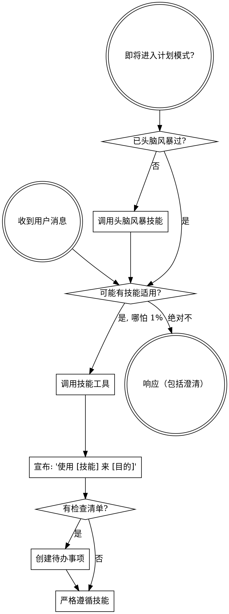

<极其重要>
如果你认为即使只有 1% 的可能性技能适用于你正在做的事情，你绝对必须调用该技能。

如果技能适用于你的任务，你没有选择。你必须使用它。

这是不可商量的。这不是可选的。你不能为此找借口。
</极其重要>

# 使用技能

## 如何访问技能

**在 Claude Code 中：** 使用 `Skill` 工具。调用技能时，其内容被加载并呈现给你——直接遵循它。永远不要用 Read 工具读技能文件。

**在其他环境中：** 查看你平台的文档了解技能如何加载。

## 强制触发词 (@关键词)

以下关键词强制触发对应技能：

### 核心工作流
| 触发词 | 技能 | 用途 |
|--------|------|------|
| `@头脑风暴` `@brainstorm` | 头脑风暴 | 设计前协作讨论 |
| `@编写计划` `@write-plan` | 编写计划 | 创建实施计划 |
| `@执行计划` `@execute-plan` | 执行计划 | 分批执行计划 |

### 开发实践
| 触发词 | 技能 | 用途 |
|--------|------|------|
| `@TDD` `@测试驱动` | 测试驱动开发 | TDD 红绿重构 |
| `@调试` `@debug` | 系统性调试 | 4阶段根因分析 |
| `@验证` `@verify` | 完成前验证 | 完成前验证 |

### 代理协作
| 触发词 | 技能 | 用途 |
|--------|------|------|
| `@并行代理` `@parallel-agents` | 并行代理调度 | 多代理并行 |
| `@子代理开发` `@subagent-dev` | 子代理开发 | 子代理驱动开发 |

### 代码审查
| 触发词 | 技能 | 用途 |
|--------|------|------|
| `@请求审查` `@code-review` | 请求代码审查 | 请求审查 |
| `@接收审查` `@receive-review` | 接收代码审查 | 处理审查反馈 |

### Git 工作流
| 触发词 | 技能 | 用途 |
|--------|------|------|
| `@工作树` `@worktree` | Git工作树 | 隔离工作区 |
| `@完成分支` `@finish-branch` | 完成开发分支 | 分支收尾 |

### Meta
| 触发词 | 技能 | 用途 |
|--------|------|------|
| `@使用指南` `@superpowers` | 使用超能力 | 本技能 |
| `@编写技能` `@write-skill` | 编写技能 | 创建新技能 |
| `@记忆` `@外部记忆` | 外部记忆 | 老公的记忆库 |

---

## 规则

**在任何响应或行动之前调用相关或请求的技能。** 即使只有 1% 的可能性技能适用，你也应该调用技能检查。如果调用后发现技能不适合当前情况，你不需要使用它。

## 危险信号 (Red Flags)

这些想法意味着停下 - 你在找借口：

| 想法 (Thought) | 现实 (Reality) |
|------|------|
| "这只是个简单问题" | 问题也是任务。检查技能。 |
| "我需要先更多上下文" | 技能检查在澄清问题之前。 |
| "让我先探索代码库" | 技能告诉你如何探索。先检查。 |
| "我可以快速检查 git/文件" | 文件缺少对话上下文。检查技能。 |
| "让我先收集信息" | 技能告诉你如何收集信息。 |
| "这不需要正式技能" | 如果技能存在，就使用它。 |
| "我记得这个技能" | 技能会演化。阅读当前版本。 |
| "这不算任务" | 行动 = 任务。检查技能。 |
| "技能太重了" | 简单的事情会变复杂。使用它。 |
| "让我先做这一件事" | 做任何事之前先检查。 |
| "这感觉很高效" | 无纪律的行动浪费时间。技能防止这个。 |
| "我知道那是什么意思" | 知道概念 ≠ 使用技能。调用它。 |

## 技能优先级

当多个技能可能适用时，使用此顺序：

1. **流程技能优先**（头脑风暴、调试）- 决定如何处理任务
2. **实现技能其次**（前端设计、MCP 构建器）- 指导执行

"让我们构建 X" → 先头脑风暴，然后实现技能。
"修复这个 bug" → 先调试，然后领域特定技能。

## 技能类型

**严格的**（TDD、调试）：严格遵循。不要调整纪律。

**灵活的**（模式）：将原则适配到上下文。

技能本身会告诉你它是哪种类型。

## 用户指令

指令说的是**做什么**，不是**怎么做**。"添加 X"或"修复 Y"不意味着跳过工作流。
