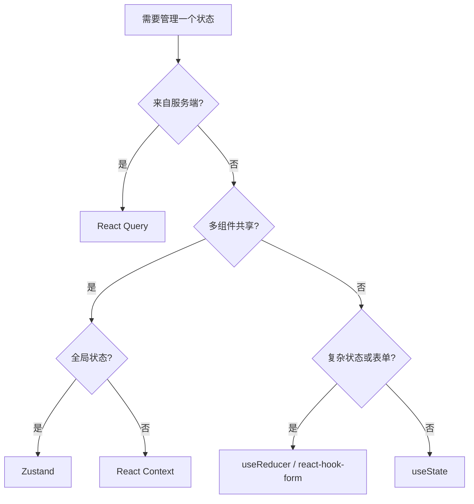
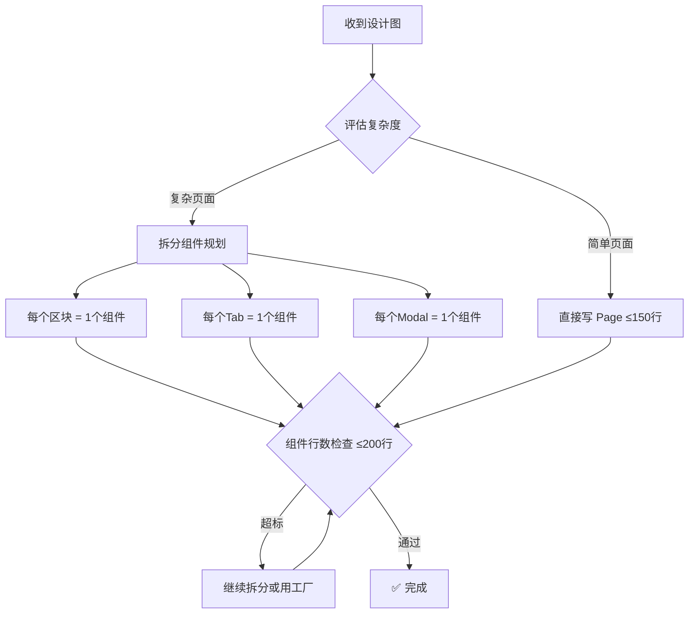

# WJBoot 前端架构规范 (V3 完整版)

> **背景**: 本规范源于对一个 5 万行代码的前端项目的深度复盘。本规范旨在通过严格的架构约束和自动化工具，从根本上解决这些问题，确保新项目的健康度和开发效率。
>
> ⚠️ **经验教训**: 以下规范来自血泪重构经验。

---

## 目录

1. [核心原则](#核心原则)
2. [目录结构](#目录结构-feature-sliced-design)
3. [开发 SOP](#开发-sop-标准作业流程)
4. [核心规范](#核心规范)
5. [编码规范](#编码规范-code-standards)
6. [避坑指南](#整合项目经验和教训)
7. [设计图到代码](设计图到代码的原则)
8. [代码审查清单](#代码审查清单-pr-checklist)

---

## 1 核心原则

1.1  **单一职责 (Single Responsibility)**: 每个文件、组件、Hook 只做一件事。
1.2  **关注点分离 (Separation of Concerns)**: 严格分离 UI、业务逻辑和数据请求。
1.3 **约定优于配置 (Convention over Configuration)**: 遵循严格的目录和命名约定，减少决策成本。
1.4  **自动化与标准化 (Automation & Standardization)**: 大量使用工厂函数生成样板代码，确保一致性。

---

## 2 目录结构 (Feature-Sliced Design)

这是 **强制性** 的目录结构，所有新代码都必须遵循。

### 2.1 目录结构
src/
├── app/                 # 应用入口、路由、全局样式、Provider
│   ├── providers/       # Context Providers (Theme, Auth, etc.)
│   ├── styles/          # 全局 CSS 和 Tailwind 配置
│   └── App.tsx          # 应用根组件和路由配置
├── components/          # 跨业务的共享组件 (Presentational)
│   ├── ui/              # 原子组件 (shadcn/ui)
│   └── shared/          # 复合组件 (e.g., UserAvatar, PageHeader)
├── constants/           # 全局常量 (API路径, 分页大小, z-index)
├── factories/           # 🔑 代码生成工厂 (核心)
│   ├── createPage.tsx   # 页面工厂
│   └── createHook.ts    # Hook 工厂 (CRUD, Mutation)
├── features/            # 业务功能模块 (核心)
│   └── {feature-name}/  # e.g., admin-user-management
│       ├── api/         # API Service (e.g., userAPI.ts)
│       ├── components/  # Feature 私有组件 (e.g., UserForm.tsx)
│       ├── hooks/       # Feature 私有 Hooks (e.g., useUserManagement.ts)
│       ├── pages/       # Feature 页面 (e.g., UserListPage.tsx)
│       └── types.ts     # Feature 私有类型
├── hooks/               # 全局通用 Hooks (e.g., useTheme, useDebounce)
├── lib/                 # 第三方库配置 (e.g., apiClient, dayjs, i18n)
├── mocks/               # MSW Mock 数据 (禁止内联在 service)
├── store/               # 全局客户端状态 (Zustand)
└── types/               # 全局共享类型 (e.g., api.ts, user.ts)
```
### 2.2 Feature 目录结构模板

```
src/features/{feature-name}/
├── components/           # 私有组件
│   ├── {Feature}Card.tsx
│   ├── {Feature}Form.tsx
│   └── {Feature}Table.tsx
├── hooks/                # 业务 hooks
│   ├── use{Feature}.ts   # CRUD hook (用工厂生成)
│   └── use{Feature}Form.ts
├── pages/                # 页面 (≤150行)
│   ├── {Feature}List.tsx
│   └── {Feature}Detail.tsx
├── types.ts              # 模块内类型
└── index.ts              # 公开导出 (只导出需要外部使用的)
```

### 2.3 API 层设计规范

```
调用链路: Page → Hook → Service → API

┌─────────────┐     ┌─────────────┐     ┌─────────────┐
│   Page      │ ──▶ │   Hook      │ ──▶ │  Service    │
│ (UI 渲染)   │     │ (React Query)│     │ (fetch 封装)│
└─────────────┘     └─────────────┘     └─────────────┘
      │                   │                   │
   ≤150行              ≤150行              ≤100行
   无业务逻辑          缓存/乐观更新        纯 API 调用
```

| 层 | 职责 | 规范 |
|---|------|-----|
| **Page** | UI 渲染、布局 | 不调用 service，只用 hooks |
| **Hook** | 数据获取、缓存 | 用 React Query，不写 fetch |
| **Service** | API 调用封装 | 只做 fetch，不处理 UI 逻辑 |

---

## 3 开发 SOP (标准作业流程)

```mermaid
### 3.1 作业流程
flowchart LR
    A[1. 定义类型] --> B[2. 编写 API Service]
    B --> C[3. 创建 Hooks]
    C --> D[4. 开发组件]
    D --> E[5. 组装页面]
    E --> F[6. 添加路由]
    F --> G[7. 编写测试]
    G --> H{行数检查}
    H -->|通过| I[✅ 完成]
    H -->|超标| J[拆分重构]
    J --> D
```

| 步骤 | 操作 | 🚨 防膨胀检查 |
| :--- | :--- | :--- |
| 1️⃣ **定义类型** | 在 `features/.../types.ts` 或 `types/` 中定义 | - |
| 2️⃣ **编写 API** | 在 `features/.../api/` 中创建 Service 文件 | ≤ 100 行，纯 API 调用，类型放 `types/` |
| 3️⃣ **创建 Hooks** | 在 `features/.../hooks/` 中创建业务 Hook | ≤ 150 行，**必须** 使用工厂函数 |
| 4️⃣ **构建 UI** | 在 `features/.../components/` 中创建私有组件 | ≤ 200 行，超标立即拆分 |
| 5️⃣ **组装页面** | 在 `features/.../pages/` 中创建页面文件 | ≤ 150 行，只做布局和数据传递 |
| 6️⃣ **注册路由** | 在 `app/App.tsx` 中添加路由 | **必须** 使用 `React.lazy()` 懒加载 |
| 7️⃣ **编写测试** | 在 `features/.../__tests__/` 中添加测试 | 覆盖率 > 80% |

### 3.2 ⚠️ 开始写代码前必须确认

| 检查项 | 状态 |
|-------|------|
| Page 文件预估行数 ≤ 150 | ☐ |
| 复杂页面已规划子组件拆分 | ☐ |
| CRUD hooks 使用工厂函数生成 | ☐ |
| 类型定义放在 `types/` 目录 | ☐ |
| Mock 使用 MSW，不内联在 service | ☐ |
| 每个 Tab/Modal/区块 独立成文件 | ☐ |

---

## 4 核心规范

### 4.1 文件行数硬顶 (ESLint 强制)

为从根本上杜绝代码膨胀，以下行数限制将通过 ESLint 规则在 CI/CD 流程中强制执行。

| 文件类型 | 最大行数 | 超标处理方案 |
| :--- | :--- | :--- |
| **页面 (`/pages`)** | **150 行** | 1. 拆分出子组件到 `components/` <br> 2. 复杂逻辑移入 `hooks/` |
| **组件 (`/components`)** | **200 行** | 1. 进一步拆分为更小的原子组件 <br> 2. 提取逻辑到自定义 Hook |
| **Hook (`/hooks`)** | **150 行** | 1. 使用 `createMutationHook` 等工厂函数 <br> 2. 拆分为多个更小的 Hook |
| **API (`/api`)** | **100 行** | 1. 类型定义必须移入 `types.ts` <br> 2. 一个文件只对应一个后端模块 |

```javascript
// .eslintrc.js - 示例配置
module.exports = {
  rules: {
    'max-lines': ['error', { max: 200, skipBlankLines: true, skipComments: true }],
    'max-lines-per-function': ['warn', { max: 50, skipBlankLines: true }],
  },
  overrides: [
    { files: ['**/features/*/pages/**/*.tsx'], rules: { 'max-lines': ['error', { max: 150 }] } },
    { files: ['**/features/*/hooks/**/*.ts'], rules: { 'max-lines': ['error', { max: 150 }] } },
    { files: ['**/features/*/api/**/*.ts'], rules: { 'max-lines': ['error', { max: 100 }] } },
    { files: ['**/components/**'], rules: { 'max-lines': ['error', { max: 200 }] } },
  ],
};
```

**CI 检查** (package.json):
```json
{
  "scripts": {
    "lint:lines": "eslint --rule 'max-lines: error' src/"
  }
}
```

### 4.2 状态管理金字塔

严格遵循此决策树来选择状态管理工具，**禁止在一个组件中使用超过 5 个 `useState`**。



| 场景 | 选择 |
|------|------|
| API 数据 | `React Query` |
| 组件内临时状态 | `useState` |
| 跨组件共享 | `Zustand` |
| URL 同步 | `useSearchParams` |
| 复杂表单 | `react-hook-form` |

### 4.3 组件拆分铁律

**任何在页面中满足以下任一条件的 UI 片段，都必须拆分为独立组件文件：**

- **选项卡 (Tab)**: 每个 Tab 的内容面板必须是独立组件。
- **弹窗 (Modal/Dialog)**: 每个弹窗必须是独立组件，其内部状态由自身或 `react-hook-form` 管理。
- **可复用的 UI 块**: 任何在页面中出现超过一次的 UI 模式。
- **复杂的条件渲染**: `if/else` 或 `switch` 渲染的大块 JSX。

### 4.4 工厂模式 (强制)

工厂是架构的精髓，**强制使用** 以消除重复的 `React Query` 封装。

#### createCRUDHook 完整示例

```typescript
// src/factories/hook/createCRUDHook.ts
interface CRUDHookOptions<T> {
  key: string;                    // React Query key 前缀
  service: CRUDService<T>;        // 包含 list/create/update/delete 方法
  queryKey?: (params?: any) => QueryKey;  // 自定义 query key
  staleTime?: number;             // 缓存时间，默认 5min
}

// 使用示例
export const useUser = createCRUDHook({
  key: 'user',
  service: userService,
  queryKey: (filter) => ['users', filter],
  staleTime: 1000 * 60 * 10,  // 10 分钟缓存
});

// 自动生成的 hooks:
// useUser.list(filter?)   → useQuery
// useUser.create()        → useMutation
// useUser.update()        → useMutation
// useUser.delete()        → useMutation
```

#### 4.5 createMutationHook 完整示例

```typescript
// src/factories/hook/createMutationHook.ts
interface MutationHookOptions<TData, TVariables> {
  mutationFn: (vars: TVariables) => Promise<ApiResponse<TData>>;
  invalidateKeys?: QueryKey[];    // 成功后失效的 query keys
  successMessage?: string;        // 成功 toast 消息
  errorMessage?: string;          // 失败 toast 消息
  onSuccessCallback?: (data: TData) => void;  // 成功回调
}

// 使用示例 - ✅ 1 行替代 30 行重复代码
export const useCreateBot = createMutationHook({
  mutationFn: createBot,
  invalidateKeys: [['bots'], ['dashboard']],
  successMessage: "机器人已创建",
  errorMessage: "创建失败",
  onSuccessCallback: (bot) => console.log('Created:', bot.id),
});
```

#### 4.6 createPage 完整示例

```typescript
// src/factories/page/createPage.ts
interface PageOptions {
  title: string;                  // 页面标题
  breadcrumbs?: string[];         // 面包屑
  layout?: 'default' | 'full' | 'sidebar';  // 布局变体
  content: React.ReactNode;       // 页面内容
}

// 使用示例
export default createPage({
  title: "用户管理",
  breadcrumbs: ["首页", "系统设置", "用户管理"],
  layout: 'sidebar',
  content: <UserListComponent />
});
```

### 4.7 表单处理 (react-hook-form + zod)

所有表单 **必须** 使用 `react-hook-form` 进行状态管理，并使用 `zod` 进行验证。

```typescript
// ✅ 完整表单示例
import { useForm } from 'react-hook-form';
import { zodResolver } from '@hookform/resolvers/zod';
import { z } from 'zod';

// 1. 定义 schema
const userSchema = z.object({
  email: z.string().email('邮箱格式错误'),
  password: z.string().min(8, '密码至少8位'),
  confirmPassword: z.string(),
}).refine(data => data.password === data.confirmPassword, {
  message: '两次密码不一致',
  path: ['confirmPassword'],
});

// 2. 推导类型
type UserForm = z.infer<typeof userSchema>;

// 3. 使用表单
function CreateUserForm() {
  const { register, handleSubmit, formState: { errors } } = useForm<UserForm>({
    resolver: zodResolver(userSchema),
  });
  
  const onSubmit = (data: UserForm) => { /* 提交逻辑 */ };
  
  return (
    <form onSubmit={handleSubmit(onSubmit)}>
      <Input {...register('email')} />
      {errors.email && <span>{errors.email.message}</span>}
      {/* ... */}
    </form>
  );
}
```

### 4.8 常量管理

- **禁止魔法数字**: 所有硬编码的字符串、数字（如分页大小、`z-index`）都必须定义在 `src/constants/` 目录下。
- **Z-Index**: 必须使用 CSS 变量定义。

```css
/* src/app/styles/global.css */
:root {
  --z-index-modal: 100;
  --z-index-drawer: 110;
  --z-index-popover: 120;
  --z-index-toast: 200;
}
```

```typescript
// src/constants/pagination.ts
export const DEFAULT_PAGE_SIZE = 10;
export const MAX_PAGE_SIZE = 100;
```

### 4.9 测试规范

- **测试框架**: 使用 `Vitest` + `React Testing Library`。
- **Mocking**: 使用 `MSW` (Mock Service Worker) 拦截和模拟 API 请求。
- **覆盖率**: 核心业务模块的测试覆盖率 **必须** 达到 **80%** 以上。
- **文件结构**: 测试文件必须与源文件并列在 `__tests__` 目录中。

```
features/admin-user-management/
├── api/
│   ├── __tests__/ 
│   │   └── userAPI.test.ts
│   └── userAPI.ts
└── hooks/
    ├── __tests__/
    │   └── useUserManagement.test.ts
    └── useUserManagement.ts
```

---

## 5 编码规范 (Code Standards)

### 5.1 语法规范 (JS/ES6)
- ✅ 用 `const` 优先，仅可变时用 `let`
- ✅ 用箭头函数 `() =>` 代替 `function`
- ✅ 用模板字符串 `` `${var}` `` 代替拼接
- ✅ 用可选链 `obj?.prop` 和空值合并 `??`
- ✅ 用解构 `const { a, b } = obj`
- ❌ 禁止 `var`
- ❌ 禁止 `==`，只用 `===`

### 5.2 数组/对象操作
- ✅ 用 `[...arr]` / `{...obj}` 做浅拷贝
- ✅ 用 `structuredClone()` 做深拷贝
- ❌ 禁止直接修改 state（`arr.push()`, `obj.prop = x`）

### 5.3异步陷阱
- ✅ 用 `Promise.allSettled` 处理可失败的并发
- ✅ 用 `Promise.all` 处理全部必须成功的并发
- ❌ 禁止 `async/await` 套在 `.forEach()` 里

### 5.4 类型陷阱
- ✅ 用类型守卫 `if ('prop' in obj)` 收窄类型
- ✅ 用 `z.infer<typeof schema>` 推导 zod 类型
- ❌ 禁止 `!` 非空断言（除非 100% 确定）

### 5.5this 绑定
- ✅ 用箭头函数避免 `this` 丢失
- ❌ 禁止在 React 中使用 `class` 组件

### 5.6 日期处理
- ✅ 用 `dayjs` 处理日期
- ❌ 禁止用原生 `Date` 做格式化

### 5.7React 19
- ✅ 用 `use()` 替代 `useContext`
- ✅ 用 `useOptimistic` 做乐观更新
- ✅ 用 `useTransition` 包裹非紧急更新
- ❌ 禁止在 Client 组件顶层用 `await`

### 5.8 React 陷阱 (闭包)
- ✅ useCallback/useEffect 依赖数组要完整
- ❌ 禁止在回调中用旧的 state 值（用函数式更新）

### 5.9React 陷阱 (useEffect)
- ✅ 依赖数组每项都要声明
- ✅ 用 ESLint exhaustive-deps 规则
- ❌ 禁止空依赖数组但内部用了外部变量
- ❌ 禁止 useEffect 里直接 setState（无限循环）

### 5.10 React 陷阱 (State)
- ✅ 用函数式更新 `setState(prev => prev + 1)`
- ✅ 多个 state 更新会自动批处理
- ❌ 禁止期待 setState 后立即拿到新值

### 5.11 React 陷阱 (Ref vs State)
- ✅ 不需要触发渲染的值用 `useRef`
- ✅ 需要触发渲染的值用 `useState`
- ❌ 禁止用 ref 存储渲染相关的数据

### 5.12 React 陷阱 (Context)
- ✅ Context 值变化会导致所有消费者重渲染
- ✅ 大型应用用 Zustand 替代 Context
- ❌ 禁止把频繁变化的值放 Context
 
### 5.13 React 陷阱 (条件渲染)
- ✅ 用 `{count > 0 && <Tag />}` 而非 `{count && <Tag />}`
- ❌ 禁止 `0`/`""`/`NaN` 直接作为条件（会渲染出来）

### 5.14 React 陷阱 (Key)
- ✅ 用唯一且稳定的 id 作为 key
- ❌ 禁止用 index 作为 key（除非列表不变）

### 5.15React 陷阱 (事件)
- ✅ 事件处理用 `useCallback` 包裹
- ❌ 禁止 `onClick={() => fn()}` 每次渲染创建新函数

### 5.16 React 陷阱 (严格模式)
- ✅ StrictMode 下 useEffect 会执行两次（开发环境正常）
- ✅ 确保 useEffect 清理函数正确

### 5.17 TypeScript
- ✅ 优先用类型推断，减少显式标注
- ✅ 组件 Props 用 `interface`，工具类型用 `type`
- ❌ 禁止 `any`，用 `unknown` 替代
- ❌ 禁止 `as` 类型断言，用类型守卫

### 5.18 TailwindCSS v4
- ✅ 用 `bg-surface`/`text-primary` 语义变量
- ✅ 响应式用 `sm:`/`md:`/`lg:` 前缀
- ❌ 禁止硬编码颜色 `bg-blue-500`
- ❌ 禁止内联 `style={{}}`

### 5.19 组件规范
- ✅ Props 事件用 `onXxx` 命名（`onClick`, `onSubmit`）
- ✅ Boolean Props 用 `isXxx`/`hasXxx`（`isLoading`, `hasError`）
- ❌ 禁止在 render 中创建函数/对象

### 5.20 Hooks 规范
- ✅ 自定义 hook 必须以 `use` 开头
- ✅ 依赖数组用 ESLint 自动检查
- ❌ 禁止条件调用 hook

### 5.21 性能规范
- ✅ 列表必须有稳定 `key`（不用 index）
- ✅ 大列表用虚拟滚动
- ❌ 禁止在组件内定义 styled 组件

### 5.22 异步规范
- ✅ 用 AbortController 取消请求
- ✅ useEffect 清理函数处理组件卸载
- ❌ 禁止忽略 Promise rejection

### 5.23 表单规范
- ✅ 用 react-hook-form 管理表单状态
- ✅ 用 zod 做表单验证
- ❌ 禁止混用受控/非受控组件

### 5.24 错误处理
- ✅ 页面级用 Error Boundary 捕获
- ✅ API 错误用 toast 提示
- ❌ 禁止空 catch 吞掉错误

### 5.25 导入规范
- ✅ 用 `@/` 别名导入
- ✅ 按 外部 → 内部 → 相对 排序
- ❌ 禁止循环依赖

### 5.26 样式规范
- ✅ 用 CSS 变量管理 z-index（`--z-modal`, `--z-toast`）
- ✅ 避免 CSS-in-JS 运行时开销
- ❌ 禁止硬编码 z-index 魔法数字

### 5.27 路由规范
- ✅ 路由守卫用 `ProtectedRoute` 组件
- ✅ 懒加载用 `React.lazy()` + `Suspense`
- ❌ 禁止在路由组件里写权限判断逻辑

### 5.28 国际化规范
- ✅ i18n key 用 `模块.页面.元素` 格式
- ✅ 复数/日期用 i18next 内置格式化
- ❌ 禁止硬编码中文字符串

### 5.29 测试规范
- ✅ 测试文件用 `*.test.tsx` 命名
- ✅ Mock 用 `vi.mock()` 或 MSW
- ❌ 禁止测试代码依赖真实 API

### 5.30 打包规范
- ✅ 按路由做代码分割
- ✅ 用 `import()` 动态导入大依赖
- ❌ 禁止在 bundle 里包含未使用的代码

---

## 6 避坑指南 (血泪教训)

> ⚠️ 以下所有避坑指南来自 项目的真实问题，务必牢记！

### 6.1 避坑 (Barrel Export)
- ✅ `index.ts` 只导出公开 API
- ❌ 禁止在 `index.ts` 里导出所有内部模块（循环依赖）

### 6.2 避坑 (Mock 数据)
- ✅ Mock 数据放 `src/mocks/` 目录
- ✅ 用 MSW 拦截 API 请求
- ❌ 禁止在 service 文件里写 mock 逻辑

### 6.3 避坑 (类型分离) 

```
前: strategy.ts (700行, 40%是类型)
后:
├── types/strategy.ts (200行 - 纯类型)
└── services/strategy.ts (300行 - 纯 API)
```

```tsx
// Step 1: 把类型移到 types/
// types/strategy.ts
export interface Strategy { ... }
export type StrategyStatus = 'active' | 'paused';

// Step 2: 在 service 中导入
// services/strategy.ts
import type { Strategy, StrategyStatus } from '@/types/strategy';
```

### 6.4 避坑(API 响应)
- ✅ 统一用 `ApiResponse<T>` 类型包装
- ✅ 在 service 层处理 error
- ❌ 禁止在组件里 `.catch()` 处理错误

### 6.5 避坑(Toast)
- ✅ 成功/失败提示统一在 mutation hook 里
- ❌ 禁止在组件里随处调用 toast

### 6.6 避坑(useState 滥用)
- ✅ 相关状态合并为对象 `useState({ a, b, c })`
- ✅ 表单状态用 react-hook-form
- ❌ 禁止一个组件超过 5 个 useState（Settings.tsx 有 18 个！）

**替代方案模板**:
```tsx
// ❌ 18 个 useState
const [password, setPassword] = useState('');
const [confirmPassword, setConfirmPassword] = useState('');
const [showPassword, setShowPassword] = useState(false);
// ... 还有 15 个

// ✅ 方案1: 合并为对象
const [formState, setFormState] = useState({
  password: '', confirmPassword: '', showPassword: false
});

// ✅ 方案2: 用 useReducer
const [state, dispatch] = useReducer(formReducer, initialState);

// ✅ 方案3: 用 react-hook-form (推荐)
const { register, handleSubmit } = useForm<FormData>();
```

### 6.7 避坑(导入爆炸)
- ✅ 组件库用 barrel import `from "@/components/ui"`
- ❌ 禁止一个文件超过 10 个 import 语句

### 6.8 避坑(页面内组件)
- ✅ 子组件独立成文件
- ❌ 禁止在页面内定义私有组件

### 6.9避坑(重复错误处理)
- ✅ 错误处理封装在 service 或工厂层
- ❌ 禁止每个 query 手写 `throw new Error`

---


### 6.10 避坑 （Dialog/Modal 拆分模式）

```
❌ 错误: 在页面内定义 Modal
pages/Settings.tsx (1000行, 包含3个Modal组件)

✅ 正确: Modal 独立成文件
pages/Settings.tsx (100行)
├── components/settings/ChangePasswordModal.tsx (80行)
├── components/settings/Add2FAModal.tsx (60行)
└── components/settings/DeleteAccountModal.tsx (50行)
```

```tsx
// ✅ Modal 调用方式
const [isOpen, setIsOpen] = useState(false);
return (
  <>
    <Button onClick={() => setIsOpen(true)}>修改密码</Button>
    <ChangePasswordModal 
      open={isOpen} 
      onClose={() => setIsOpen(false)} 
    />
  </>
);
```

### 6.11 Tab 页拆分模式

```
❌ 错误: 所有 Tab 写在一个文件
pages/Settings.tsx (1052行, 6个Tab全部内联)

✅ 正确: 每个 Tab 独立成文件
pages/Settings.tsx (50行, 只做Tab路由)
├── components/settings/AccountTab.tsx
├── components/settings/SecurityTab.tsx
├── components/settings/NotificationsTab.tsx
├── components/settings/ApiKeysTab.tsx
├── components/settings/DevicesTab.tsx
└── components/settings/ExchangeTab.tsx
```

```tsx
// ✅ Settings.tsx 只做 Tab 路由
const tabs = [
  { id: 'account', label: '账户', component: AccountTab },
  { id: 'security', label: '安全', component: SecurityTab },
  // ...
];

return (
  <Tabs defaultValue="account">
    <TabsList>
      {tabs.map(t => <TabsTrigger key={t.id} value={t.id}>{t.label}</TabsTrigger>)}
    </TabsList>
    {tabs.map(t => (
      <TabsContent key={t.id} value={t.id}>
        <t.component />
      </TabsContent>
    ))}
  </Tabs>
);
```

## 7 设计图 → 代码拆分原则



### 禁止事项 ❌

1. **禁止巨型页面**: 一个 Tab 页 = 一个独立组件文件
2. **禁止内联 Mock**: Mock 使用 MSW 统一拦截
3. **禁止类型内联**: Service 文件不放类型定义
4. **禁止重复 Hooks**: CRUD mutation 必须用工厂生成

---

## 8 代码审查清单 (PR Checklist)

在合并任何 PR 之前，必须逐项检查：

### 8.1 架构规范
- [ ] **文件行数**: 是否所有文件都符合行数限制？(Page ≤150, Component ≤200, Hook ≤150, API ≤100)
- [ ] **目录结构**: 文件是否放在了正确的 `features` 或 `components` 目录下？
- [ ] **关注点分离**: 页面组件是否只负责布局，不含复杂逻辑？组件是否含有 API 调用？

### 8.2状态管理
- [ ] **`useState` 数量**: 组件内的 `useState` 是否超过 5 个？
- [ ] **状态选择**: 是否按照状态管理金字塔选择了正确的工具？

### 8.3 工厂模式
- [ ] **工厂使用**: `useMutation` 是否都通过 `createMutationHook` 创建？
- [ ] **CRUD Hooks**: 是否使用 `createCRUDHook` 生成标准 CRUD 操作？

### 8.4 类型与常量
- [ ] **类型位置**: `api` 或组件中是否还存在内联的 `type` / `interface`？
- [ ] **常量**: 是否存在硬编码的魔法数字 (分页大小, z-index, URL路径)？

### 8.5组件拆分
- [ ] **Tab 拆分**: 每个 Tab 内容是否独立成文件？
- [ ] **Modal 拆分**: 每个 Modal/Dialog 是否独立成文件？
- [ ] **页面内组件**: 是否在页面内定义了私有组件？(应独立成文件)

### 8.6 测试与质量
- [ ] **测试**: 是否为新功能或被修改的功能添加了单元测试或集成测试（覆盖率 > 80%）？
- [ ] **懒加载**: 新增的页面路由是否使用了 `React.lazy()`？
- [ ] **Mock**: Mock 数据是否放在 `src/mocks/` 目录，使用 MSW？

### 8.7 踩坑检查
- [ ] **Barrel Export**: `index.ts` 是否只导出公开 API？
- [ ] **Toast**: Toast 调用是否统一在 mutation hook 中？
- [ ] **错误处理**: 是否在组件中使用 `.catch()` 处理错误？(应在 service 层)
- [ ] **导入数量**: 单文件 import 语句是否超过 10 个？
- [ ] **@前端**: 是否符合前端章节2，3，4，5，6，7的规范

---

### 8.8 Tailwind v4 踩坑记录

#### 8.8.1 CSS 变量在任意值语法中不生效

**问题描述**: 在 Tailwind v4 中使用 CSS 变量作为任意值时，样式无法正确渲染。

```tsx
// ❌ 不生效 - Tailwind v4 对 CSS 变量的任意值支持有问题
className="bg-[var(--color-surface)]"
className="text-[var(--color-primary)]"
className="border-[var(--color-border)]"

// ✅ 方案 1: 使用内联样式（临时方案，违反规范但能工作）
style={{ backgroundColor: 'var(--color-surface)' }}
style={{ backgroundColor: '#181A20' }}

// ✅ 方案 2: 在 CSS 中定义 @theme 扩展（推荐）
/* index.css */
@import "tailwindcss";
@theme {
  --color-surface: #181A20;
  --color-primary: #F0B90B;
}
/* 然后使用 */
className="bg-surface text-primary"
```

**根本原因**: Tailwind v4 的 JIT 编译器在处理 `var()` 函数作为任意值时存在兼容性问题。

**推荐解决方案**:
1. **短期**: 使用内联 `style` 属性配合 CSS 变量
2. **长期**: 在 `index.css` 中使用 `@theme` 指令注册自定义颜色，然后使用标准 Tailwind 类名

**验证方式**: 
```bash
# 如果页面样式错乱（如布局挤压、颜色丢失），检查是否使用了 var() 任意值语法
grep -r "var(--" src/ --include="*.tsx" | grep "className"
```

**日期**: 2026-01-31
**项目**: user-frontend (WJBoot User 端)