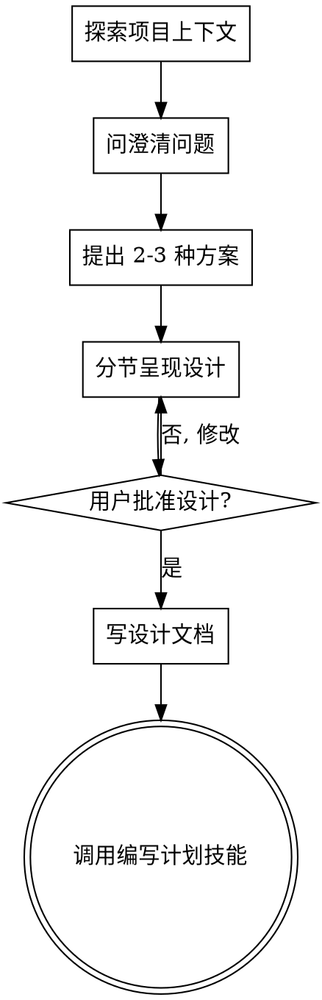

# 将想法转化为设计方案

## 概述

通过自然的协作对话，帮助将想法转化为完整的设计和规范。

首先了解当前项目上下文，然后逐一提问来完善想法。一旦理解了要构建的内容，呈现设计并获得用户批准。

<HARD-GATE>
在呈现设计并获得用户批准之前，不得调用任何实现技能、编写任何代码、搭建任何项目或采取任何实现行动。这适用于每个项目，不论感觉多简单。
</HARD-GATE>

## 反模式："这太简单了不需要设计"

每个项目都要走这个流程。一个 TODO 列表、一个单函数工具、一个配置更改——全都一样。"简单"项目恰恰是未审视的假设造成最多浪费的地方。设计可以很短（真正简单的项目只需几句话），但你必须呈现它并获得批准。

## 检查清单

你必须为以下每个项目创建待办事项，按顺序完成：

1. **探索项目上下文** — 查看文件、文档、最近提交
2. **问澄清问题** — 逐一提问，理解目的、约束、成功标准
3. **提出 2-3 种方案** — 说明权衡和你的推荐
4. **呈现设计** — 按复杂度分节，每节后获得用户批准
5. **写设计文档** — 保存到 `docs/plans/YYYY-MM-DD-<主题>-design.md` 并提交
6. **过渡到实现** — 调用 @编写计划 技能创建详细实现计划

## 流程图

**终态是调用编写计划。** 不要调用前端设计、MCP 构建器或任何其他实现技能。头脑风暴后你调用的唯一技能是编写计划。

## 流程

**理解想法：**
- 先查看当前项目状态（文件、文档、最近提交）
- 逐一提问来完善想法
- 尽可能使用选择题，开放式问题也可以
- 每条消息只问一个问题 - 如果话题需要深入探索，拆成多个问题
- 聚焦于理解：目的、约束、成功标准

**探索方案：**
- 提出 2-3 种不同方案并说明权衡
- 以对话方式呈现选项，给出推荐和理由
- 先说推荐方案，解释原因

**呈现设计：**
- 确信理解了要构建的内容后，开始呈现设计
- 按复杂度调整每节篇幅：简单直白的几句话，细微复杂的 200-300 字
- 每节后询问是否符合预期
- 涵盖：架构、组件、数据流、错误处理、测试
- 如有不清楚的地方，随时回头澄清

## 设计完成后

**文档化：**
- 将验证过的设计写入 `docs/plans/YYYY-MM-DD-<主题>-design.md`
- 确保文档简洁清晰
- 将设计文档提交到 git

**实现：**
- 调用 @编写计划 技能创建详细实现计划
- 不要调用任何其他技能。@编写计划 是下一步。

## 核心原则

- **逐一提问** - 不要用多个问题压倒用户
- **优先选择题** - 比开放式问题更容易回答
- **严格 YAGNI** - 从所有设计中移除不必要的功能
- **探索替代方案** - 总是提出 2-3 种方案后再决定
- **增量验证** - 分节呈现设计，逐节验证
- **保持灵活** - 有不清楚的地方就回头澄清
