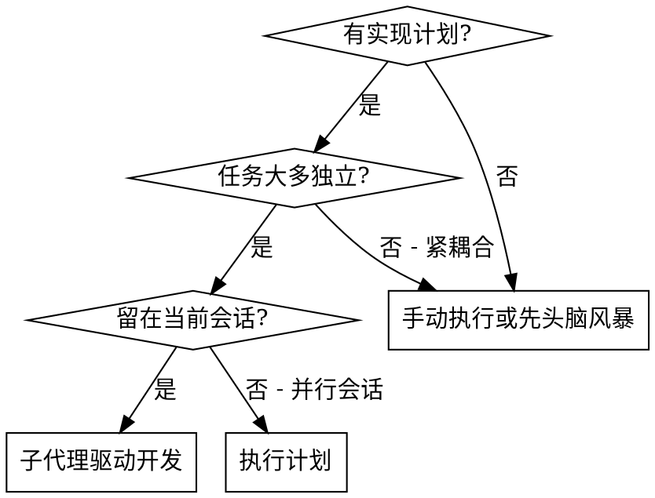
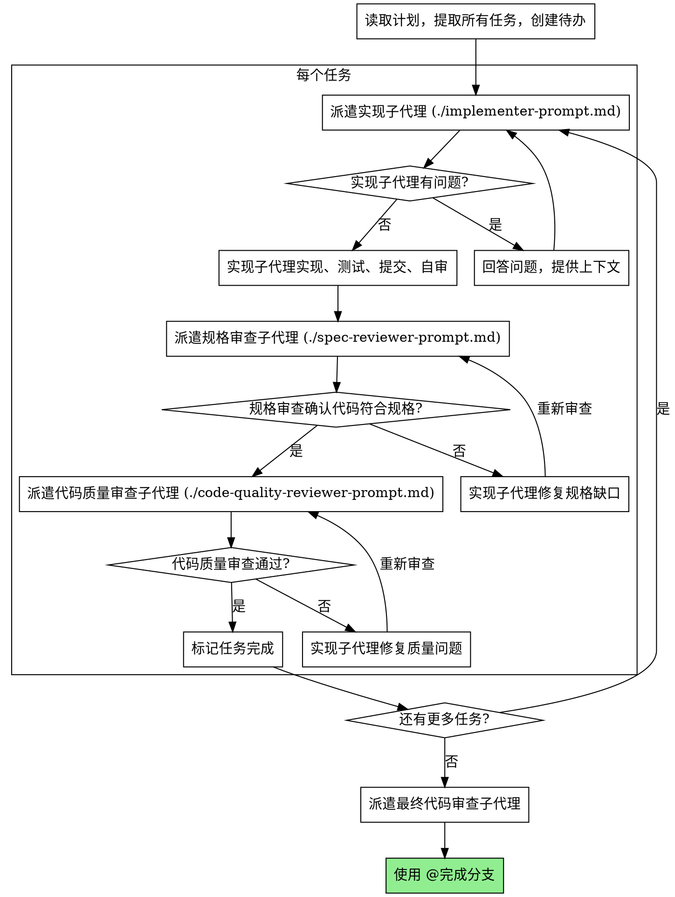

# 子代理驱动开发 (Subagent-Driven Development)

通过每个任务派遣新的子代理来执行计划，每个任务后进行两阶段审查：先规格合规审查 (spec compliance)，再代码质量审查 (code quality)。

**核心原则 (Core principle):** 每任务新子代理 + 两阶段审查（规格然后质量）= 高质量、快迭代

## 何时使用 (When to Use)



**vs. 执行计划（并行会话）(vs. Executing Plans):**
- 同一会话（无上下文切换）(Same session - no context switch)
- 每任务新子代理（无上下文污染）(Fresh subagent per task - no context pollution)
- 每任务后两阶段审查：先规格合规，再代码质量
- 更快迭代（任务间无人工介入）(Faster iteration - no human-in-loop)

## 流程 (The Process)



## Prompt 模板 (Prompt Templates)

- `./implementer-prompt.md` - 派遣实现子代理
- `./spec-reviewer-prompt.md` - 派遣规格合规审查子代理
- `./code-quality-reviewer-prompt.md` - 派遣代码质量审查子代理

**实现子代理 (Implementer subagent):**
```
任务: [完整任务文本]
上下文: [相关背景]
要求: 
1. 遵循 TDD（先测试后实现）
2. 完成后自审并提交
3. 有问题先问
```

**规格审查子代理 (Spec compliance reviewer):**
```
审查: 代码是否完全符合规格？
对比: [任务规格 vs 实现]
报告: 缺失内容 (Missing)、多余内容 (Extra)、偏差 (Deviation)
```

**代码质量审查子代理 (Code quality reviewer):**
```
审查: BASE_SHA..HEAD_SHA
关注: 代码质量、测试覆盖、可维护性
报告: Critical/Important/Minor 问题
```

## 示例工作流 (Example Workflow)

```
You: 我正在使用子代理驱动开发来执行这个计划。

[一次读取计划文件: docs/plans/feature-plan.md]
[提取所有 5 个任务的完整文本和上下文]
[创建待办事项列表]

任务 1: Hook 安装脚本

[获取任务 1 文本和上下文（已提取）]
[派遣实现子代理，提供完整任务文本 + 上下文]

Implementer: "开始前 - hook 应该安装在用户级还是系统级？"

You: "用户级 (~/.config/superpowers/hooks/)"

Implementer: "明白。正在实现..."
[稍后] Implementer:
  - 实现了 install-hook 命令
  - 添加了测试，5/5 通过
  - 自审: 发现遗漏了 --force 标志，已添加
  - 已提交

[派遣规格审查子代理]
Spec reviewer: ✅ 规格合规 - 所有需求满足，无多余内容

[获取 git SHAs, 派遣代码质量审查子代理]
Code reviewer: 优点: 测试覆盖好，干净。问题: 无。批准。

[标记任务 1 完成]

任务 2: 恢复模式

[派遣实现子代理]
Implementer: [无问题，继续]
Implementer:
  - 添加了 verify/repair 模式
  - 8/8 测试通过
  - 自审: 一切正常
  - 已提交

[派遣规格审查子代理]
Spec reviewer: ❌ 问题:
  - 缺失: 进度报告（规格说"每 100 项报告"）
  - 多余: 添加了 --json 标志（未请求）

[实现者修复问题]
Implementer: 移除了 --json 标志，添加了进度报告

[规格审查者再次审查]
Spec reviewer: ✅ 现在规格合规

[派遣代码质量审查子代理]
Code reviewer: 问题 (Important): 魔法数字 (100)

[实现者修复]
Implementer: 提取了 PROGRESS_INTERVAL 常量

[代码审查者再次审查]
Code reviewer: ✅ 批准

[标记任务 2 完成]

...

[所有任务完成后]
[派遣最终代码审查子代理]
Final reviewer: 所有需求满足，可以合并

Done!
```

## 优势 (Advantages)

**vs. 手动执行 (vs. Manual execution):**
- 子代理自然遵循 TDD (Subagents follow TDD naturally)
- 每任务新上下文（无混淆）(Fresh context per task)
- 并行安全（子代理不干扰）(Parallel-safe)
- 子代理可以提问（工作前和工作中）

**vs. 执行计划 (vs. Executing Plans):**
- 同一会话（无交接）(Same session - no handoff)
- 持续进展（无等待）(Continuous progress)
- 审查检查点自动化 (Review checkpoints automatic)

**效率提升 (Efficiency gains):**
- 无文件读取开销（控制器提供完整文本）
- 控制器精确策划需要的上下文
- 子代理一开始就获得完整信息
- 问题在工作开始前浮现（不是之后）

**质量门控 (Quality gates):**
- 自审在交接前捕获问题 (Self-review catches issues)
- 两阶段审查：规格合规，然后代码质量
- 审查循环确保修复实际有效
- 规格合规防止过度/不足构建 (over/under-building)
- 代码质量确保实现构建良好

**成本 (Cost):**
- 更多子代理调用（每任务 1 实现者 + 2 审查者）
- 控制器做更多准备工作（预先提取所有任务）
- 审查循环增加迭代
- 但早期捕获问题（比后面调试便宜）

## 危险信号 (Red Flags)

**永不 (Never):**
- 在未获得用户明确同意的情况下在 main/master 分支上开始实现 (Start implementation on main/master branch without explicit user consent)
- 跳过审查（规格合规或代码质量）
- 带着未修复问题继续
- 并行派遣多个实现子代理（冲突）
- 让子代理读取计划文件（改为提供完整文本）
- 跳过场景设置上下文（子代理需要理解任务位置）
- 忽略子代理问题（让他们继续前先回答）
- 接受规格合规的"差不多"（审查发现问题 = 未完成）
- 跳过审查循环（审查发现问题 = 实现者修复 = 再审查）
- 让实现者自审替代实际审查（两者都需要）
- **在规格合规 ✅ 之前开始代码质量审查**（顺序错误）
- 任一审查有未解决问题时移动到下一任务

**如果子代理提问 (If subagent asks questions):**
- 清楚完整地回答 (Answer clearly and completely)
- 需要时提供额外上下文
- 不要催促他们进入实现 (Don't rush them)

**如果审查者发现问题 (If reviewer finds issues):**
- 实现者（同一子代理）修复
- 审查者再次审查
- 重复直到批准
- 不要跳过重新审查 (Don't skip the re-review)

**如果子代理任务失败 (If subagent fails task):**
- 派遣修复子代理并提供具体指令
- 不要手动修复（上下文污染）

## 集成 (Integration)

**必需的工作流技能 (Required workflow skills):**
- `@git工作树` - **必须**: 在开始前设置隔离的工作区 (Set up isolated workspace before starting)
- `@编写计划` - 创建此技能执行的计划
- `@请求审查` - 代码审查模板
- `@完成分支` - 所有任务后完成开发

**子代理应使用 (Subagents should use):**
- `@TDD` - 子代理遵循测试驱动开发

**替代工作流 (Alternative workflow):**
- `@执行计划` - 用于并行会话而非同会话执行
