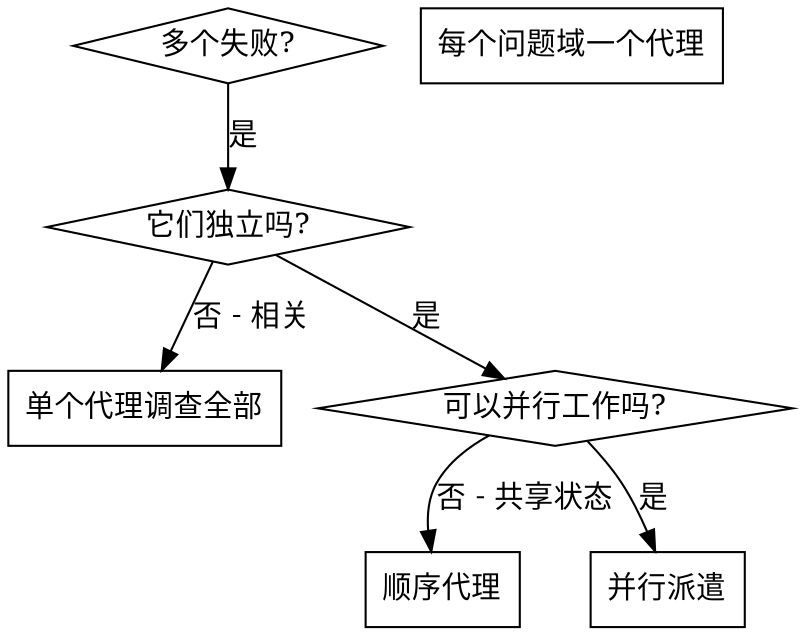

# 并行代理调度 (Dispatching Parallel Agents)

## 概述 (Overview)

当有多个不相关的失败（不同测试文件、不同子系统、不同 bug）时，顺序调查浪费时间。每个调查是独立的，可以并行进行。

**核心原则 (Core principle):** 每个独立问题域派遣一个代理。让它们并发工作。

## 何时使用 (When to Use)



**使用场景：**
- 3+ 个测试文件失败，有不同的根因
- 多个子系统独立损坏
- 每个问题可以在不了解其他问题的情况下理解
- 调查间无共享状态

**不要使用：**
- 失败相关（修复一个可能修复其他）
- 需要理解完整系统状态
- 代理会相互干扰

## 模式 (The Pattern)

### 1. 识别独立域 (Identify Independent Domains)

按问题分组：
- 文件 A 测试：工具审批流程
- 文件 B 测试：批次完成行为
- 文件 C 测试：中止功能

每个域独立 - 修复工具审批不影响中止测试。

### 2. 创建聚焦的代理任务 (Create Focused Agent Tasks)

每个代理获得：
- **具体范围 (Specific scope):** 一个测试文件或子系统
- **清晰目标 (Clear goal):** 让这些测试通过
- **约束 (Constraints):** 不要修改其他代码
- **预期输出 (Expected output):** 发现和修复内容的摘要

### 3. 并行派遣 (Dispatch in Parallel)

```typescript
// 在 Claude Code / AI 环境中
Task("Fix agent-tool-abort.test.ts failures")
Task("Fix batch-completion-behavior.test.ts failures")
Task("Fix tool-approval-race-conditions.test.ts failures")
// 所有三个并发运行
```

### 4. 审查和集成 (Review and Integrate)

代理返回时：
- 阅读每个摘要
- 验证修复不冲突
- 运行完整测试套件
- 集成所有更改

## 代理 Prompt 结构 (Agent Prompt Structure)

好的代理 prompt 是：
1. **聚焦 (Focused)** - 一个清晰的问题域
2. **自包含 (Self-contained)** - 理解问题所需的所有上下文
3. **明确输出 (Specific about output)** - 代理应返回什么？

```markdown
修复 src/agents/agent-tool-abort.test.ts 中的 3 个失败测试：

1. "should abort tool with partial output capture" - 期望消息中有 'interrupted at'
2. "should handle mixed completed and aborted tools" - 快速工具被中止而不是完成
3. "should properly track pendingToolCount" - 期望 3 个结果但得到 0

这些是时序/竞态条件问题。你的任务：

1. 阅读测试文件，理解每个测试验证什么
2. 找到根因 - 是时序问题还是实际 bug？
3. 修复方式：
   - 用基于事件的等待替换任意超时
   - 如发现中止实现的 bug 则修复
   - 如测试行为已变则调整测试期望

不要只增加超时 - 找到真正的问题。

返回：你发现了什么，修复了什么。
```

## 常见错误 (Common Mistakes)

**❌ 太宽泛 (Too broad):** "修复所有测试" - 代理会迷失
**✅ 具体 (Specific):** "修复 agent-tool-abort.test.ts" - 聚焦范围

**❌ 无上下文 (No context):** "修复竞态条件" - 代理不知道在哪
**✅ 有上下文 (Context):** 粘贴错误消息和测试名称

**❌ 无约束 (No constraints):** 代理可能重构一切
**✅ 有约束 (Constraints):** "不要更改生产代码"或"只修复测试"

**❌ 输出模糊 (Vague output):** "修复它" - 你不知道改了什么
**✅ 输出明确 (Specific):** "返回根因和更改摘要"

## 何时不使用 (When NOT to Use)

**相关失败 (Related failures):** 修复一个可能修复其他 - 先一起调查
**需要完整上下文 (Need full context):** 理解需要看整个系统
**探索性调试 (Exploratory debugging):** 你还不知道什么坏了
**共享状态 (Shared state):** 代理会干扰（编辑相同文件，使用相同资源）

## 实战示例 (Real Example from Session)

**场景 (Scenario):** 大重构后 3 个文件 6 个测试失败

**失败 (Failures):**
- agent-tool-abort.test.ts: 3 个失败（时序问题）
- batch-completion-behavior.test.ts: 2 个失败（工具未执行）
- tool-approval-race-conditions.test.ts: 1 个失败（执行计数 = 0）

**决策 (Decision):** 独立域 - 中止逻辑与批次完成与竞态条件分开

**派遣 (Dispatch):**
```
代理 1 → 修复 agent-tool-abort.test.ts
代理 2 → 修复 batch-completion-behavior.test.ts
代理 3 → 修复 tool-approval-race-conditions.test.ts
```

**结果 (Results):**
- 代理 1：用基于事件的等待替换超时
- 代理 2：修复事件结构 bug（threadId 位置错误）
- 代理 3：添加等待异步工具执行完成

**集成 (Integration):** 所有修复独立，无冲突，全套件绿色

**节省时间 (Time saved):** 3 个问题并行解决 vs 顺序

## 关键收益 (Key Benefits)

1. **并行化 (Parallelization)** - 多个调查同时进行
2. **聚焦 (Focus)** - 每个代理范围窄，跟踪上下文少
3. **独立 (Independence)** - 代理不相互干扰
4. **速度 (Speed)** - 3 个问题在 1 个问题的时间内解决

## 验证 (Verification)

代理返回后：
1. **审查每个摘要** - 理解什么改变了
2. **检查冲突** - 代理是否编辑了相同代码？
3. **运行完整套件** - 验证所有修复一起工作
4. **抽查** - 代理可能犯系统性错误

## 实战影响 (Real-World Impact)

来自调试会话 (2025-10-03)：
- 3 个文件 6 个失败
- 3 个代理并行派遣
- 所有调查并发完成
- 所有修复成功集成
- 代理更改间零冲突
