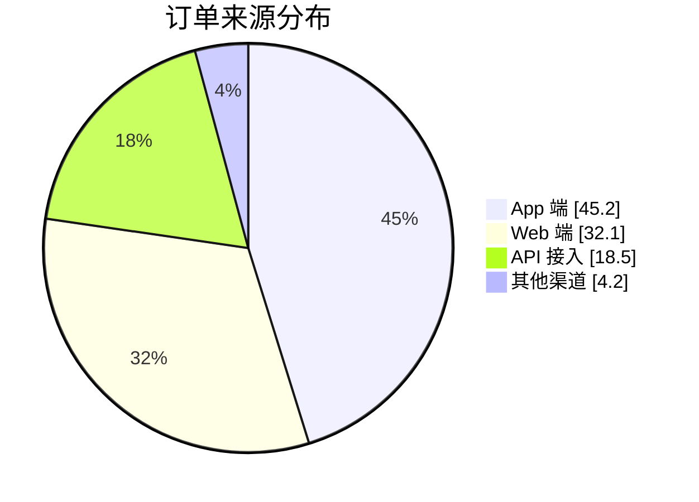
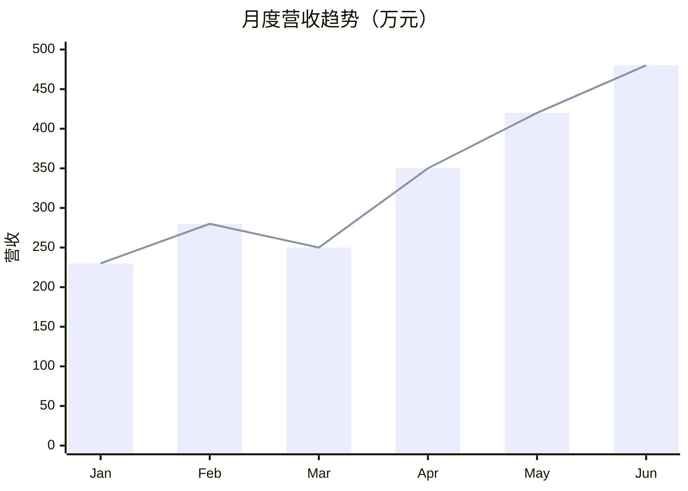
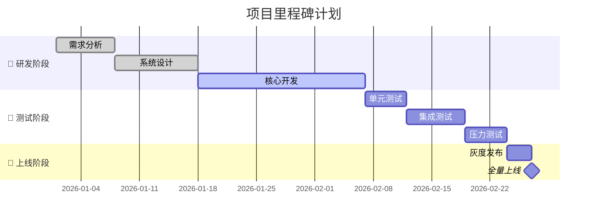
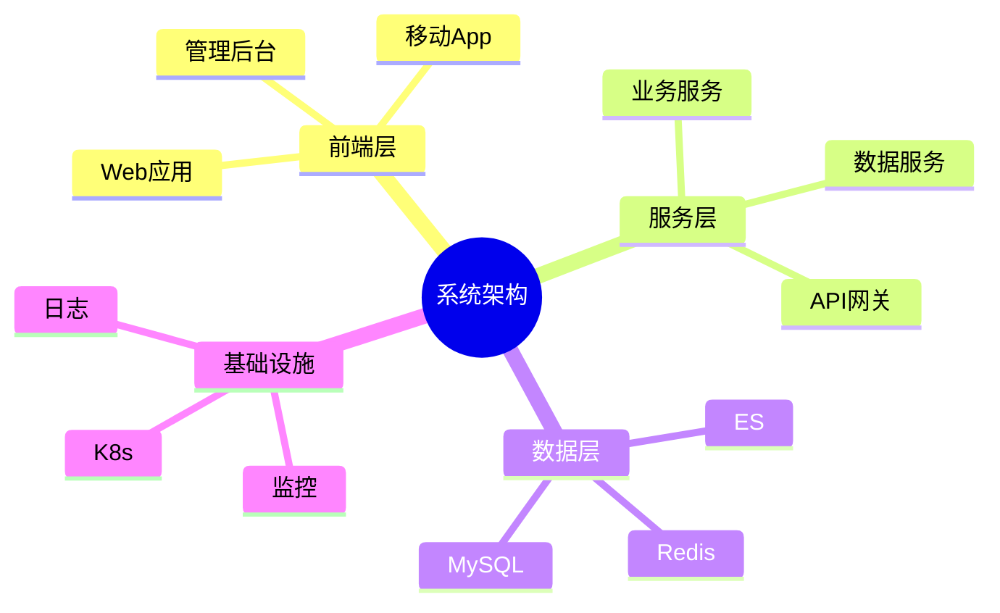
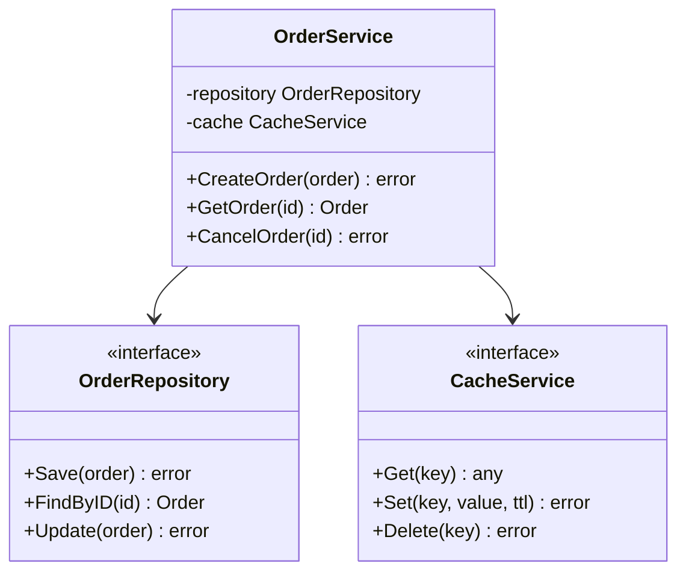
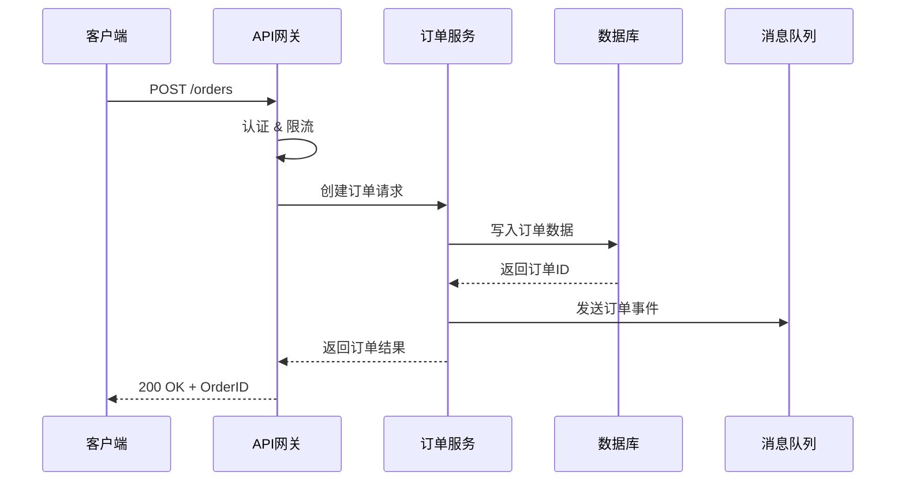
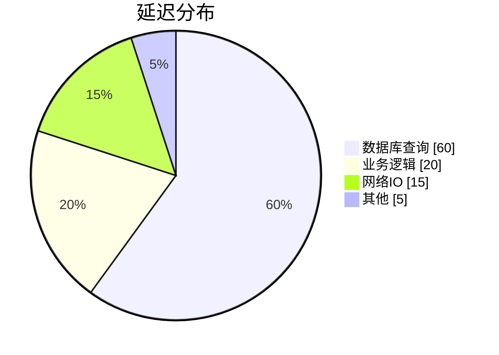
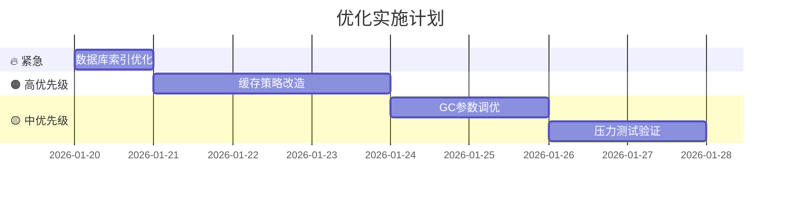

# Markdown 报告规范

> 🎯 **核心理念**：**清晰** · **美观** · **专业** · **数据驱动** **现代化风格**

> 🎯 **核心理念**：**清晰** · **美观** · **专业** · **数据驱动**
>
> **🚫 拒绝丑陋**：
> 1.  **拒绝文字墙**：每 3-4 行必须有空行或列表打断。
> 2.  **拒绝裸数据**：大于 3 个数据项必须使用 **表格** 或 **图表 (Mermaid)**。
> 3.  **拒绝黑白默片**：必须使用 Emoji (🟢/🔴/⚠️) 和 引用块 (`[!TIP]`) 增加视觉层级。

此技能指导创建专业级 Markdown 报告，避免粗糙的排版和混乱的数据呈现。每份报告都应该是**信息传达的艺术品**。

## 何时使用

在以下场景使用此技能：

- 撰写技术分析报告
- 创建项目进度汇报
- 编写性能测试报告
- 设计系统架构文档
- 制作数据分析报告
- 编写知识库文档
- 生成自动化报告模板

---

## 第一部分：文档结构设计

### 1.1 标准报告骨架

每份专业报告应包含以下核心模块：

```markdown
# 📊 [报告标题]

> **摘要**：一句话概括报告的核心发现和价值

| 元信息 | 内容 |
|:-------|:-----|
| 版本 | v1.0.0 |
| 作者 | 张三 |
| 日期 | 2026-01-20 |
| 状态 | ✅ 已发布 |

---

## 📋 目录

## 1. 执行摘要
## 2. 背景与目标
## 3. 方法论
## 4. 核心发现
## 5. 详细分析
## 6. 结论与建议
## 7. 附录

---

*最后更新：2026-01-20 08:00*
```

### 1.2 元信息表规范

| 字段 | 格式规范 | 示例 |
|:-----|:---------|:-----|
| **标题** | 简洁明确，不超过20字 | 2026年Q1交易系统性能分析报告 |
| **版本** | 语义化版本 SemVer | `v1.2.0` / `v0.9.0-beta` |
| **作者** | 姓名或团队 | 张工 / 性能优化组 |
| **日期** | ISO 8601 格式 | `2026-01-20` |
| **状态** | Emoji + 状态词 | 📝 草稿 / ✅ 发布 / 🔄 更新中 / 📦 归档 |
| **审阅人** | 可选，需审核时添加 | 李经理 |
| **机密级别** | 可选，敏感报告添加 | 🔒 内部 / ⚠️ 机密 |

### 1.3 摘要写作规范

> [!IMPORTANT]
> 摘要是报告的"电梯演讲"——30秒内让读者理解核心价值。

**结构公式**：`[背景/问题] + [关键发现] + [核心建议/价值]`

```markdown
<!-- ❌ 不好的摘要 -->
> 本报告分析了系统性能。

<!-- ✅ 好的摘要 -->
> 本报告对交易系统进行了全面性能审计，发现 **3个关键瓶颈**（数据库查询、
> 缓存命中率、GC停顿），通过针对性优化可将 **P99延迟降低67%**，
> 预计年化节省服务器成本 **¥120万**。
```

---

## 第二部分：标题与层级系统

### 2.1 标题层级规范

```
# H1 — 文档主标题（每文档仅一个，配合 Emoji）
## H2 — 章节标题（带编号，主要结构单元）
### H3 — 小节标题（详细分解）
#### H4 — 细分内容（必要时使用）
##### H5 — 补充说明（极少使用，考虑用其他方式）
```

**最佳实践**：
- 层级深度不超过 **4 级**
- 章节标题添加 **数字编号**（`## 1.`、`## 2.`）
- 主标题可添加 **主题 Emoji**

### 2.2 标题命名对比

| ❌ 避免 | ✅ 推荐 | 原因 |
|:--------|:--------|:-----|
| `## 性能` | `## 3. 性能分析` | 添加编号便于引用 |
| `### 响应时间` | `### 3.1 响应时间指标` | 层级清晰，语义完整 |
| `## 一些发现` | `## 📈 核心指标发现` | 具体化，添加视觉标记 |
| `### 结果1` | `### 数据库优化效果` | 描述性标题传达信息 |

### 2.3 章节 Emoji 指南

使用恰当的 Emoji 作为视觉锚点，提升阅读体验：

| 场景类型 | 推荐 Emoji | 使用示例 |
|:---------|:-----------|:---------|
| **概述/总览** | 📋 📊 🎯 | `## 📋 执行摘要` |
| **分析/数据** | 📈 📉 🔍 | `## 📈 性能分析` |
| **配置/设置** | ⚙️ 🔧 🛠️ | `## ⚙️ 系统配置` |
| **安全/告警** | 🔒 ⚠️ 🛡️ | `## 🔒 安全审计` |
| **进度/时间** | ⏰ 📅 🗓️ | `## 📅 项目里程碑` |
| **代码/技术** | 💻 🖥️ 📦 | `## 💻 技术实现` |
| **结论/建议** | 💡 ✨ 🎯 | `## 💡 建议措施` |
| **附录/参考** | 📚 📖 📎 | `## 📚 附录` |

---

## 第三部分：数据表格规范

### 3.1 表格对齐原则

```markdown
| 左对齐（文本）   | 居中对齐（标签） | 右对齐（数值）  |
|:-----------------|:----------------:|----------------:|
| 描述性文字       | 状态标签         | 12,345.67       |
```

**黄金法则**：

| 数据类型 | 对齐方式 | 语法 | 原因 |
|:---------|:--------:|:-----|:-----|
| 文本/描述 | ⬅️ 左对齐 | `:---` | 符合阅读习惯 |
| 标签/状态 | ⬛ 居中 | `:---:` | 视觉平衡 |
| 数字/金额 | ➡️ 右对齐 | `---:` | 便于对比数位 |
| 日期/时间 | ⬛ 居中 | `:---:` | 格式统一 |

### 3.2 数值格式化标准

| 数据类型 | 格式规范 | ❌ 错误 | ✅ 正确 |
|:---------|:---------|:--------|:--------|
| **整数** | 千分位分隔 | `1234567` | `1,234,567` |
| **小数** | 统一精度（2-4位） | `0.1`, `0.123456` | `0.10`, `0.1235` |
| **百分比** | 带%符号，1-2位小数 | `0.9812` | `98.12%` |
| **金额** | 货币符号 + 千分位 | `12345` | `¥ 12,345.00` |
| **大数** | K/M/B 缩写 | `1234567890` | `1.23B` 或 `12.35亿` |
| **时间** | 统一单位 | `0.245秒` | `245 ms` 或 `245ms` |
| **字节** | 自适应单位 | `1073741824` | `1.00 GB` |
| **变化率** | 带正负号 | `21.7` | `+21.7%` / `-5.3%` |

### 3.3 状态指示器系统

#### 圆形指示器（推荐）

| 符号 | 语义 | 适用场景 | 阈值建议 |
|:----:|:-----|:---------|:---------|
| 🟢 | 正常/达标/健康 | 指标在目标范围内 | ≥ 目标值 |
| 🟡 | 警告/关注/临界 | 接近阈值，需关注 | 80%-100% 目标值 |
| 🔴 | 异常/告警/危险 | 超出阈值，需处理 | < 80% 目标值 |
| ⚪ | 无数据/不适用 | 数据缺失或不相关 | N/A |

#### 趋势指示器

| 符号 | 语义 | 使用场景 |
|:----:|:-----|:---------|
| ⬆️ | 上升（正面） | 营收、效率提升 |
| ⬇️ | 下降（正面） | 成本、延迟降低 |
| 🔺 | 上升（负面） | 错误率、故障增加 |
| 🔻 | 下降（负面） | 用户量、收入减少 |
| ➡️ | 持平 | 无明显变化 |

#### 优先级指示器

| 符号 | 级别 | 含义 |
|:----:|:-----|:-----|
| 🔥 | P0 | 紧急/阻塞性问题 |
| 🟠 | P1 | 高优先级 |
| 🟡 | P2 | 中优先级 |
| 🟢 | P3 | 低优先级 |

### 3.4 综合表格示例

#### ✅ 规范的指标对比表

| 指标名称 | 本期值 | 上期值 | 环比变化 | 状态 | 趋势 |
|:---------|-------:|-------:|---------:|:----:|:----:|
| 日活用户 | 125,678 | 98,432 | +27.7% | 🟢 | ⬆️ |
| 订单量 | 45,123 | 42,567 | +6.0% | 🟢 | ⬆️ |
| 平均延迟 | 45.2 ms | 52.1 ms | -13.2% | 🟢 | ⬇️ |
| 错误率 | 0.12% | 0.05% | +140.0% | 🔴 | 🔺 |
| 缓存命中率 | 94.5% | 95.2% | -0.7% | 🟡 | ➡️ |

#### ✅ 规范的任务进度表

| 任务 | 负责人 | 开始日期 | 截止日期 | 进度 | 状态 |
|:-----|:------:|:--------:|:--------:|-----:|:----:|
| 数据库优化 | 张三 | 01-10 | 01-20 | 100% | ✅ |
| 缓存改造 | 李四 | 01-15 | 01-25 | 75% | 🔄 |
| 压力测试 | 王五 | 01-20 | 01-30 | 30% | 🔄 |
| 文档更新 | 赵六 | 01-25 | 02-05 | 0% | ⏳ |

### 3.5 仪表盘卡片布局 (Dashboard Cards) ⭐

> [!TIP]
> 拒绝枯燥的列表！使用表格模拟"数据看板"效果，将核心指标置顶展示。

| 👥 活跃用户 | 💰 本月营收 | 📉 平均耗时 | ⚡️ 系统 QPS |
|:---:|:---:|:---:|:---:|
| **125,403** | **¥ 452,000** | **45ms** | **2,500** |
| 🟢 +12.5% | 🟢 +8.3% | 🟢 -15% | 🟡 +20% |

### 3.6 复杂表格处理

#### 宽表格处理

当表格过宽时，使用 HTML `<div>` 包裹并居中：

```html
<div align="center">

| 很长的列名称A | 很长的列名称B | 很长的列名称C | 很长的列名称D |
|:--------------|:--------------|:--------------|:--------------|
| 数据 | 数据 | 数据 | 数据 |

</div>
```

#### 合并单元格替代

Markdown 不支持单元格合并，使用分组标题替代：

```markdown
### 分类 A 指标

| 指标 | 数值 | 状态 |
|:-----|-----:|:----:|
| A-1 | 100 | 🟢 |
| A-2 | 200 | 🟢 |

### 分类 B 指标

| 指标 | 数值 | 状态 |
|:-----|-----:|:----:|
| B-1 | 300 | 🟡 |
| B-2 | 400 | 🔴 |
```

---

## 第四部分：数据可视化

### 4.1 Mermaid 图表库

> [!TIP]
> Mermaid 是 Markdown 中最强大的可视化工具，支持 10+ 种图表类型。

#### 📊 饼图 — 占比分析



#### 📈 XY 图表 — 趋势分析



#### 🔄 流程图 — 流程说明


#### 🗓️ 甘特图 — 项目进度



#### 🗺️ 思维导图 — 结构展示



#### 📦 类图 — 架构设计



#### ⏱️ 时序图 — 交互流程



### 4.2 文本图表（ASCII Art）

当 Mermaid 不可用时，使用 ASCII 图表：

#### 趋势图

```
响应时间趋势 (ms)
│
80 ┤                              
60 ┤      ╭──────╮                
40 ┤──────╯      ╰────╮    优化前 ········
20 ┤                  ╰────────── 优化后 ──
 0 ┼───┬───┬───┬───┬───┬───┬───►
   W1  W2  W3  W4  W5  W6  W7
```

#### 柱状图

```
CPU 使用率分布

100% |
 90% | ██
 80% | ██ ██
 70% | ██ ██ ██
 60% | ██ ██ ██ ██
 50% | ██ ██ ██ ██ ██
     +-----------------------------
       00h  06h  12h  18h  24h
```

#### 树形结构

```
project/
├── cmd/
│   └── server/
│       └── main.go
├── internal/
│   ├── handler/
│   │   ├── order.go
│   │   └── user.go
│   ├── service/
│   │   ├── order.go
│   │   └── user.go
│   └── repository/
│       └── mysql/
└── pkg/
    ├── logger/
    └── config/
```

---

## 第五部分：代码与技术内容

### 5.1 代码块规范

```markdown
<!-- 基本语法 -->
```language
代码内容
``` 

<!-- 带文件名 -->
```go title="internal/service/order.go"
func CreateOrder(ctx context.Context, req *OrderRequest) error {
    // ...
}
```
```

### 5.2 常用语言标识

| 语言/格式 | 标识符 | 语言/格式 | 标识符 |
|:----------|:-------|:----------|:-------|
| Go | `go` | Python | `python` |
| TypeScript | `typescript`/`ts` | JavaScript | `javascript`/`js` |
| SQL | `sql` | Bash/Shell | `bash`/`sh` |
| JSON | `json` | YAML | `yaml` |
| HTML | `html` | CSS | `css` |
| Markdown | `markdown`/`md` | Diff | `diff` |

### 5.3 代码注释规范

```go
// CalculateSMA 计算简单移动平均线
//
// 算法复杂度：O(n)，使用滑动窗口优化
//
// 参数：
//   - prices: 价格序列，要求长度 >= period
//   - period: 计算周期，必须 > 0
//
// 返回：
//   - SMA 值序列，长度 = len(prices) - period + 1
//   - 如果输入无效返回 error
func CalculateSMA(prices []float64, period int) ([]float64, error) {
    if period <= 0 {
        return nil, errors.New("period must be positive")
    }
    // 实现逻辑...
}
```

### 5.4 Diff 展示变更

```diff
  func processOrder(ctx context.Context, order *Order) error {
-     // 旧的实现：直接查询数据库
-     result, err := db.Query("SELECT * FROM orders WHERE id = ?", order.ID)
+     // 新的实现：先查缓存
+     result, err := cache.Get(ctx, fmt.Sprintf("order:%s", order.ID))
+     if err == cache.ErrNotFound {
+         result, err = db.Query("SELECT * FROM orders WHERE id = ?", order.ID)
+     }
      if err != nil {
          return fmt.Errorf("get order: %w", err)
      }
      // ...
  }
```

### 5.5 命令行输出

```bash
# 构建项目
$ go build -o bin/server ./cmd/server
Building for linux/amd64...
✓ Build successful

# 运行测试
$ go test -v ./...
=== RUN   TestOrderService_Create
--- PASS: TestOrderService_Create (0.02s)
=== RUN   TestOrderService_Cancel
--- PASS: TestOrderService_Cancel (0.01s)
PASS
ok      github.com/project/internal/service    0.123s

# 性能测试结果
$ go test -bench=. -benchmem
BenchmarkSMA-8     5000000    234 ns/op    0 B/op    0 allocs/op
```

---

## 第六部分：GitHub 警示框

### 6.1 五种警示类型

> [!NOTE]
> **说明**：提供背景信息、补充说明或实现细节。用于帮助读者理解上下文，不影响主要操作。

> [!TIP]
> **技巧**：性能优化建议、最佳实践或效率提升方法。提供可选的改进方案。

> [!IMPORTANT]
> **重要**：必须了解的关键信息、核心步骤或必要条件。跳过这些可能导致任务失败。

> [!WARNING]
> **警告**：破坏性变更、兼容性问题或潜在风险。需要额外注意，但不会造成不可逆影响。

> [!CAUTION]
> **危险**：高风险操作，可能导致数据丢失、安全漏洞或系统故障。操作前务必确认后果。

### 6.2 使用原则

| 规则 | ❌ 避免 | ✅ 推荐 |
|:-----|:--------|:--------|
| 适度使用 | 每段都放警示框 | 每节最多 1-2 个 |
| 不连续 | 连续放置多个警示框 | 警示框间有正文分隔 |
| 不嵌套 | 警示框内放代码块/表格 | 保持内容简洁 |
| 有价值 | 用于普通说明 | 真正重要时才使用 |

### 6.3 场景选择指南

```
是否影响系统安全或数据？
├── 是 → [!CAUTION] 危险
└── 否
    └── 是否可能导致问题？
        ├── 是 → [!WARNING] 警告
        └── 否
            └── 是必须知道的信息吗？
                ├── 是 → [!IMPORTANT] 重要
                └── 否
                    └── 是否提供更好的方式？
                        ├── 是 → [!TIP] 技巧
                        └── 否 → [!NOTE] 说明
```

---

## 第七部分：排版美化技巧

### 7.1 分隔与间距

```markdown
---                           <!-- 章节分隔，水平线 -->

<br>                          <!-- 增加段落间距 -->

&nbsp;                        <!-- 行内空格（非换行空格） -->

<!-- 空行控制 -->
段落一

段落二（上方一个空行）


段落三（上方两个空行，更大间距）
```

### 7.2 文本强调样式

| 样式 | 语法 | 效果 | 适用场景 |
|:-----|:-----|:-----|:---------|
| **粗体** | `**文本**` | **文本** | 重点词汇、关键概念 |
| *斜体* | `*文本*` | *文本* | 术语、引用、强调 |
| ~~删除线~~ | `~~文本~~` | ~~文本~~ | 废弃内容、旧版本 |
| `行内代码` | `` `代码` `` | `代码` | 变量名、函数名、命令 |
| ***粗斜体*** | `***文本***` | ***文本*** | 极度强调（慎用） |

### 7.3 列表规范

#### 无序列表（层级不超过3级）

```markdown
- 一级项目
  - 二级项目
    - 三级项目（最深层级）
  - 另一个二级项目
- 另一个一级项目
```

#### 有序列表

```markdown
1. 第一步：准备环境
2. 第二步：配置参数
   1. 子步骤 A：数据库配置
   2. 子步骤 B：缓存配置
3. 第三步：启动服务
```

#### 任务清单

```markdown
- [x] ✅ 已完成：数据库迁移
- [/] 🔄 进行中：API 开发（75%）
- [ ] ⏳ 待开始：单元测试
- [ ] 📋 待评审：文档更新
```

### 7.4 引用块样式

#### 标准引用

> 这是一段重要的引用内容，用于强调外部来源的观点或数据。

#### 带出处的引用

> 💬 **专家观点**
>
> "过早优化是万恶之源，但也不要忽视明显的性能问题。"
>
> — *Donald Knuth, 《计算机程序设计艺术》*

#### 高亮引用块

> 📌 **关键结论**
>
> 通过本次优化，系统性能提升显著：
> - P99 延迟：**降低 67%**（150ms → 50ms）
> - 吞吐量：**提升 3 倍**（1000 QPS → 3000 QPS）
> - 错误率：**降低 90%**（0.5% → 0.05%）

### 7.5 快捷键展示

使用 `<kbd>` 标签展示键盘快捷键：

| 操作 | 快捷键 |
|:-----|:-------|
| 保存 | <kbd>Ctrl</kbd> + <kbd>S</kbd> |
| 撤销 | <kbd>Ctrl</kbd> + <kbd>Z</kbd> |
| 终端 | <kbd>Ctrl</kbd> + <kbd>`</kbd> |
| 命令面板 | <kbd>Ctrl</kbd> + <kbd>Shift</kbd> + <kbd>P</kbd> |

### 7.6 折叠内容

```html
<details>
<summary>📁 点击展开详细日志</summary>

这里是详细的日志内容...

```
2026-01-20 08:00:00 [INFO] Server started
2026-01-20 08:00:01 [INFO] Database connected
2026-01-20 08:00:02 [INFO] Cache initialized
```

</details>
```

效果：

<details>
<summary>📁 点击展开详细日志</summary>

这里是详细的日志内容...

</details>

---

## 第八部分：专业报告模板

### 8.1 技术分析报告模板

````markdown
# 📊 [系统名称] 技术分析报告

> **摘要**：[核心发现] + [关键数据] + [主要建议]

| 元信息 | 内容 |
|:-------|:-----|
| 版本 | v1.0.0 |
| 作者 | [姓名] |
| 日期 | YYYY-MM-DD |
| 状态 | ✅ 已发布 |

---

## 📋 目录

1. [执行摘要](#1-执行摘要)
2. [分析背景](#2-分析背景)
3. [核心发现](#3-核心发现)
4. [详细分析](#4-详细分析)
5. [建议措施](#5-建议措施)
6. [附录](#6-附录)

---

## 1. 执行摘要

### 1.1 核心指标概览

| 指标 | 当前值 | 目标值 | 差距 | 状态 |
|:-----|-------:|-------:|-----:|:----:|
| P99 延迟 | 150 ms | 100 ms | +50% | 🔴 |
| 吞吐量 | 1,000 QPS | 2,000 QPS | -50% | 🔴 |
| 错误率 | 0.05% | 0.10% | -50% | 🟢 |
| CPU 使用率 | 75% | 80% | -5% | 🟢 |

### 1.2 核心结论

> [!IMPORTANT]
> **发现 3 个关键问题，需优先处理**

1. **数据库慢查询**：占总延迟 60%，需索引优化
2. **缓存命中率低**：仅 72%，目标 95%
3. **GC 停顿频繁**：P99 停顿 50ms，需调优

---

## 2. 分析背景

### 2.1 分析范围

- **系统**：交易核心服务
- **模块**：订单服务、支付服务、风控服务
- **时间范围**：2026-01-01 ~ 2026-01-15
- **数据来源**：Prometheus、Jaeger、MySQL slow log

### 2.2 分析方法


---

## 3. 核心发现

### 3.1 发现一：数据库慢查询

**问题描述**：
订单查询接口 P99 延迟 150ms，其中 SQL 执行占 90ms（60%）。

**根因分析**：
- `orders` 表缺少复合索引
- 关联查询未使用覆盖索引
- 分页查询使用 OFFSET 方式

**影响范围**：
- 影响接口：`/api/orders`、`/api/orders/{id}`
- 影响用户：所有订单查询场景

### 3.2 发现二：缓存命中率低

| 缓存类型 | 当前命中率 | 目标命中率 | 状态 |
|:---------|----------:|----------:|:----:|
| 用户缓存 | 85% | 95% | 🟡 |
| 订单缓存 | 72% | 95% | 🔴 |
| 配置缓存 | 99% | 95% | 🟢 |

---

## 4. 详细分析

### 4.1 性能瓶颈分析

[详细分析内容，配合图表]



### 4.2 资源使用分析

[资源使用详情...]

---

## 5. 建议措施

### 5.1 优先级矩阵

| 优先级 | 措施 | 预期收益 | 工作量 | 负责人 |
|:------:|:-----|:---------|:-------|:------:|
| 🔥 P0 | 添加数据库索引 | 延迟 -40% | 1天 | 张三 |
| 🟠 P1 | 优化缓存策略 | 命中率 +20% | 3天 | 李四 |
| 🟡 P2 | 调优 GC 参数 | GC停顿 -30% | 2天 | 王五 |

### 5.2 实施路线图



---

## 6. 附录

### 6.1 术语表

| 术语 | 定义 |
|:-----|:-----|
| P99 | 第99百分位延迟，99%请求的响应时间 |
| QPS | 每秒查询数（Queries Per Second） |
| GC | 垃圾回收（Garbage Collection） |

### 6.2 参考资料

- [MySQL 索引优化指南](链接)
- [Redis 缓存最佳实践](链接)
- [Go GC 调优文档](链接)

### 6.3 附件清单

| 文件名 | 说明 |
|:-------|:-----|
| `slow_query.log` | 慢查询日志 |
| `perf_report.html` | 性能分析报告 |
| `trace.json` | 链路追踪数据 |

---

<div align="center">

📄 **报告结束**

*生成时间：`YYYY-MM-DD HH:mm:ss` | 工具版本：`v1.0.0`*

</div>
````

### 8.2 项目进度报告模板

````markdown
# 📅 [项目名称] 周报 / 月报

> **本期亮点**：[1-2句核心进展]

| 元信息 | 内容 |
|:-------|:-----|
| 报告周期 | YYYY-MM-DD ~ YYYY-MM-DD |
| 报告人 | [姓名] |
| 项目状态 | 🟢 正常 / 🟡 有风险 / 🔴 延期 |

---

## 📊 整体进度

```
████████████████████░░░░░░░░░░ 65%
```

| 阶段 | 计划进度 | 实际进度 | 状态 |
|:-----|:--------:|:--------:|:----:|
| 需求分析 | 100% | 100% | ✅ |
| 系统设计 | 100% | 100% | ✅ |
| 开发实现 | 80% | 65% | 🟡 |
| 测试验收 | 0% | 0% | ⏳ |

---

## ✅ 本期完成

- [x] 完成订单模块核心开发
- [x] 完成支付接口联调
- [x] 修复 5 个高优 Bug

## 🔄 进行中

- [ ] 用户模块开发（进度 70%）
- [ ] 接口文档编写（进度 50%）

## 📋 下期计划

- [ ] 完成用户模块开发
- [ ] 开始集成测试
- [ ] 准备压力测试环境

---

## ⚠️ 风险与阻塞

| 问题 | 影响 | 解决方案 | 负责人 | 状态 |
|:-----|:-----|:---------|:------:|:----:|
| 第三方接口延迟 | 影响联调进度 | 协调供应商加速 | 张三 | 🔄 |
| 测试环境不足 | 可能影响测试 | 申请扩容 | 李四 | ✅ |

---

## 📈 关键指标

| 指标 | 本期 | 上期 | 趋势 |
|:-----|-----:|-----:|:----:|
| 代码提交数 | 156 | 142 | ⬆️ |
| Bug 修复数 | 23 | 18 | ⬆️ |
| 代码覆盖率 | 78% | 72% | ⬆️ |

---

*报告时间：YYYY-MM-DD*
````

---

## 第九部分：检查清单

### 9.1 结构检查

- [ ] 文档有清晰的主标题和摘要
- [ ] 元信息表完整（版本、作者、日期、状态）
- [ ] 章节标题有编号，层级不超过 4 级
- [ ] 目录与正文标题一致

### 9.2 数据规范检查

- [ ] 数值使用千分位分隔
- [ ] 百分比统一精度
- [ ] 表格对齐正确（文本左、标签中、数字右）
- [ ] 状态指示器使用一致
- [ ] 变化率带正负号

### 9.3 可视化检查

- [ ] Mermaid 图表渲染正确
- [ ] 图表有标题说明
- [ ] 配色协调不刺眼
- [ ] 复杂流程用图表而非纯文本

### 9.4 排版美化检查

- [ ] 章节间有分隔线 `---`
- [ ] 警示框使用适度（每节 ≤ 2 个）
- [ ] 代码块有语言标识
- [ ] 链接可点击且有效
- [ ] Emoji 使用恰当不过度

### 9.5 专业性检查

- [ ] 术语定义清晰
- [ ] 数据来源可追溯
- [ ] 结论有数据支撑
- [ ] 建议可执行

---

## 📚 附录：快速参考

### A. Markdown 语法速查

| 功能 | 语法 |
|:-----|:-----|
| 粗体 | `**text**` |
| 斜体 | `*text*` |
| 链接 | `[text](url)` |
| 图片 | `` |
| 代码 | `` `code` `` |
| 引用 | `> quote` |
| 表格 | `\| col \|` |
| 任务 | `- [ ] task` |
| 分隔 | `---` |

### B. 状态符号速查

| 用途 | 符号组 |
|:-----|:-------|
| 健康状态 | 🟢 🟡 🔴 ⚪ |
| 趋势方向 | ⬆️ ⬇️ ➡️ 🔺 🔻 |
| 优先级 | 🔥 🟠 🟡 🟢 |
| 任务状态 | ✅ 🔄 ⏳ ❌ |
| 文档状态 | 📝 ✅ 🔄 📦 |

### C. 文件命名规范

```
[日期]_[类型]_[主题]_v[版本].md

示例：
2026-01-20_分析报告_交易系统性能审计_v1.0.md
2026-01-20_技术方案_数据库分库分表设计_v2.1.md
2026-01-20_周报_开发进度汇报_W03.md
```

---

<div align="center">

**📖 Markdown 报告规范 v2.0**

*让每份报告都成为专业的数据艺术品*

🎯 清晰 · 📊 美观 · 💼 专业 · 📈 数据驱动

</div>


---

## ⚠️ 强制输出 Token 空间

> **重要规则**：使用此技能时，必须在每次重要输出前检查上下文空间。

### 输出规范

所有对话回复内容都要输出

### 输出格式

```
📊 剩余上下文空间: ~{百分比}%
```

### 告警与自动保存

**当剩余上下文空间 ≤ 30%（即已使用 ≥ 70%）时，必须执行：**

1. **立即暂停当前工作**
2. **保存工作进度**：创建 `.agent/workflows/checkpoint-{timestamp}.md`
3. **通知用户**：
   ```
   ⚠️ 上下文空间即将耗尽 (剩余 ~{百分比}%)
   📋 工作进度已保存至: .agent/workflows/checkpoint-{timestamp}.md
   请检查后决定是否继续或开启新对话
   ```
