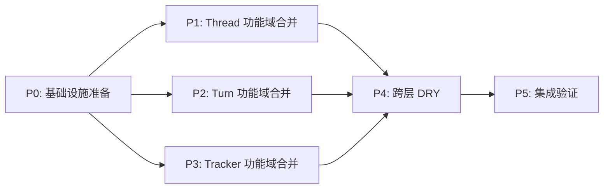

# Codexadapter DRY 合并重构

> 基于仓库 2026-02-26 02:00 实际文件状态

## 概览

| 属性 | 值 |
|------|-----|
| 当前文件 | 81 生产 + 9 测试 = 90 总计 |
| 目标文件 | **不设硬性数量（18 为参考值）** |
| 当前有效行 | 6054 |
| 目标有效行 | **显著下降（以可读性与稳定性为准）** |
| 可并行任务 | P1, P2, P3 |
| 串行依赖 | P0 → [P1,P2,P3] → P4 → P5 |

## 新增硬约束（必须遵守）

1. 合并必须按代码功能域，不按原文件名机械拼接。
2. 文件数不是硬指标，18 仅作为收敛参考，不得为凑数牺牲职责边界。
3. 同一功能层必须统一命名风格：
   - thread 层：`thread_*.go`
   - turn 层：`turn_*.go`（含 `slash_command.go`）
   - tracker 层：`turn_tracker*.go`
4. 命名优先表达职责（如 lifecycle/listing/archive/runtime/prepare/event/stall），避免无语义编号名。
5. 功能必须等价：除非显式记录为“行为修复”，禁止改变外部可观测行为。
6. 无回归约束：公共方法签名、事件名、payload key、错误语义保持兼容。

## 任务依赖图

## 任务清单

- [ ] P0: 基础设施准备 (串行, 3 文件)
- [ ] P1: Thread 功能域合并 ⚡ (37 生产 + 4 测试)
- [ ] P2: Turn 功能域合并 ⚡ (23 生产 + 3 测试)
- [ ] P3: Tracker 功能域合并 ⚡ (18 生产 + 2 测试)
- [ ] P4: 跨层 DRY 优化 (串行)
- [ ] P5: 集成验证 + 清理 (串行)
- [ ] `compatibility-checklist.md` + `baseline/` — P5 步骤 6.1 依赖，P0 创建

## 全覆盖约束（必须满足）

1. `internal/apiserver/codexadapter/*.go`（含测试）必须 100% 归属到某个阶段。
2. 允许按主题拆并文件，但不允许出现“无人负责文件”。
3. P5 必须执行“零遗漏检查”，未归属文件数必须为 0。

## 文件分配矩阵

> 所有文件位于 `internal/apiserver/codexadapter/`
> 本矩阵用于“按主题功能合并”，不是按来源文件名搬运。

### P0 基础设施任务包（串行）

| 主题 | 职责 | 产物（命名约束） |
|:-----|:-----|:----------------|
| adapter 基座 | deps 默认值、accessor、通用校验与日志字段工具 | `adapter.go`、`runtime_context.go` |
| client 委托 | client 访问门面收敛 | 合入 `adapter.go` 并删除 `adapter_client.go`（单一策略） |

### P1 Thread 任务包（并行）

| 主题包 | 职责 | 推荐文件（同层统一 `thread_*.go`） |
|:------|:-----|:----------------------------------|
| Lifecycle | start/resume/fork/command/resolve | `thread_lifecycle.go` |
| Listing | list/history/archive source 聚合 | `thread_listing.go` |
| Manage | name/alias/id/manage/usecase | `thread_manage.go` |
| Archive Core | archive state/types/collect/normalize | `thread_archive.go` |
| Archive Ops | restore/prune/inspect | `thread_archive_ops.go` |
| Archive Utils | manifest/fileops/roots/path/name alloc/cleanup | `thread_archive_utils.go` |
| Messages | load/source/rollout | `thread_messages.go` |
| Message Stream | stream/history exists/candidates | `thread_messages_stream.go` |

### P2 Turn 任务包（并行）

| 主题包 | 职责 | 推荐文件（同层统一 `turn_*.go`） |
|:------|:-----|:--------------------------------|
| Runtime Orchestration | ready/start/steer/notify/with_thread | `turn_runtime.go` |
| Resume & Search | resume candidate + search | `turn_resume.go` |
| Interrupt | interrupt/forceComplete/state/wait/notify | `turn_interrupt.go` |
| Prepare | input/attachment/timeline/skills prepare | `turn_prepare.go` |
| Prompt & Skill | prompt/lsp hint/skill match/render | `turn_prompt.go` |
| Slash Command | slash 参数解析与发送 | `slash_command.go`（例外） |

### P3 Tracker 任务包（并行）

| 主题包 | 职责 | 推荐文件（同层统一 `turn_tracker*.go`） |
|:------|:-----|:---------------------------------------|
| Core | state/lifecycle/terminal/status/heartbeat | `turn_tracker.go` |
| Stall | stall detect/grace/auto interrupt | `turn_tracker_stall.go` |
| Event | parse/diag/capture/finalize/summary | `turn_tracker_event.go` |

### 并行边界与冲突控制

| 边界 | P1 | P2 | P3 | 说明 |
|:-----|:--:|:--:|:--:|:-----|
| `thread_*` | W | | | thread 仅 P1 写入 |
| `turn_*`（非 tracker） | | W | | turn 仅 P2 写入 |
| `turn_tracker*` | | | W | tracker 仅 P3 写入 |
| `adapter.go` / `runtime_context.go` | R | R | R | 只读依赖 P0 产物 |
| `thread_archive_utils_guardrail_test.go` | W | | | 归档清理前需先迁移 guardrail |

> 说明：跨阶段唯一高风险耦合点是 archive guardrail 与 `thread_archive_utils.go` 的删改顺序。

### 覆盖归属矩阵（生产 + 测试）

| 归属阶段 | 覆盖范围 |
|:--------|:---------|
| P0 | `adapter.go`、`adapter_client.go`、`runtime_context.go` |
| P1 | `thread_*.go`（37个）、`thread_history_test.go`、`thread_list_helpers_test.go`、`thread_messages_test.go`、`thread_archive_utils_guardrail_test.go` |
| P2 | `turn_*.go`（排除 `turn_tracker*`，23个）、`slash_command*.go`、`with_thread.go`、`turn_prompt_test.go`、`turn_resume_test.go`、`with_thread_test.go` |
| P3 | `turn_tracker*.go`（18个）、`turn_tracker_test.go`、`tracked_turn_shape_guardrail_test.go` |
| P5 | 全目录零遗漏检查 + 汇总验收 + `compatibility-checklist.md` 签核 |
