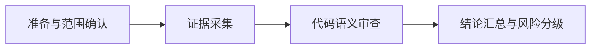

# Go Code Review Workflow

## 概览

| 属性 | 值 |
|------|-----|
| 预计总耗时 | 45 分钟 |
| 可并行任务 | 无（本次按顺序执行） |
| 串行依赖 | P0 -> P1 -> P2 -> P3 |

## 任务依赖图

## 任务清单

- [x] P0: 准备与范围确认
- [x] P1: 证据采集
- [x] P2: 代码语义审查
- [x] P3: 结论汇总与风险分级

## 文件分配矩阵

| 文件/目录 | P0 | P1 | P2 | P3 | 冲突 |
|----------|:--:|:--:|:--:|:--:|:----:|
| `.agent/workflows/go-code-review-2026-02-21/*.md` | W | W | W | W | 🟢 |
| `internal/apiserver/methods_turn.go` | R | R | R | R | 🟢 |
| `internal/apiserver/methods_skills_test.go` | R | R | R | R | 🟢 |
| `internal/apiserver/methods_skills.go` | R | R | R | R | 🟢 |
| `go test ./...` 输出 |  | R | R | R | 🟢 |

> W = 写入, R = 只读
