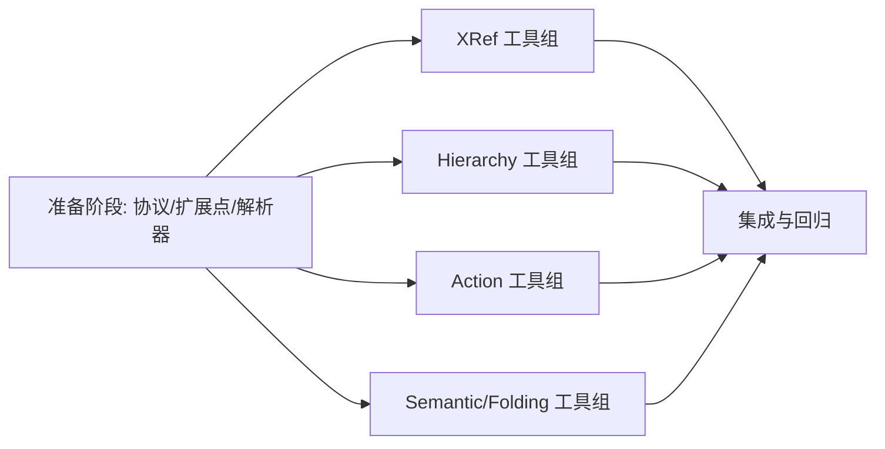

# LSP 扩展工具实现工作流（修复版）

> 现状：已上线 9 个工具（open_file / hover / diagnostics / definition / references / document_symbol / rename / completion / did_change）。
> 目标：新增 10 个工具（workspace_symbol / implementation / call_hierarchy / code_action / type_definition / signature_help / format / type_hierarchy / semantic_tokens / folding_range），总计 19 个。
> 兼容目标：面向 **多语言 LSP 3.17 通用**，并支持“**未先调用 lsp_open_file 时工具也可用**”（自动引导）。

## 为什么要修复

原计划存在以下结构性问题：

1. 并行阶段会反复修改同一批核心文件，存在高冲突风险。
2. 多处 LSP 联合返回类型未完整覆盖（LocationLink、CodeAction|Command、WorkspaceSymbol 新旧形态）。
3. workspace_symbol 仅按 language 取已运行 client，未启动时不可用。
4. 验证策略偏弱（以编译为主，缺少协议解析与 handler 专项测试）。
5. 将 `commit/push` 写入主流程，不利于审查与回滚。

本修复版按“任务编排”原则重构为：`P0（串行） -> P1/P2/P3/P4（并行） -> PN（串行集成）`。

## 兼容范围与可用性目标

1. 协议范围：以 LSP 3.17 为目标，优先兼容标准联合类型与 provider 形态（bool/object）。
2. 语言范围：主支持 Go / Rust / TypeScript(JavaScript)；Python 主要用于脚本能力（次级兼容），C 为次级兼容（环境可用即测），不做 gopls 特化分支。
3. 可用性范围：除 `lsp_diagnostics` 外，所有基于 `file_path` 的定位类工具在未先 `lsp_open_file` 时可自动引导执行。
4. 同步范围：对文档内容同步与容错策略对齐 IDE 体验（自动同步、版本回退、失败重开）。
5. 一致性范围：杜绝旧内容分析；无法确认最新内容时，工具必须 fail-closed 返回错误，不给旧结果。
6. 交互建议：仍保留“先 `lsp_open_file` 再分析”的最佳实践提示，但不再作为硬前置。

## 任务概览

| 属性 | 值 |
|------|-----|
| 预计总耗时 | 1.5 ~ 2.5 天 |
| 并行任务 | P1, P2, P3, P4 |
| 串行依赖 | P0 -> [P1,P2,P3,P4] -> PN |
| 并行安全策略 | 文件隔离 + 接口优先 + 依赖明确 |
| LSP 兼容策略 | 3.17 联合类型全覆盖 + provider 兼容反序列化 |
| 无 open_file 策略 | tool handler 自动 bootstrap document/client |
| 落盘缓存目录 | `/Users/mima0000/.multi-agent` |

## 任务依赖图



## 文件分配矩阵（并行冲突防护）

| 文件/目录 | P0 | P1 | P2 | P3 | P4 | PN | 说明 |
|---|:---:|:---:|:---:|:---:|:---:|:---:|---|
| `internal/lsp/protocol.go` | W | | | | | | 仅 P0 修改能力字段 |
| `internal/lsp/client.go` | W | | | | | | 仅 P0 改 initialize/共享字段 |
| `internal/apiserver/server_dynamic_tools.go` | W | | | | | | 仅 P0 注入扩展挂载点 |
| `internal/apiserver/methods.go` | | | | | | W | 仅 PN 更新提示词 |
| `internal/lsp/protocol_ext_*.go` | | W | W | W | W | | 并行新增文件，互不冲突 |
| `internal/lsp/client_*_tools.go` | | W | W | W | W | | 并行新增文件，互不冲突 |
| `internal/lsp/manager_*_tools.go` | | W | W | W | W | | 并行新增文件，互不冲突 |
| `internal/apiserver/server_dynamic_tools_*_ext.go` | | W | W | W | W | | 并行新增文件，互不冲突 |
| `internal/lsp/*_test.go`（按组） | | W | W | W | W | | 并行新增测试文件 |
| `internal/apiserver/*_test.go`（按组） | | W | W | W | W | | 并行新增测试文件 |

标记说明：`W=可写`，空白=禁止触碰。

---

## P0：准备阶段（串行，必须先完成）

### 目标

建立稳定契约与扩展点，使后续 4 个并行任务完全文件隔离。

### 任务

1. 在 `internal/lsp/protocol.go` 补齐 capability 声明。
- `TextDocumentClientCapabilities` 增加：`Completion`、`Rename`、`CallHierarchy`、`TypeHierarchy`、`CodeAction`、`SignatureHelp`、`Formatting`、`FoldingRange`、`SemanticTokens`。
- `ServerCapabilities` 新增字段统一使用兼容类型（优先 `any` 或显式联合结构），避免 bool/object 反序列化失败。

2. 在 `internal/lsp/client.go` 的 `Start()` 完成能力发送与初始化结果缓存。
- 发送新增 client capabilities。
- 解析并缓存 semantic tokens legend（仅缓存，不在此阶段实现业务工具）。

3. 建立协议联合解析基础（新文件，不与并行任务冲突）。
- 新增 `internal/lsp/protocol_ext_common.go`：
  - `LocationLink`、`Command`、`WorkspaceSymbol`（支持新旧结构）。
  - 通用解码器：
    - `decodeLocationsLike(raw)`：支持 `Location | []Location | []LocationLink | null`。
    - `decodeWorkspaceSymbols(raw)`：支持 `[]SymbolInformation | []WorkspaceSymbol | null`。
    - `decodeCodeActions(raw)`：支持 `(CodeAction | Command)[] | null`。

4. 在 `internal/apiserver/server_dynamic_tools.go` 注入扩展挂载点（一次性改动）。
- `registerDynamicTools()` 末尾调用 `registerExtendedLSPDynamicTools()`。
- `buildLSPDynamicTools()` 末尾追加 `buildExtendedLSPDynamicTools()`。
- 采用“注册器模式”避免并行冲突：
  - `internal/apiserver/server_dynamic_tools_ext_registry.go` 维护 provider 注册表。
  - 每个并行组仅在各自文件 `init()` 注册 provider，不修改公共函数体。
  - 公共聚合逻辑只在 P0 一次性落地。
  - 聚合输出前按 `tool name` 做稳定排序，避免动态工具顺序抖动。

5. 增加“按文件/按语言确保启动 client”的公共入口（避免 workspace_symbol 未启动失败）。
- 新增 `internal/lsp/manager_bootstrap.go`：
  - `ensureClientForFile(filePath)`（基于扩展名走 `ensureClient`）。
  - `ensureClientForLanguage(language)`（语言直连模式，不依赖 filePath）。
  - `normalizeLanguage(language)`（别名归一：`ts/js/javascript -> typescript`，`rs -> rust`，`golang -> go`，`py -> python`，`c/cpp -> c`）。
- 参数决议规则（`workspace_symbol`）：
  - 仅 `language`：使用 `normalizeLanguage(language)` 后直连启动。
  - 仅 `file_path`：按扩展推导 language 并启动。
  - 同时给 `file_path + language`：
    - 若 `file_path` 可推导且与 `language` 一致：继续执行。
    - 若 `file_path` 可推导但与 `language` 冲突：返回参数冲突错误（fail-closed）。
    - 若 `file_path` 不可推导：回退使用 `language`。

6. 增加“无需预先 open_file”的自动引导机制（本次核心修复）。
- 新增 `internal/lsp/manager_bootstrap_document.go`，提供 `BootstrapDocument(filePath)`：
  - 若 client 未运行：自动启动。
  - 若文档未打开：读磁盘最新内容并发送 `didOpen`。
  - 若文档已打开：先做磁盘状态校验（mtime/size/hash）；若变化则发送 `didChange`。
  - 若 `didChange` 失败（版本不同步/服务端丢状态）：自动执行 `didClose + didOpen` 回退。
  - 若仍失败：重启对应 client 后重开文档（IDE 常见容错路径）。
  - 若文件不可读：返回结构化错误，提示补充 `file_path` 或先显式 `lsp_open_file`。
- 增加文档状态缓存（内存 + 落盘）与互斥控制，确保并发下版本单调递增。
- 增加“同步 + 查询原子化”约束：
  - 对同一 `uri` 使用同一把互斥锁。
  - 在同一临界区内完成 `stale check -> didOpen/didChange/reopen -> LSP request`。
  - 禁止“同步完成后释放锁、再单独发请求”的 TOCTOU 路径。
- 新增 `workspace_symbol` 特例入口：
  - `BootstrapLanguage(language)`：仅按 language 启动服务，不要求 file_path。
  - `BootstrapLanguageFromFile(filePath)`：按 file_path 推导 language 启动服务。

7. 引入落盘缓存（使用 APP 缓存目录）。
- 根目录默认：`/Users/mima0000/.multi-agent/lsp-cache/`。
- 根目录可配置：优先读取 `MULTI_AGENT_LSP_CACHE_DIR`，未设置时使用默认值。
- 若目录不可写：降级为内存缓存并记录告警（不阻断主流程）。
- 建议结构：`{workspace_hash}/{language}/{uri_hash}.json`。
- 缓存字段：`uri`、`version`、`mtime_ns`、`size`、`content_hash`、`last_synced_at`、`open_state`。
- 作用：进程重启后恢复版本基线、避免无谓全量 reopen、支撑 stale 检测。
- 清理策略：TTL + workspace 维度清理（例如 7 天）。

8. 统一 schema 策略（支持二选一）。
- `lsp_workspace_symbol` 参数采用 `oneOf`：
  - 方案 A：`file_path + query`
  - 方案 B：`language + query`
- 校验规则：`file_path` 与 `language` 至少提供一个；同时提供时按“参数决议规则”处理（不做无条件覆盖）。
- 语义约束：当仅提供 `language` 时，必须走 `BootstrapLanguage(language)`，不得报“需要先 open_file”。
- 其他 position 类工具保持 `file_path` 必填（因 line/column 语义依赖具体文档）。

### P0 完成标准

- `go build ./...` 通过。
- 新增的联合解析器有基础单测（至少覆盖 null/单值/数组三类）。
- 自动引导场景测试通过（未先 `lsp_open_file` 也能执行新工具）。
- stale 防护测试通过（构造磁盘更新后不得返回旧分析结果）。
- 参数决议测试通过（`file_path+language` 一致/冲突/不可推导回退三类）。
- 现有 9 工具行为不变。

### P0 验证命令

```bash
cd /Users/mima0000/Desktop/wj/multi-agent-orchestration/go-agent-v2
go build ./...
go test -run "Decode|Union|Initialize|Bootstrap|Stale|Resync|Resolution|Atomic|Ordering|CacheDir" ./internal/lsp/...
```

---

## P1：XRef 工具组（并行）

### 范围

实现：`workspace_symbol`、`implementation`、`type_definition`。

### 可修改文件

- `internal/lsp/protocol_ext_xref.go`
- `internal/lsp/client_xref_tools.go`
- `internal/lsp/manager_xref_tools.go`
- `internal/apiserver/server_dynamic_tools_xref_ext.go`
- `internal/lsp/client_xref_tools_test.go`
- `internal/apiserver/server_dynamic_tools_xref_test.go`

### 禁止修改

- `internal/lsp/protocol.go`
- `internal/lsp/client.go`
- `internal/apiserver/server_dynamic_tools.go`
- 其他并行组文件

### 关键实现约束

1. `workspace_symbol` schema 支持二选一：`file_path + query` 或 `language + query`。
2. `implementation` / `type_definition` 必须支持 `LocationLink` 返回。
3. 未先 `lsp_open_file` 时：
   - `workspace_symbol(language)` 路径必须调用 `BootstrapLanguage`；
   - `workspace_symbol(file_path)` 路径调用 `BootstrapLanguageFromFile`；
   - 其他定位工具调用 `BootstrapDocument`。
4. handler 返回限制：最多 50 条。

### 验证

```bash
go test ./internal/lsp/... -run "WorkspaceSymbol|Implementation|TypeDefinition"
go test ./internal/apiserver/... -run "WorkspaceSymbol|Implementation|TypeDefinition"
```

---

## P2：Hierarchy 工具组（并行）

### 范围

实现：`call_hierarchy`、`type_hierarchy`。

### 可修改文件

- `internal/lsp/protocol_ext_hierarchy.go`
- `internal/lsp/client_hierarchy_tools.go`
- `internal/lsp/manager_hierarchy_tools.go`
- `internal/apiserver/server_dynamic_tools_hierarchy_ext.go`
- `internal/lsp/client_hierarchy_tools_test.go`
- `internal/apiserver/server_dynamic_tools_hierarchy_test.go`

### 关键实现约束

1. 两步协议必须显式处理 `prepare` 空结果。
2. `direction` 仅允许：`incoming|outgoing|both` / `supertypes|subtypes|both`。
3. 未先 `lsp_open_file` 时，先执行 `BootstrapDocument`，再发起 prepare 请求。
4. 返回对象需保持稳定字段，避免前端侧二次猜测。
5. 任一同步失败时必须 fail-closed，不得回落到旧结果。

### 验证

```bash
go test ./internal/lsp/... -run "CallHierarchy|TypeHierarchy"
go test ./internal/apiserver/... -run "CallHierarchy|TypeHierarchy"
```

---

## P3：Action 工具组（并行）

### 范围

实现：`code_action`、`signature_help`、`format`。

### 可修改文件

- `internal/lsp/protocol_ext_actions.go`
- `internal/lsp/client_actions_tools.go`
- `internal/lsp/manager_actions_tools.go`
- `internal/apiserver/server_dynamic_tools_actions_ext.go`
- `internal/lsp/client_actions_tools_test.go`
- `internal/apiserver/server_dynamic_tools_actions_test.go`

### 关键实现约束

1. `code_action` 必须完整支持 `(CodeAction | Command)[]`，不能丢 Command。
2. `format` 默认返回 `TextEdit[]`，不自动 apply。
3. `signature_help` 对 `documentation` 和 `label` 的联合类型要有容错解析。
4. 未先 `lsp_open_file` 时，先执行 `BootstrapDocument`，再调用对应 textDocument/* 方法。
5. 任一同步失败时必须 fail-closed，不得回落到旧结果。

### 验证

```bash
go test ./internal/lsp/... -run "CodeAction|SignatureHelp|Format"
go test ./internal/apiserver/... -run "CodeAction|SignatureHelp|Format"
```

---

## P4：Semantic/Folding 工具组（并行）

### 范围

实现：`semantic_tokens`、`folding_range`。

### 可修改文件

- `internal/lsp/protocol_ext_semantic.go`
- `internal/lsp/client_semantic_tools.go`
- `internal/lsp/manager_semantic_tools.go`
- `internal/apiserver/server_dynamic_tools_semantic_ext.go`
- `internal/lsp/client_semantic_tools_test.go`
- `internal/apiserver/server_dynamic_tools_semantic_test.go`

### 关键实现约束

1. semantic tokens 解码依赖 P0 缓存的 legend；legend 缺失时返回可诊断错误。
2. 输出限制：最多 200 条 decoded token。
3. `folding_range` 返回前做空值与边界过滤。
4. 未先 `lsp_open_file` 时，先执行 `BootstrapDocument`。
5. 任一同步失败时必须 fail-closed，不得回落到旧结果。

### 验证

```bash
go test ./internal/lsp/... -run "SemanticTokens|FoldingRange"
go test ./internal/apiserver/... -run "SemanticTokens|FoldingRange"
```

---

## PN：集成与回归（串行）

### 任务

1. 合并并行分支并处理冲突（理论上仅可能发生在导入顺序与测试命名）。
2. 在 `internal/apiserver/methods.go` 更新 `defaultLSPUsagePromptHint`：9 -> 19 工具。
3. 调整提示文案：将“必须先 `lsp_open_file`”改为“优先 `lsp_open_file`，未先调用时工具会自动 bootstrap”。
4. 校准动态工具 schema 文档（明确 `lsp_workspace_symbol` 的 `file_path|language` 二选一）。
5. 引入统一测试辅助函数 `requireServerOrSkip(t, language)`，所有语言相关集成测试统一通过该 helper 决定 skip。
6. 全量回归。
7. 补充变更说明（不在此工作流内强制 `git push`）。

### 最终验证命令

```bash
cd /Users/mima0000/Desktop/wj/multi-agent-orchestration/go-agent-v2
go build ./...
go test -timeout 120s ./internal/lsp/... ./internal/apiserver/...
```

---

## 回归门禁（必须全部通过）

1. 编译门禁：`go build ./...`
2. 协议门禁：联合类型解析测试全绿。
3. 工具门禁：10 个新工具均有 handler 入参校验测试。
4. 可用性门禁：未先 `lsp_open_file` 场景下，新增 10 工具均可调用（文件不存在场景返回可解释错误）。
  - 特别检查：`lsp_workspace_symbol` 在“仅 `language` + `query`”输入时可直接工作。
5. 反陈旧门禁：任意工具在磁盘内容更新后必须先同步再查询，禁止返回旧结果。
6. 多语言门禁（可用即测）：按 `exec.LookPath` 动态探测环境可用语言服务器，对可用语言强制回归；不可用语言标记 skip，不判失败。
  - 主门禁：Go + Rust + TypeScript(JavaScript) 必须覆盖。
  - 次门禁：Python（脚本场景）/C 在可用时纳入。
7. 测试门禁：所有语言相关用例必须经 `requireServerOrSkip` 统一处理可用性判定。
8. 兼容门禁：原有 9 工具测试不回归。
9. 资源门禁：返回条数限制生效（workspace_symbol=50，semantic_tokens=200，completion 维持现状）。

## 非目标（本计划不做）

1. 不在本流程强制 `git commit` / `git push`。
2. 不引入自动 apply format/code_action edits。
3. 不扩展非 LSP 相关动态工具。

## 执行检查清单

- [ ] P0 完成并通过门禁
- [ ] P1/P2/P3/P4 文件范围无重叠
- [ ] PN 合并后全量测试通过
- [ ] 提示词与工具列表一致（19 个）
