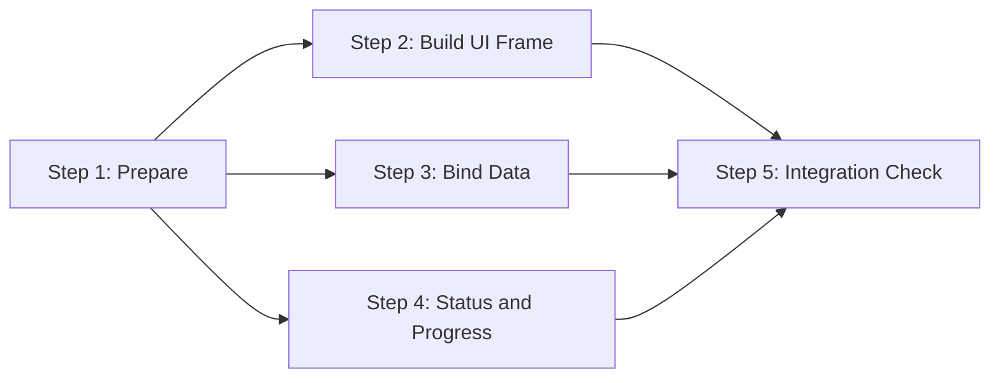

# Task 12345 Five Steps Demo

## 概览

| 属性 | 值 |
|------|-----|
| 预计总耗时 | 1 小时 |
| 可并行任务 | P1, P2, P3 |
| 串行依赖 | P0 -> [P1,P2,P3] -> P4 |

## 任务依赖图

## 任务清单

- [ ] Step 1 / P0: Prepare (必须先完成)
- [ ] Step 2 / P1: Build UI Frame ⚡ 可并行
- [ ] Step 3 / P2: Bind Data ⚡ 可并行
- [ ] Step 4 / P3: Status and Progress ⚡ 可并行
- [ ] Step 5 / P4: Integration Check (等待 P1-P3 完成)

## 文件分配矩阵

| 文件/目录 | P1 | P2 | P3 | 冲突 |
|----------|:--:|:--:|:--:|:----:|
| `docs/demo-ui/layout.md` | W | | | 🟢 |
| `docs/demo-ui/data.md` | | W | | 🟢 |
| `docs/demo-ui/progress.md` | | | W | 🟢 |
| `docs/demo-ui/shared-spec.md` | R | R | R | 🟢 只读 |

> W = 写入, R = 只读
