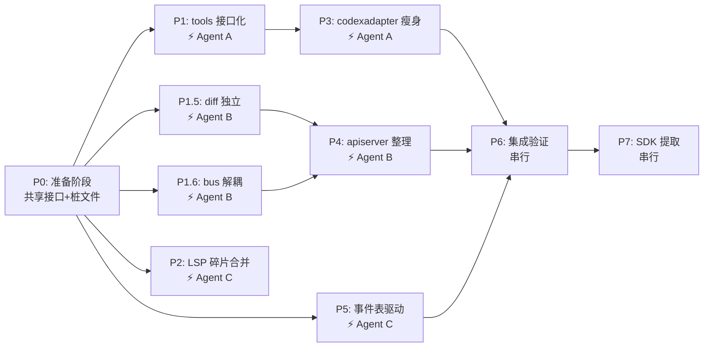

# 解耦治理与 SDK 抽取

## 概览

| 属性 | 值 |
|------|-----|
| 预计总耗时 | 17–25 小时 |
| 可并行任务 | P1 + P1.5 + P1.6 + P2, P3 + P4 + P5（P5 可前置） |
| 串行依赖 | P0 → [P1, P1.5, P1.6, P2] → [P3, P4, P5] → P6 → P7（P5 可在 P0 后提前启动） |
| 目标 | 以 P6 实测为 baseline（当前 `internal/` 有效行数约 35,846）→ P7 后 `<=22,000`（Stretch: `<20,000`）+ 3 个 SDK 子包 |
| 执行策略 | 先解耦/瘦身，再迁移；优先 `git mv`，禁止直接 `cp + rm -rf` 大爆炸迁移 |

## 任务依赖图



## 任务清单

- [ ] P0: 准备阶段 — 共享接口定义 + 桩文件 (必须先完成)
- [ ] P1: tools Provider 接口抽象 ⚡ 可并行
- [ ] P1.5: diff 模块独立 ⚡ 可并行
- [ ] P1.6: bus 解耦 (router.go 接口注入) ⚡ 可并行
- [ ] P2: LSP 碎片文件合并 ⚡ 可并行
- [ ] P3: codexadapter 瘦身 ⚡ 可并行
- [ ] P4: apiserver 整理 ⚡ 可并行
- [ ] P5: 事件处理表驱动 ⚡ 可并行
- [ ] P6: 集成验证 (等待 P3-P5 完成)
- [ ] P7: SDK 提取 (等待 P6 完成)

## 文件分配矩阵 — 第一波并行 (P1 + P1.5 + P1.6 + P2)

| 文件/目录 | P1 (Agent A) | P1.5 (Agent B) | P1.6 (Agent B) | P2 (Agent C) | 冲突 |
|----------|:----:|:----:|:----:|:----:|:----:|
| `internal/tools/*.go` | ✓ 写 | | | | 🟢 |
| `internal/tooladapter/*.go` | ✓ 写 | | | | 🟢 |
| `internal/apiserver/tool_providers.go` | ✓ 写 | | | | 🟢 |
| `internal/difftracker/` (新) | | ✓ 写 | | | 🟢 |
| `internal/apiserver/server_dynamic_tools_diff.go` | | ✓ 写 | | | 🟢 |
| `internal/apiserver/server_dynamic_tools.go` | | ✓ 写 | | | 🟢 |
| `internal/bus/router.go` | | | ✓ 写 | | 🟢 |
| `internal/bus/bus.go` 或 `types.go` | | | ✓ 写 | | 🟢 |
| `internal/bus/*_test.go` | | | ✓ 写 | | 🟢 |
| `internal/lsp/*.go` | | | | ✓ 写 | 🟢 |
| `internal/agentcore/*.go` | R | R | | | 🟢 只读 |
| `internal/codex/*.go` | | | R | | 🟢 只读 |

## 文件分配矩阵 — 第二波并行 (P3 + P4 + P5，可前置)

| 文件/目录 | P3 (Agent A) | P4 (Agent B) | P5 (Agent C) | 冲突 |
|----------|:----:|:----:|:----:|:----:|
| `internal/apiserver/codexadapter/*.go` | ✓ 写 | | | 🟢 |
| `internal/apiserver/server.go`, `server_context.go` | R | R | | 🟢 只读 |
| `internal/apiserver/methods_ui_*.go` | | ✓ 写 | | 🟢 |
| `internal/apiserver/server_state_groups.go` | | ✓ 写 | | 🟢 |
| `internal/codex/client_appserver_events.go` | | | ✓ 写 | 🟢 |
| `internal/uistate/runtime_event_handlers.go` | | | ✓ 写 | 🟢 |
| `internal/dashboard/*.go` (已有包，新增文件) | | ✓ 写 | | 🟢 |

> 默认把 UI 业务逻辑下沉到 `internal/dashboard/`，避免 P4/P5 在 `internal/uistate/` 形成冲突和边界污染。

## test 文件归属规则

| 规则 | 说明 |
|------|------|
| test 跟随业务 | test 文件归属与它测试的业务文件同一 Agent |
| 跨组件 test | 若 test import 多个 Agent 的代码，放到 **P6 集成阶段**修复 |
| 命名约定 | `*_p1_*_test.go` 归 P1，`*_p3_*_test.go` 归 P3，无前缀的跟随业务文件 |
| bus 路由回归 test | `internal/bus/router_test.go`（及同类 `internal/bus/*_test.go`）归 P1.6 |
| apiserver 顶层 25 个 test | 不确定归属时，先不动，P6 统一修复 |

## 并行执行规范（必须）

并行 Agent 必须使用独立 worktree + 分支，禁止共享同一工作目录直接并发提交。

```bash
# 示例（分支前缀统一 codex/）
git worktree add ../go-agent-v2-p1 -b codex/p1-tools
git worktree add ../go-agent-v2-p15 -b codex/p15-diff
git worktree add ../go-agent-v2-p16 -b codex/p16-bus
git worktree add ../go-agent-v2-p2 -b codex/p2-lsp
```

- 每个 worktree 仅执行自己的 phase，禁止跨 phase 改文件。
- 每个 phase 提交前先 `git status --short`，确认无外来改动再 commit。

## 阶段门禁（必须满足才进入下一阶段）

- P0→P1/P1.5/P1.6/P2: `go build ./...` 通过，且只新增接口/桩文件，无行为变化。
- 波次 1→波次 2: `go test ./internal/tools/... ./internal/tooladapter/... ./internal/lsp/... ./internal/bus/... ./internal/codex/... ./internal/uistate/...` 全部通过。
- 波次 2→P6: `go test ./internal/apiserver/... ./internal/codex/... ./internal/uistate/...` 全部通过。
- P6→P7: 依赖边界校验通过（tools/difftracker/lsp 无非法 internal 依赖，且 `internal/bus` 不再依赖 `internal/codex`）。

## 回滚策略

每个 Phase 完成后必须创建 checkpoint 提交（可选打 tag）：

```bash
# 仅 add 当前 phase 相关文件，避免误收敛其他并行修改
git add <phase-related-files>
git commit -m "checkpoint: pX <summary>"
# 可选：git tag pX-done-$(date +%Y%m%d-%H%M)
```

失败恢复使用非破坏流程（禁止直接重置当前工作分支）：

```bash
# 从 checkpoint 提交/标签拉起恢复分支
git switch -c recover-pX <checkpoint-commit-or-tag>
# 评估后 cherry-pick 需要的提交回主分支
```

## 验证命令（每个 Phase 完成后必跑）

```bash
cd /Users/mima0000/Desktop/wj/multi-agent-orchestration/go-agent-v2
go build ./...
go vet ./...
go test ./...
```
