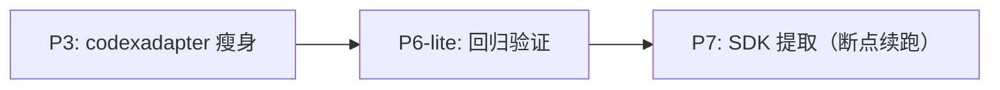

# 解耦治理与 SDK 抽取

## 当前状态（2026-02-27）

| 属性 | 值 |
|------|-----|
| 已完成阶段 | P0, P1, P1.5, P1.6, P2, P4, P5, P6 |
| 未完成阶段 | **P3, P7** |
| 当前执行链 | **P3 → P6-lite（回归）→ P7** |
| 注意事项 | 仓库处于“部分目录已迁移到 `pkg/`”状态，P7 必须按断点续跑流程执行 |

## 收尾依赖图（执行版）



## 阶段清单（执行版）

- [x] P0: 准备阶段
- [x] P1: tools Provider 接口抽象
- [x] P1.5: diff 模块独立
- [x] P1.6: bus 解耦
- [x] P2: LSP 碎片合并
- [x] P4: apiserver 顶层整理
- [x] P5: 事件表驱动
- [x] P6: 全量集成验证（历史基线）
- [ ] P3: codexadapter 瘦身（剩余）
- [ ] P7: SDK 提取（剩余）

## 文件分配（仅剩阶段）

| 文件/目录 | P3 | P7 | 约束 |
|----------|:--:|:--:|------|
| `internal/apiserver/codexadapter/*.go` | ✓ 写 | R | P3 主战场 |
| `internal/apiserver/codexadapter/*_test.go` | ✓ 写 | R | P3 行为回归 |
| `internal/agentcore/**` | R | ✓ 写/迁移 | P7 迁移到 `pkg/codexsdk/agentcore` |
| `internal/codex/**` | R | ✓ 写/迁移 | P7 迁移到 `pkg/codexsdk/codex` |
| `pkg/codexsdk/**` | R | ✓ 写 | P7 目标目录 |
| 其余目录 | R | R | 非本轮范围 |

## 阶段门禁（必须）

- P3 完成门禁:
  - `go build ./...`
  - `go test ./internal/apiserver/codexadapter/...`
  - `go test ./internal/apiserver/...`
- P3 → P7 前门禁（P6-lite）:
  - `go build ./...`
  - `go vet ./...`
  - `go test ./...`
  - 依赖边界检查:
    - `pkg/toolsdk/tools` 不 import `internal/executor|runner|service|store`
    - `pkg/diffsdk/difftracker` 与 `pkg/toolsdk/lsp` 不 import 任何 `internal/*`
    - `internal/bus` 不 import `internal/codex`
- P7 完成门禁:
  - `internal/agentcore` 与 `internal/codex` 目录已迁移移除
  - 无残留 import `github.com/multi-agent/go-agent-v2/internal/(agentcore|codex|lsp|tools|tooladapter|difftracker)`
  - `go build ./... && go test ./...` 通过

## 并行与回滚规范

- 当前仅剩 2 个阶段，默认串行执行，不再并行拆分。
- 推荐在独立 worktree 执行，避免与其他进行中的改动互相污染：
  ```bash
  git worktree add ../go-agent-v2-p3p7 -b codex/p3-p7-finish
  ```
- 每阶段结束创建 checkpoint 提交：
  ```bash
  git add <phase-related-files>
  git commit -m "checkpoint: pX <summary>"
  ```
- 失败恢复：
  ```bash
  git switch -c recover-pX <checkpoint-commit>
  ```

## 验证命令（每阶段必跑）

```bash
cd /Users/mima0000/Desktop/wj/multi-agent-orchestration/go-agent-v2
go build ./...
go vet ./...
go test ./...
```
