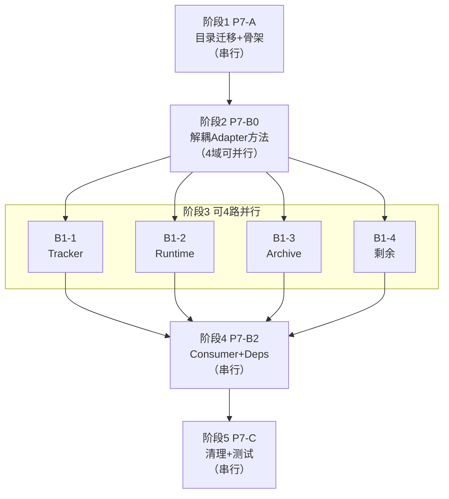

# P7: SDK 提取（极限瘦身版）

> 默认串行执行。P7 拆为 `P7-A`、`P7-B0`、`P7-B1`、`P7-B2`、`P7-C` 五步；其中 `B0/B1` 可按下文并行策略执行，仍需逐步过门禁，失败即停。

## 前置条件（必须）

- [ ] P3 已完成并通过门禁
- [ ] P6-lite 已通过（`go build ./... && go vet ./... && go test ./...`）
- [ ] 在独立 worktree 执行
- [ ] 工作树干净：
  ```bash
  test -z "$(git status --porcelain)" || { echo "FAIL: dirty worktree"; exit 1; }
  ```

## 硬约束

1. `codexadapter` 最终仅保留：
   - 存储访问（`store`）
   - UI 状态同步与通知（`uistate` + notify）
   - 薄委托桩（每方法 ≤ 15 行，仅做入参归一化 + 调用 `consumer`）
2. `codexadapter` 禁止承载任何 codex 业务规则（turn/thread/archive/tracker/interrupt/resume 等）。
3. `codexsdk` 分层：
   - `service`（纯业务规则与状态转换，无外部 I/O）
   - `consumer`（进程/文件/网络/store 等外部依赖接线）
4. 依赖方向固定：`consumer → service`（单向），`codexadapter → consumer`（单向）。
   - `service` 禁止依赖 `consumer`
   - `codexadapter` 禁止直接依赖 `service`
5. **规模门禁：`codexadapter` 非测试有效行数 ≤ 1000**。
6. 迁移仅用 `git mv`，禁止 `cp + rm -rf`。
7. import 替换仅改 import 行，排除 `vendor/.agent/.tmp`。
8. 每步结束创建 checkpoint commit。
9. **禁止胶水层**：不得新建 bridge/proxy/wrapper/shim/forwarder/relay 层。迁移 = 「剪切 + 粘贴 + 改 package 声明」，不是「复制 + 原地留桥接」。
10. **反胶水零膨胀**：关注迁移域净增，防止“复制 + 桥接”绕过。
    - 迁移域（`internal/apiserver/codexadapter` + `pkg/codexsdk`）Go 代码净增 `delta_scope = added - deleted` 必须 `<= +50`
    - `codexadapter` Go 代码净增 `delta_adapter = added - deleted`：`B0` 允许 `<= +200`，其余步骤必须 `<= 0`
11. **禁止 net-new 文件**：除 B0 的 `_logic.go` 和 SDK 骨架 `doc.go`/`iface.go` 外，不得新建任何 `.go` 文件。如果需要新文件，先删旧文件——总文件数只减不增。
12. **迁移即删除**：`git mv` 完成后原路径不得残留同名/近似文件。每步检查：
    ```bash
    # 反胶水门禁：codexadapter 不得出现 bridge/proxy/wrapper/shim/relay 后缀文件
    find internal/apiserver/codexadapter -name '*_bridge*' -o -name '*_proxy*' -o -name '*_wrapper*' -o -name '*_shim*' -o -name '*_relay*' -o -name '*_forwarder*' | \
      grep -q . && { echo "FAIL: glue layer files detected"; exit 1; } || true
    # 反膨胀门禁：用 git diff 统计迁移域净增；每步执行前设置 P7_STEP=A|B0|B1|B2|C
    calc_delta() {
      git diff --numstat -- "$@" | \
        awk '$1 ~ /^[0-9]+$/ && $2 ~ /^[0-9]+$/ && $3 ~ /\.go$/ {a+=$1; d+=$2} END {print a-d+0}'
    }
    scope_delta=$(calc_delta internal/apiserver/codexadapter pkg/codexsdk)
    adapter_delta=$(calc_delta internal/apiserver/codexadapter)
    echo "delta_scope=$scope_delta delta_adapter=$adapter_delta step=${P7_STEP:-unset}"
    test "$scope_delta" -le 50 || { echo "FAIL: migration scope inflated too much"; exit 1; }
    if [ "${P7_STEP:-}" = "B0" ]; then
      test "$adapter_delta" -le 200 || { echo "FAIL: B0 adapter delta too large"; exit 1; }
    else
      test "$adapter_delta" -le 0 || { echo "FAIL: adapter must be non-increasing outside B0"; exit 1; }
    fi
    ```

## 现状审计基线

| 指标 | 数值 |
|---|---|
| `codexadapter` 非测试有效行数 | 6311 |
| 真正属于 store/UI 的行数 | ~659 |
| 需迁出的业务行数 | ~5100 |

## SDK 分层目录结构

```
pkg/codexsdk/
├── iface.go                    # 顶层接口契约
├── service/                    # 纯业务规则（无外部 I/O）
│   ├── archive/                # 归档策略、manifest 解析、完整性检查
│   ├── tracker/                # turn 状态机、stall 检测、事件解析
│   ├── runtime/                # turn 准备、提交、prompt 构建
│   ├── lifecycle/              # thread 启动/恢复/fork
│   ├── interrupt/              # 中断决策
│   ├── prompt/                 # prompt 构建与校验
│   ├── rollout/                # 消息展开核心逻辑
│   ├── listing/                # 线程列表排序/过滤
│   ├── command/                # slash command 解析
│   ├── history/                # 历史消息核心逻辑
│   └── common/                 # 共享路径/工具函数
├── consumer/                   # 外部 I/O 接线
│   ├── archive/                # 文件系统 I/O、SHA256、磁盘操作
│   ├── runtime/                # 进程管理、client 调用
│   ├── lifecycle/              # 进程拉起/恢复接线
│   ├── rollout/                # 消息展开 I/O
│   ├── listing/                # store 查询接线
│   └── history/                # 历史消息 I/O
├── agentcore/                  # (P7-A 迁入)
└── codex/                      # (P7-A 迁入)
```

## 迁移映射指引

### 🔴 迁出文件（业务规则 → SDK）

| 源文件 | 有效行 | 目标 service 子包 | 目标 consumer 子包 |
|---|---|---|---|
| `turn_tracker_core.go` | 468 | `service/tracker` | — |
| `turn_tracker.go` | 432 | — | `consumer/tracker` |
| `turn_tracker_stall.go` | 247 | — | `consumer/tracker` |
| `turn_tracker_event.go` | 140 | — | `consumer/tracker` |
| `turn_runtime.go` | 462 | — | `consumer/runtime` |
| `turn_prepare.go` | 374 | — | `consumer/runtime` |
| `turn_prepare_core.go` | 51 | `service/runtime` | — |
| `turn_steer_alignment.go` | 4 | `service/runtime` | — |
| `thread_archive_core.go` | 583 | `service/archive` | — |
| `thread_archive_utils.go` | 496 | `service/archive` | — |
| `thread_archive.go` | 319 | — | `consumer/archive` |
| `thread_lifecycle.go` | 323 | — | `consumer/lifecycle` |
| `turn_interrupt.go` | 191 | — | `consumer/interrupt` |
| `turn_interrupt_core.go` | 117 | `service/interrupt` | — |
| `turn_prompt.go` | 156 | — | `consumer/prompt` |
| `turn_prompt_core.go` | 114 | `service/prompt` | — |
| `turn_resume.go` | 40 | — | `consumer/lifecycle` |
| `turn_resume_core.go` | 121 | `service/lifecycle` | — |
| `thread_messages_rollout.go` | 139 | — | `consumer/rollout` |
| `thread_messages_rollout_core.go` | 84 | `service/rollout` | — |
| `thread_listing.go` | 248 | — | `consumer/listing` |
| `thread_listing_core.go` | 168 | `service/listing` | — |
| `slash_command.go` | 113 | — | `consumer/command` |
| `thread_history.go` | 199 | — | `consumer/history` |
| `thread_history_core.go` | 32 | `service/history` | — |
| `turn_common_paths.go` | 31 | `service/common` | — |

### 🟢 保留文件（存储 + UI 状态）

| 源文件 | 有效行 | 说明 |
|---|---|---|
| `adapter.go` | 297 → ~200 | 裁剪后仅留 Deps/Adapter + store/uistate 访问器 + 薄委托 |
| `thread_messages.go` | 171 | UI 消息聚合（依赖 store） |
| `thread_messages_hydration.go` | 135 | 消息水合（依赖 uistate） |
| `thread_recover.go` | 45 | 崩溃恢复（依赖 store） |
| `stream_timeout.go` | 11 | 常量配置 |
| **合计** | **~660 + ~150 薄委托** | **目标 ≤ 1000** |

### 测试文件跟随迁移

| 测试文件 | 跟随目标 |
|---|---|
| `turn_tracker_test.go` | `service/tracker/` |
| `tracked_turn_shape_guardrail_test.go` | `service/tracker/` |
| `turn_interrupt_test.go` | `service/interrupt/` |
| `turn_resume_test.go` | `service/lifecycle/` |
| `turn_prompt_test.go` | `service/prompt/` |
| `slash_command_test.go` | `service/command/` |
| `thread_archive_load_map_test.go` | `service/archive/` |
| `thread_archive_utils_guardrail_test.go` | `service/archive/` |
| `thread_history_test.go` | `service/history/` |
| `thread_list_helpers_test.go` | `service/listing/` |

---

## 并行执行策略



| 阶段 | 步骤 | 并行性 | 说明 |
|---|---|---|---|
| 1 | P7-A | 串行 | 全仓 import 修复，必须最先完成 |
| 2 | P7-B0 | **4 域并行** | tracker / runtime / archive / lifecycle+其余 互不影响 |
| 3 | B1-1 / B1-2 / B1-3 / B1-4 | **4 路并行** | 各批次迁入不同 service 子包，零文件交叉 |
| 4 | P7-B2 | 串行 | 依赖 B1 全部完成，重构 Deps |
| 5 | P7-C | 串行 | 最终清理、回归测试 |

### B1 并行执行指引

```bash
# 在 P7-A 完成的 checkpoint 上创建 4 个 worktree
git worktree add ../.worktrees/p7-b1-1-tracker HEAD
git worktree add ../.worktrees/p7-b1-2-runtime HEAD
git worktree add ../.worktrees/p7-b1-3-archive HEAD
git worktree add ../.worktrees/p7-b1-4-remaining HEAD
```

各 worktree 独立执行各自的 B1 批次，完成后按以下顺序合并（冲突最少的先合）：

```bash
# 1. 先合 B1-3（archive，最独立，0 冲突）
git merge p7-b1-3-archive

# 2. 合 B1-1（tracker，可能有 codexadapter import 冲突）
git merge p7-b1-1-tracker
# 冲突仅在 import 行 → 保留双方 import 即可

# 3. 合 B1-2（runtime）
git merge p7-b1-2-runtime

# 4. 合 B1-4（remaining）
git merge p7-b1-4-remaining

# 合并后门禁
go build ./...
go test ./...
```

> **冲突范围**：仅 `codexadapter/` 内残留薄壳文件的 import 行。每个 B1 批次修改的是不同 service 子包，不会产生逻辑冲突。

---

## 执行步骤

// turbo-all

### P7-A：目录迁移 + SDK 骨架搭建（不改行为）

目标：迁移 agentcore/codex 到 SDK，搭建 service/consumer 骨架。

允许改动：

- `internal/agentcore/**`
- `internal/codex/**`
- `pkg/codexsdk/**`
- `internal/apiserver/codexadapter/*.go`（仅允许 import 路径机械替换）
- 全仓 import 行（仅相关路径）

执行：

```bash
move_if_exists() {
  src="$1"
  dst="$2"
  if [ -d "$src" ] && [ -d "$dst" ]; then
    echo "FAIL both exist: $src and $dst"
    return 1
  fi
  if [ -d "$src" ]; then
    mkdir -p "$(dirname "$dst")"
    git mv "$src" "$dst"
    echo "MOVED $src -> $dst"
  else
    echo "SKIP  $src (already migrated)"
  fi
}

move_if_exists internal/agentcore pkg/codexsdk/agentcore
move_if_exists internal/codex     pkg/codexsdk/codex
```

```bash
replace_import_path() {
  from="$1"
  to="$2"
  rg -l -0 "$from" --glob '*.go' --glob '!vendor/**' --glob '!.agent/**' --glob '!.tmp/**' | \
    while IFS= read -r -d '' f; do
      FROM="$from" TO="$to" perl -pi -e '
        BEGIN {
          $from = $ENV{"FROM"};
          $to = $ENV{"TO"};
        }
        s|^(\s*(?:import\s+)?(?:(?:[A-Za-z_][A-Za-z0-9_]*|_|\.)\s+)?\")\Q$from\E(\"(\s*//.*)?)$|$1$to$2|g
      ' "$f"
    done
}

replace_import_path 'github.com/multi-agent/go-agent-v2/internal/agentcore' 'github.com/multi-agent/go-agent-v2/pkg/codexsdk/agentcore'
replace_import_path 'github.com/multi-agent/go-agent-v2/internal/codex'     'github.com/multi-agent/go-agent-v2/pkg/codexsdk/codex'
```

搭建 SDK 骨架：

```bash
for dir in \
  pkg/codexsdk/service/archive \
  pkg/codexsdk/service/tracker \
  pkg/codexsdk/service/runtime \
  pkg/codexsdk/service/lifecycle \
  pkg/codexsdk/service/interrupt \
  pkg/codexsdk/service/prompt \
  pkg/codexsdk/service/rollout \
  pkg/codexsdk/service/listing \
  pkg/codexsdk/service/command \
  pkg/codexsdk/service/history \
  pkg/codexsdk/service/common \
  pkg/codexsdk/consumer/archive \
  pkg/codexsdk/consumer/runtime \
  pkg/codexsdk/consumer/lifecycle \
  pkg/codexsdk/consumer/rollout \
  pkg/codexsdk/consumer/listing \
  pkg/codexsdk/consumer/history; do
  mkdir -p "$dir"
  echo "package $(basename $dir)" > "$dir/doc.go"
done

# 创建顶层接口契约文件
cat > pkg/codexsdk/iface.go << 'EOF'
package codexsdk

// SDK top-level interface contract placeholder.
// Service and consumer interfaces will be defined here as migration proceeds.
EOF
```

P7-A 门禁：

```bash
go build ./...
go test ./pkg/codexsdk/agentcore/... ./pkg/codexsdk/codex/...
go test ./...
```

P7-A 约束检查：

```bash
# 本步允许改动 codexadapter，但仅限 internal/(agentcore|codex) -> pkg/codexsdk/(agentcore|codex) import 替换
unexpected=$(
  git diff -U0 -- 'internal/apiserver/codexadapter/*.go' | \
    rg '^[+-]' | \
    rg -v '^(---|\+\+\+)' | \
    rg -v '^[+-]\s*$' | \
    rg -v '^[+-]\s*(([A-Za-z_][A-Za-z0-9_]*|_|\.)\s+)?"github.com/multi-agent/go-agent-v2/(internal/(agentcore|codex)(/[^"]+)?|pkg/codexsdk/(agentcore|codex)(/[^"]+)?)"$' || true
)
test -z "$unexpected" || {
  echo "$unexpected"
  echo "FAIL: P7-A codexadapter changes must be import-path-only"
  exit 1
}
```

P7-A checkpoint：

```bash
git add -u
git add -- pkg/codexsdk
git commit -m "checkpoint: p7-A directory migration + SDK skeleton"
```

---

### P7-B0：解耦 Adapter 方法为独立函数（前置必做）

> **为什么需要 B0？**
> codexadapter 中 14 个待迁文件共含 **133 个 `func (a *Adapter)` 方法**。
> 直接 `git mv` 到新包后 `Adapter` 类型未定义 → 编译失败。
> B0 先在 codexadapter 包内把业务逻辑提取为独立函数，再由 B1 迁移纯逻辑文件。

目标：将 `*Adapter` 方法中的业务逻辑提取为接受参数/接口的独立函数，行为不变。

允许改动：

- `internal/apiserver/codexadapter/*.go`（仅重构，不跨包）

禁止改动：

- 不新增/删除任何公共 API
- 不跨域到其他模块

执行模式（逐文件重复）：

```
对每个含 *Adapter 方法的待迁文件 X.go：
1. 将 func (a *Adapter) foo(args...) 中的核心逻辑提取为：
   func fooLogic(deps FooDeps, args...) → 纯参数/接口签名，无 *Adapter 依赖
2. 原方法瘦身为：
   func (a *Adapter) foo(args...) { return fooLogic(a.toDeps(), args...) }
3. 独立函数写入 X_core.go 或新建 X_logic.go（同 codexadapter 包）
4. 确认 go build ./... && go test ./... 通过
```

按文件 Adapter 方法数量从多到少执行：

| 文件 | Adapter 方法数 | 提取目标 |
|---|---|---|
| `thread_lifecycle.go` | 17 | `thread_lifecycle_logic.go` |
| `turn_tracker.go` | 16 | 追加到 `turn_tracker_core.go` |
| `turn_runtime.go` | 14 | `turn_runtime_logic.go` |
| `turn_tracker_stall.go` | 13 | 追加到 `turn_tracker_core.go` |
| `turn_prepare.go` | 12 | 追加到 `turn_prepare_core.go` |
| `thread_listing.go` | 10 | 追加到 `thread_listing_core.go` |
| `turn_tracker_event.go` | 8 | 追加到 `turn_tracker_core.go` |
| `turn_interrupt.go` | 7 | 追加到 `turn_interrupt_core.go` |
| `thread_history.go` | 6 | 追加到 `thread_history_core.go` |
| `slash_command.go` | 6 | `slash_command_logic.go` |
| `turn_prompt.go` | 5 | 追加到 `turn_prompt_core.go` |
| `thread_messages_rollout.go` | 4 | 追加到 `thread_messages_rollout_core.go` |
| `thread_archive.go` | 14 | `thread_archive_logic.go` |
| `turn_resume.go` | 1 | 追加到 `turn_resume_core.go` |

B0 门禁：

```bash
go build ./...
go test ./internal/apiserver/codexadapter/...
go test ./...

# 确认 Adapter 方法已全部瘦化为薄壳（≤15行）
allow_long='ThreadMessages|LoadAllThreadMessagesFromRollout|ThreadArchiveMap|ThreadArchive|ThreadUnarchive|ThreadRecover'
find internal/apiserver/codexadapter -maxdepth 1 -name '*.go' ! -name '*_test.go' -print0 | \
  xargs -0 awk -v allow="$allow_long" '
  function name_of(sig,   s) {
    s=sig
    sub(/^func \(a \*Adapter\) /, "", s)
    sub(/\(.*/, "", s)
    return s
  }
  /^func \(a \*Adapter\) / { in_fn=1; sig=$0; name=name_of(sig); depth=0; lines=0 }
  in_fn {
    line=$0
    lines++
    tmp=line
    opens=gsub(/\{/, "{", tmp)
    closes=gsub(/\}/, "}", tmp)
    depth += opens - closes
    if (depth == 0) {
      if (name != "" && lines > 15 && name !~ allow) {
        printf "FAIL: long adapter method %s has %d lines\n", name, lines
        bad=1
      }
      in_fn=0
    }
  }
  END { exit bad ? 1 : 0 }
'

git add -u
git commit -m "checkpoint: p7-B0 decouple Adapter methods into standalone functions"
```

---

### P7-B1：纯逻辑文件迁出到 SDK service（4 批）

> B0 完成后，`_core.go` / `_logic.go` 文件已无 `*Adapter` 依赖，可安全 `git mv`。
> 含 `*Adapter` 薄壳的原文件（`turn_tracker.go` 等）**留在 codexadapter**，在 B2 由 consumer 接管。

目标：将纯业务逻辑文件从 codexadapter 迁入 `pkg/codexsdk/service/*`，行为不变。

允许改动：

- `internal/apiserver/codexadapter/*.go`（import 修复 + 薄壳调用路径）
- `pkg/codexsdk/service/**`
- 全仓 import 行（仅相关路径）

禁止改动：

- 跨域到无关模块（tools/lsp/difftracker 等）
- `git mv` 含 `*Adapter` 方法的文件（这些留给 B2）

#### B1-1：Tracker 纯逻辑（~1287 行）

迁移文件（均 0 个 Adapter 方法）：
- `turn_tracker_core.go`（含 B0 追加的独立函数）

测试跟随：`tracked_turn_shape_guardrail_test.go`
目标包：`pkg/codexsdk/service/tracker`

```bash
git mv internal/apiserver/codexadapter/turn_tracker_core.go pkg/codexsdk/service/tracker/
git mv internal/apiserver/codexadapter/tracked_turn_shape_guardrail_test.go pkg/codexsdk/service/tracker/
rm -f pkg/codexsdk/service/tracker/doc.go
# 修改 package 声明为 tracker；修复 import
# codexadapter 中薄壳改为调用 service/tracker 包函数
```

留在 codexadapter 的薄壳文件：`turn_tracker.go` `turn_tracker_stall.go` `turn_tracker_event.go`（仅含 `*Adapter` 薄方法，B2 再处理）

B1-1 门禁：

```bash
go build ./...
go test ./pkg/codexsdk/service/tracker/...
go test ./internal/apiserver/codexadapter/...
go test ./...
git add -u && git add -- pkg/codexsdk/service
git commit -m "checkpoint: p7-B1-1 tracker core -> service/tracker"
```

#### B1-2：Runtime + Prepare 纯逻辑（~891 行）

迁移文件（均 0 个 Adapter 方法）：
- `turn_prepare_core.go`（含 B0 追加的独立函数）
- `turn_runtime_logic.go`（B0 新建）
- `turn_steer_alignment.go`

目标包：`pkg/codexsdk/service/runtime`

```bash
git mv internal/apiserver/codexadapter/turn_prepare_core.go pkg/codexsdk/service/runtime/
git mv internal/apiserver/codexadapter/turn_runtime_logic.go pkg/codexsdk/service/runtime/
git mv internal/apiserver/codexadapter/turn_steer_alignment.go pkg/codexsdk/service/runtime/
rm -f pkg/codexsdk/service/runtime/doc.go
# 修改 package 声明；修复 import
```

留在 codexadapter 的薄壳文件：`turn_runtime.go` `turn_prepare.go`

B1-2 门禁：

```bash
go build ./...
go test ./...
git add -u && git add -- pkg/codexsdk/service
git commit -m "checkpoint: p7-B1-2 runtime core -> service/runtime"
```

#### B1-3：Archive core + utils（~1079 行）— 可直接迁移

> ✅ 这两个文件均 0 个 Adapter 方法，无需 B0 解耦，可直接 `git mv`。

迁移文件：`thread_archive_core.go` `thread_archive_utils.go`
测试跟随：`thread_archive_load_map_test.go` `thread_archive_utils_guardrail_test.go`
目标包：`pkg/codexsdk/service/archive`

```bash
git mv internal/apiserver/codexadapter/thread_archive_core.go pkg/codexsdk/service/archive/
git mv internal/apiserver/codexadapter/thread_archive_utils.go pkg/codexsdk/service/archive/
git mv internal/apiserver/codexadapter/thread_archive_load_map_test.go pkg/codexsdk/service/archive/
git mv internal/apiserver/codexadapter/thread_archive_utils_guardrail_test.go pkg/codexsdk/service/archive/
rm -f pkg/codexsdk/service/archive/doc.go
```

B1-3 门禁：

```bash
go build ./...
go test ./pkg/codexsdk/service/archive/...
go test ./...
git add -u && git add -- pkg/codexsdk/service
git commit -m "checkpoint: p7-B1-3 archive -> service/archive"
```

#### B1-4：剩余纯逻辑文件（~1563 行）

迁移文件（均 0 个 Adapter 方法）与目标：

| 文件 | 目标包 |
|---|---|
| `thread_lifecycle_logic.go`（B0 新建） | `service/lifecycle` |
| `turn_interrupt_core.go` | `service/interrupt` |
| `turn_resume_core.go` | `service/lifecycle` |
| `turn_prompt_core.go` | `service/prompt` |
| `slash_command_logic.go`（B0 新建） | `service/command` |
| `thread_history_core.go` | `service/history` |
| `thread_listing_core.go` | `service/listing` |
| `thread_messages_rollout_core.go` | `service/rollout` |
| `turn_common_paths.go` | `service/common` |

测试跟随：`turn_interrupt_test.go` `turn_resume_test.go` `turn_prompt_test.go` `slash_command_test.go` `thread_history_test.go` `thread_list_helpers_test.go`

留在 codexadapter 的薄壳文件：`thread_lifecycle.go` `turn_interrupt.go` `turn_resume.go` `turn_prompt.go` `slash_command.go`

```bash
# 逐个 git mv 纯逻辑文件，修改 package 声明和 import
# 清理空 doc.go
```

B1-4 门禁：

```bash
go build ./...
go test ./pkg/codexsdk/service/...
go test ./...
git add -u && git add -- pkg/codexsdk/service
git commit -m "checkpoint: p7-B1-4 remaining core -> service/*"
```

B1 总门禁（核心业务函数不得残留在 codexadapter 的非薄壳文件中）：

```bash
# 业务函数定义应在 service/*，codexadapter 仅保留薄壳调用
rg -n 'func normalizeTrackedTurnStatus|func extractTrackedString|func pruneArchivedCodexSourceFiles|func inspectThreadArchiveForRestore|func supersedeActiveTurn|func captureAndInjectTurnSummary|func mergeTrackedTurnCompletionPayload|func collectThreadArtifactCandidates|func restoreThreadArchiveEntry' \
  internal/apiserver/codexadapter/*.go && { echo "FAIL: core logic functions still defined in codexadapter"; exit 1; } || true
```

---

### P7-B2：Adapter 薄壳 + I/O 接线迁出到 consumer + Deps 重构

目标：

- B1 留下的 `*Adapter` 薄壳文件迁入 `pkg/codexsdk/consumer/*`
- I/O 逻辑从 codexadapter 迁入 `pkg/codexsdk/consumer/*`
- `Deps` 重构为 SDK + consumer 能力注入
- codexadapter 仅保留最终薄委托（调用 consumer）

允许改动：

- `internal/apiserver/codexadapter/*.go`
- `pkg/codexsdk/consumer/**`
- `pkg/codexsdk/iface.go`
- 必要 apiserver 接线文件（仅编译所需）

B1 遗留的薄壳文件 + I/O 文件迁入 consumer：

| 文件 | 目标 consumer 子包 | 说明 |
|---|---|---|
| `turn_tracker.go` | `consumer/tracker` | B1 遗留薄壳 |
| `turn_tracker_stall.go` | `consumer/tracker` | B1 遗留薄壳 |
| `turn_tracker_event.go` | `consumer/tracker` | B1 遗留薄壳 |
| `turn_runtime.go` | `consumer/runtime` | B1 遗留薄壳 + I/O |
| `turn_prepare.go` | `consumer/runtime` | B1 遗留薄壳 |
| `thread_lifecycle.go` | `consumer/lifecycle` | B1 遗留薄壳 + I/O |
| `turn_interrupt.go` | `consumer/interrupt` | B1 遗留薄壳 |
| `turn_resume.go` | `consumer/lifecycle` | B1 遗留薄壳 |
| `turn_prompt.go` | `consumer/prompt` | B1 遗留薄壳 |
| `slash_command.go` | `consumer/command` | B1 遗留薄壳 |
| `thread_archive.go` | `consumer/archive` | I/O 接线 |
| `thread_archive_logic.go` | `consumer/archive` | B0 新建 |
| `thread_listing.go` | `consumer/listing` | I/O 接线 |
| `thread_history.go` | `consumer/history` | I/O 接线 |
| `thread_messages_rollout.go` | `consumer/rollout` | I/O 接线 |

执行指引：

1. 将 I/O 接线函数迁入 consumer 子包
2. 在 consumer 中定义稳定接口
3. 重构 `Deps` 结构：去除业务钩子，改为 consumer 实例注入
4. codexadapter 方法变成薄委托（每个 ≤ 15 行）
5. adapter 保留 API 兼容：请求/响应/错误语义不漂移

P7-B2 门禁：

```bash
go build ./...
go test ./internal/apiserver/codexadapter/...
go test ./internal/apiserver/...
go test ./...
git add -u && git add -- pkg/codexsdk/consumer pkg/codexsdk/iface.go
git commit -m "checkpoint: p7-B2 consumer + Deps refactor"
```

P7-B2 职责边界检查（必须通过）：

```bash
# 1) codexadapter 不得依赖旧 internal 路径（仅允许 store/uistate/commonadapter/contracts）
violations=$(
  rg -n '"github.com/multi-agent/go-agent-v2/internal/' internal/apiserver/codexadapter/*.go | \
  rg -v 'internal/(store|uistate|apiserver/commonadapter|apiserver/contracts)'
)
test -z "$violations" || { echo "$violations"; echo "FAIL: codexadapter has disallowed internal deps"; exit 1; }

# 2) codexadapter 不应再包含业务函数
rg -n 'ensureThreadReadyForTurn|tryResumeHistoricalCandidates|checkTurnStall|waitInterruptOutcome|restoreThreadArchiveSources|collectThreadArtifactCandidates|rolloutMessageToThreadHistory|normalizeTrackedTurnStatus|extractTrackedString|pruneArchivedCodexSourceFiles|inspectThreadArchiveForRestore|supersedeActiveTurn|beginTrackedTurn|completeTrackedTurnByID' \
  internal/apiserver/codexadapter/*.go && { echo "FAIL: business logic still in codexadapter"; exit 1; } || true

# 3) service 不得依赖 consumer
rg -n '"github.com/multi-agent/go-agent-v2/pkg/codexsdk/consumer' pkg/codexsdk/service --glob '*.go' && \
  { echo "FAIL: service depends on consumer"; exit 1; } || true

# 4) codexadapter 只能依赖 consumer，不得直接依赖 service/codex/agentcore
rg -n '"github.com/multi-agent/go-agent-v2/pkg/codexsdk/service' internal/apiserver/codexadapter/*.go && \
  { echo "FAIL: codexadapter depends on service directly"; exit 1; } || true
rg -n '"github.com/multi-agent/go-agent-v2/pkg/codexsdk/(codex|agentcore)"' internal/apiserver/codexadapter/*.go && \
  { echo "FAIL: codexadapter depends on codex/agentcore directly"; exit 1; } || true

# 5) 分层目录必须存在且有非占位实现
for d in pkg/codexsdk/service pkg/codexsdk/consumer; do
  [ -d "$d" ] || { echo "FAIL: missing layer dir $d"; exit 1; }
  find "$d" -name '*.go' ! -name 'doc.go' -type f | grep -q . || { echo "FAIL: $d has no implementation files"; exit 1; }
done

# 6) service 纯度检查：禁止外部 I/O 与 internal 依赖
rg -n '^\s*"github.com/multi-agent/go-agent-v2/internal/' pkg/codexsdk/service --glob '*.go' && \
  { echo "FAIL: service imports internal packages"; exit 1; } || true
rg -n '^\s*"(os|os/exec|io|io/fs|path/filepath|net|net/http|database/sql)"' pkg/codexsdk/service --glob '*.go' && \
  { echo "FAIL: service contains IO imports"; exit 1; } || true
```

---

### P7-C：清理 + 回归测试 + 终审

目标：

- 清理过渡代码与重复逻辑
- codexadapter 裁剪至 ≤ 1000 行
- 补齐回归测试

允许改动：

- `internal/apiserver/codexadapter/*`
- `pkg/codexsdk/*`
- 直接相关测试

执行指引：

1. 删除过渡函数与重复实现，保留单一事实来源。
2. codexadapter 中超长函数做最终裁剪（应仅剩适配逻辑）。
3. 补齐回归测试（至少）：
   - turn lifecycle（started/streaming/terminal）
   - stream error/timeout
   - thread archive/restore
   - adapter → consumer 契约测试

P7-C 门禁：

```bash
go build ./...
go vet ./...
go test ./...
```

P7-C 规模门禁（必须通过）：

```bash
lines=$(find ./internal/apiserver/codexadapter -name '*.go' ! -name '*_test.go' -exec cat {} + | \
  sed '/^[[:space:]]*$/d; /^[[:space:]]*\/\//d; /^[[:space:]]*\/\*/d; /^[[:space:]]*\*/d' | wc -l | tr -d ' ')
echo "codexadapter_effective_lines=$lines"
test "$lines" -le 1000 || { echo "FAIL: codexadapter too large ($lines > 1000)"; exit 1; }

# 薄委托门禁：Adapter 导出方法默认 <= 15 行（白名单仅存储/UI聚合）
allow_long='ThreadMessages|LoadAllThreadMessagesFromRollout|ThreadArchiveMap|ThreadArchive|ThreadUnarchive|ThreadRecover'
find internal/apiserver/codexadapter -maxdepth 1 -name '*.go' ! -name '*_test.go' -print0 | \
  xargs -0 awk -v allow="$allow_long" '
  function name_of(sig,   s) {
    s=sig
    sub(/^func \(a \*Adapter\) /, "", s)
    sub(/\(.*/, "", s)
    return s
  }
  /^func \(a \*Adapter\) / { in_fn=1; sig=$0; name=name_of(sig); depth=0; lines=0 }
  in_fn {
    line=$0
    lines++
    tmp=line
    opens=gsub(/\{/, "{", tmp)
    closes=gsub(/\}/, "}", tmp)
    depth += opens - closes
    if (depth == 0) {
      if (name != "" && lines > 15 && name !~ allow) {
        printf "FAIL: long adapter method %s has %d lines\n", name, lines
        bad=1
      }
      in_fn=0
    }
  }
  END { exit bad ? 1 : 0 }
'

# 终态白名单：codexadapter 仅允许存储/UI状态 + 入口适配文件
allowed='^(adapter.go|thread_messages.go|thread_messages_hydration.go|thread_recover.go|stream_timeout.go)$'
extra=$(
  find internal/apiserver/codexadapter -maxdepth 1 -name '*.go' ! -name '*_test.go' -exec basename {} \; | \
    rg -v "$allowed" || true
)
test -z "$extra" || { echo "$extra"; echo "FAIL: unexpected codexadapter non-test files"; exit 1; }
```

P7-C checkpoint：

```bash
git add -u && git add -- internal/apiserver/codexadapter pkg/codexsdk
git commit -m "checkpoint: p7-C cleanup + regression tests"
```

---

## 最终核验（P7 结束）

```bash
# 旧 codex 目录应消失
for d in internal/agentcore internal/codex; do
  [ ! -d "$d" ] || { echo "FAIL still exists: $d"; exit 1; }
done

# 不应残留旧 codex import
rg -n '^\s*(import\s+)?([A-Za-z_][A-Za-z0-9_]*\s+)?"github.com/multi-agent/go-agent-v2/internal/(agentcore|codex)"' \
  --glob '*.go' --glob '!vendor/**' --glob '!.agent/**' --glob '!.tmp/**' . && \
  { echo "FAIL old codex imports still exist"; exit 1; } || true

# 规模终审
lines=$(find ./internal/apiserver/codexadapter -name '*.go' ! -name '*_test.go' -exec cat {} + | \
  sed '/^[[:space:]]*$/d; /^[[:space:]]*\/\//d; /^[[:space:]]*\/\*/d; /^[[:space:]]*\*/d' | wc -l | tr -d ' ')
echo "codexadapter_final_effective_lines=$lines"
test "$lines" -le 1000 || { echo "FAIL: codexadapter still too large"; exit 1; }

# 终态白名单：codexadapter 仅允许存储/UI状态 + 入口适配文件
allowed='^(adapter.go|thread_messages.go|thread_messages_hydration.go|thread_recover.go|stream_timeout.go)$'
extra=$(
  find internal/apiserver/codexadapter -maxdepth 1 -name '*.go' ! -name '*_test.go' -exec basename {} \; | \
    rg -v "$allowed" || true
)
test -z "$extra" || { echo "$extra"; echo "FAIL: unexpected codexadapter non-test files"; exit 1; }

# 依赖方向终审
rg -n '"github.com/multi-agent/go-agent-v2/pkg/codexsdk/consumer' pkg/codexsdk/service --glob '*.go' && \
  { echo "FAIL: service depends on consumer"; exit 1; } || true
rg -n '"github.com/multi-agent/go-agent-v2/pkg/codexsdk/service' internal/apiserver/codexadapter/*.go && \
  { echo "FAIL: codexadapter depends on service directly"; exit 1; } || true
rg -n '"github.com/multi-agent/go-agent-v2/pkg/codexsdk/(codex|agentcore)"' internal/apiserver/codexadapter/*.go && \
  { echo "FAIL: codexadapter depends on codex/agentcore directly"; exit 1; } || true

# 分层目录与实现终审
for d in pkg/codexsdk/service pkg/codexsdk/consumer; do
  [ -d "$d" ] || { echo "FAIL: missing layer dir $d"; exit 1; }
  find "$d" -name '*.go' ! -name 'doc.go' -type f | grep -q . || { echo "FAIL: $d has no implementation files"; exit 1; }
done

# service 纯度终审
rg -n '^\s*"github.com/multi-agent/go-agent-v2/internal/' pkg/codexsdk/service --glob '*.go' && \
  { echo "FAIL: service imports internal packages"; exit 1; } || true
rg -n '^\s*"(os|os/exec|io|io/fs|path/filepath|net|net/http|database/sql)"' pkg/codexsdk/service --glob '*.go' && \
  { echo "FAIL: service contains IO imports"; exit 1; } || true

# 薄委托终审（同 P7-C 门禁）
allow_long='ThreadMessages|LoadAllThreadMessagesFromRollout|ThreadArchiveMap|ThreadArchive|ThreadUnarchive|ThreadRecover'
find internal/apiserver/codexadapter -maxdepth 1 -name '*.go' ! -name '*_test.go' -print0 | \
  xargs -0 awk -v allow="$allow_long" '
  function name_of(sig,   s) {
    s=sig
    sub(/^func \(a \*Adapter\) /, "", s)
    sub(/\(.*/, "", s)
    return s
  }
  /^func \(a \*Adapter\) / { in_fn=1; sig=$0; name=name_of(sig); depth=0; lines=0 }
  in_fn {
    line=$0
    lines++
    tmp=line
    opens=gsub(/\{/, "{", tmp)
    closes=gsub(/\}/, "}", tmp)
    depth += opens - closes
    if (depth == 0) {
      if (name != "" && lines > 15 && name !~ allow) {
        printf "FAIL: long adapter method %s has %d lines\n", name, lines
        bad=1
      }
      in_fn=0
    }
  }
  END { exit bad ? 1 : 0 }
'

go build ./...
go test ./...
```

## 完成标准

- [ ] `P7-A` 完成：目录/import 迁移 + SDK 骨架搭建通过
- [ ] `P7-B0` 完成：133 个 Adapter 方法解耦为独立函数，薄壳全部 ≤15 行
- [ ] `P7-B1` 完成：纯逻辑 _core.go/_logic.go 4 批全部迁入 `pkg/codexsdk/service/*`
- [ ] `P7-B2` 完成：Adapter 薄壳 + I/O 接线迁入 `consumer/*`，Deps 重构完成
- [ ] `P7-C` 完成：过渡代码清理，关键回归测试补齐
- [ ] `codexsdk` 分层完成：`service` 与 `consumer` 分离且依赖方向正确
- [ ] `codexadapter` 仅保留存储与 UI 状态职责 + 薄委托
- [ ] `codexadapter` 非测试有效行数 **≤ 1000**
- [ ] `internal/agentcore`、`internal/codex` 已移除
- [ ] 无残留 import `internal/(agentcore|codex)`
- [ ] `go build ./... && go test ./...` 全部通过

## 回滚建议

每一步结束创建 checkpoint：

```bash
git add <p7-step-related-files>
git commit -m "checkpoint: p7-<A|B1-n|B2|C> <summary>"
```

恢复：

```bash
git switch -c recover-p7 <checkpoint-commit>
```
