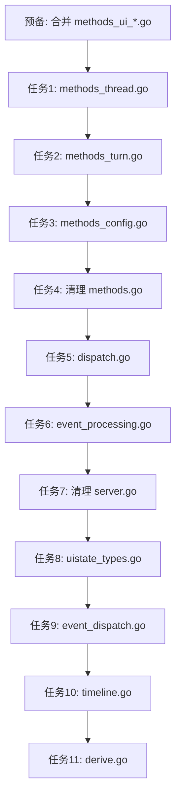

# God File 拆分实现计划

> **给 Claude:** 使用 @执行计划 逐任务实现。每个任务遵循 @重构 低风险简化流程 (存量测试绿色 → 纯移动代码 → 测试仍绿色)。遇到编译/测试失败使用 @系统性调试。

## 概述

| 项目 | 值 |
|------|---|
| 目标 | 将 3 个超大文件拆分为逻辑内聚的小文件 |
| 风险 | 🟢 低 — 纯文件拆分，不改逻辑 |
| 约束 | ≤15 非测试 .go/包, ≥50 行/文件, ≤3 层文件名, <300 行/提交 |

## Anti-Chains 合规

| 包 | 现有 | 合并 | 新增 | 最终 | 合规 |
|----|------|------|------|------|------|
| apiserver | 11 | -1 (合并 ui 碎片) | +5 | **15** | ✅ |
| uistate | 3 | 0 | +4 | **7** | ✅ |

## 验证命令

```bash
cd /Users/mima0000/Desktop/wj/multi-agent-orchestration/go-agent-v2
go build ./...
go test ./internal/apiserver/... ./internal/uistate/... -count=1 -short
```

## 现有文件 (不动)

`dashboard_methods.go`(253), `workspace_methods.go`(199), `notifications.go`(150), `protocol.go`(127), `resource_tools.go`(623), `orchestration_tools.go`(191), `turn_tracker.go`, `event_normalizer.go`, `uistate.go`

---

## 预备任务: 合并 UI 碎片文件

合并 `methods_ui_dashboard.go`(78) + `methods_ui_projects.go`(207) → `methods_ui.go`(285)

---

## 第一部分: methods.go (3557行 → 5 个新文件 + 瘦身)

### 任务 1: 提取 `methods_thread.go` (~1200行)

thread/* handler + thread alias + slash 命令(thread 相关) + resume/history 辅助。

**类型/常量:**
- `threadStartParams`, `threadInfo`, `threadStartResponse`
- `threadResumeParams`, `threadResumeResponse`
- `threadIDParams`, `threadForkParams`, `threadForkResponse`
- `threadNameSetParams`, `threadRollbackParams`
- `threadListItem`, `threadListResponse`, `threadLoadedListResponse`
- `threadMessagesParams`
- `codexThreadIDPattern`, `threadMessageHydrationMaxRecords`, `threadMessageHydrationPageSize`

**Handler:**
- `threadStartTyped`, `threadResumeTyped`, `threadForkTyped`
- `threadNameSetTyped`, `threadCompact`, `threadRollbackTyped`
- `threadList`, `threadLoadedList`
- `threadReadTyped`, `threadResolveTyped`
- `threadMessagesTyped`, `threadBgTerminalsClean`

**辅助:**
- `buildThreadSnapshots`, `buildThreadSnapshotsFromListItems`
- `streamRemainingHistory`, `msgsToRecords`
- `calculateHydrationLoadLimit`, `loadAllThreadMessagesFromCodexRollout`
- `resolveHistoricalCodexThreadID`, `resolveHistoricalCodexThreadIDs`
- `isHistoricalResumeCandidateError`, `threadExistsInHistory`
- `isLikelyCodexThreadID`, `appendUniqueThreadID`
- `buildResumeCandidates`, `tryResumeCandidates`

**Thread alias:**
- `persistThreadAlias`, `persistThreadAliasPreference`
- `loadThreadAliases`, `loadThreadAliasesFromPrefs`
- `normalizeThreadAliases`, `applyThreadAliases`, `applyThreadAliasesSnapshot`

**Slash (thread 相关):**
- `threadUndo`, `threadModelSet`, `threadPersonality`
- `threadApprovals`, `threadMCPList`, `threadSkillsList`, `threadDebugMemory`
- `resolveSlashCommandThread`, `resolveThreadForSlashCommand`

---

### 任务 2: 提取 `methods_turn.go` (~600行)

turn/* + review + interrupt + 用户输入/附件构建。

**类型:**
- `UserInput`, `turnStartParams`, `turnInfo`, `turnStartResponse`
- `activeTurnIDReader`, `turnSteerParams`, `reviewStartParams`

**Handler:**
- `resolveClientActiveTurnID`, `turnStartTyped`, `turnSteerTyped`
- `turnInterrupt`, `turnForceComplete`
- `reviewStartTyped`, `ensureThreadReadyForTurn`

**辅助:**
- `normalizeInterruptState`, `isInterruptActiveState`
- `isInterruptNoActiveTurnError`, `readThreadRuntimeState`
- `waitInterruptSettled`, `waitInterruptOutcome`, `interruptSettleMode`
- `sendSlashCommand`, `sendSlashCommandWithArgs`
- `extractInputs`, `buildAttachmentName`, `buildAttachmentPreviewURL`
- `buildUserTimelineAttachments`, `buildUserTimelineAttachmentsFromInputs`
- `skillInputText`, `collectInputSkillNames`, `collectSkillNameSet`
- `mergeSkillNameSets`, `mergePromptText`, `lowerContainsAny`
- `buildConfiguredSkillPrompt`, `buildAutoMatchedSkillPrompt`

---

### 任务 3: 提取 `methods_config.go` (~850行)

config + skills + mcp + model + account + command + search + logs + debug + UI prefs。

**类型/常量:**
- `fuzzySearchParams`
- `configValueWriteParams`, `configBatchWriteParams`, `configBatchWriteEntry`
- `lspDiagnosticsQueryParams`
- `skillsConfigWriteParams`, `skillsConfigReadParams`
- `skillsLocalReadParams`, `skillsLocalImportDirParams`, `skillsRemoteReadParams`, `skillsRemoteWriteParams`
- `skillImportStats`, `skillImportFailure`, `skillImportResult`
- `commandExecParams`, `commandExecResponse`
- `accountLoginStartParams`, `logListParams`
- `uiPrefGetParams`, `uiPrefSetParams`
- `commandBlocklist`, `maxOutputSize`, `configEnvAllowPrefixes`, `prefThreadAliases`
- `maxSkillImportFiles`, `maxSkillImportSingleFileSize`, `maxSkillImportTotalFileSize`

**Handler:**
- `skillsList`, `appList`, `modelList`, `configRead`
- `configValueWriteTyped`, `configBatchWriteTyped`
- `mcpServerStatusList`, `mcpServerReload`
- `lspDiagnosticsQueryTyped`
- `skillsConfigReadTyped`, `skillsConfigWriteTyped`, `GetAgentSkills`
- `skillsLocalReadTyped`, `skillsLocalImportDirTyped`
- `skillsRemoteReadTyped`, `skillsRemoteWriteTyped`
- `commandExecTyped`, `fuzzyFileSearchTyped`
- `accountLoginStartTyped`, `accountLoginCancel`, `accountLogout`, `accountRead`
- `collaborationModeList`, `experimentalFeatureList`
- `configRequirementsRead`, `accountRateLimitsRead`
- `logListTyped`, `logFilters`
- `debugRuntime`, `debugForceGC`
- `uiPreferencesGet`, `uiPreferencesSet`, `uiPreferencesGetAll`
- `uiStateGet`

**辅助:**
- `isAllowedEnvKey`, `fuzzyMatch`, `boolToStatus`, `asString`
- `normalizeSkillName`, `normalizeSkillNames`
- `skillImportDirName`, `ensureSourceSkillFile`, `copyRegularFile`, `copySkillDirectory`
- `collectSkillImportSources`, `importSingleSkillDirectory`
- `persistResolvedUIPreference`
- `resolveMainAgentPreference`, `resolvePreferredThreadID`
- `resolvePreferredCmdThreadID`, `hasThread`, `firstThreadID`
- `looksLikeMainAgent`

---

### 任务 4: 清理 methods.go

保留: `registerMethods()`, `initializeParams`, `initialize()`, `withThread()` — 预期 ~300行

> 说明: `typedHandler()` 定义在 `protocol.go`，不属于 `methods.go` 清理范围。

---

## 第二部分: server.go (2023行 → 2 个新文件 + 瘦身)

### 任务 5: 提取 `dispatch.go` (~350行)

JSON-RPC 分发 + HTTP debug 端点。

- `rpcEnvelope` struct
- `parseIntID`, `rawIDtoAny`
- `readLoop`, `sendResponseViaOutbox`, `handleClientResponse`
- `handleParsedMessage`, `dispatchRequest`
- `handleHTTPRPC`, `writeJSONRPCError`
- `recoveryMiddleware`, `corsMiddleware`, `handleSSE`

---

### 任务 6: 提取 `event_processing.go` (~500行)

事件转发 + payload 解析 + LSP 工具。

**事件转发:**
- `AgentEventHandler`
- `handleApprovalRequest`

**Payload:**
- `payloadExtractKeys` 变量
- `mergePayloadFromMap`, `walkNestedJSON`, `mergePayloadFields`
- `normalizeFiles`, `uniqueStrings`, `parseFilesFromPatchDelta`
- `toolResultSuccess`
- `rememberFileChanges`, `consumeRememberedFileChanges`, `enrichFileChangePayload`

**LSP:**
- `SetupLSP`, `buildLSPDynamicTools`, `handleDynamicToolCall`
- `extractToolFilePath`, `buildToolNotifyPayload`
- `lspHover`, `lspOpenFile`, `lspDiagnostics`

---

### 任务 7: 清理 server.go

保留: `Server`/`Deps` struct, `New`, `ListenAndServe`, `handleUpgrade`,
`InvokeMethod`, `Notify`, `broadcastNotification`, `shouldEmitUIStateChanged`,
`throttledUIStateChanged`, `flushUIStateChanged`,
`enqueueConnMessage`, `disconnectConn`, `syncUIRuntimeFromNotify`, `shouldReplayThreadNotifyToUIRuntime`,
`SendRequest`, `SendRequestToAll`, `SetNotifyHook`, `checkLocalOrigin`,
`Handler` type, `wsOutbound`/`connEntry` struct + 连接方法,
`skillsDirectory`, `registerDynamicTools` — 预期 ~650行

---

## 第三部分: runtime_state.go (2511行 → 4 个新文件 + 瘦身)

> [!NOTE]
> 用户新增了 `hasAccumulatedText` 函数，已纳入任务 10 (timeline)。

### 任务 8: 提取 `uistate_types.go` (~120行)

- `ThreadSnapshot`, `TimelineAttachment`, `TimelineItem`, `AgentMeta`
- `TokenUsageSnapshot`, `RuntimeSnapshot`, `HistoryRecord`
- `threadRuntime` struct + `newThreadRuntime`
- `resolvedFields` struct
- `planEntry` struct

---

### 任务 9: 提取 `event_dispatch.go` (~500行)

**分发框架:**
- `runtimeEventHandler` type + `runtimeEventHandlers` map
- `resolveEventFields`
- `applyAgentEventLocked`, `applyLifecycleStateLocked`
- `clearTurnLifecycleLocked`

**handle*Event 函数 (16个):**
- `handleTurnStartedEvent`, `handleTurnCompleteEvent`
- `handleAssistantDeltaEvent`, `handleAssistantDoneEvent`
- `handleReasoningDeltaEvent`
- `handleCommandStartEvent`, `handleCommandOutputEvent`, `handleCommandDoneEvent`
- `handleFileEditStartEvent`, `handleFileEditDoneEvent`
- `handleToolCallEvent`, `handleApprovalRequestEvent`
- `handlePlanDeltaEvent`, `handleDiffUpdateEvent`
- `handleUserMessageEvent`, `handleErrorEvent`

---

### 任务 10: 提取 `timeline.go` (~700行)

**Hydration:**
- `HydrateHistory`, `AppendHistory`, `hydrateContentPayload`
- `extractUserAttachmentsFromPayload`, `attachmentName`, `attachmentPreview`
- `hasAccumulatedText`

**Timeline CRUD:**
- `AppendUserMessage`, `ClearThreadTimeline`
- `pushTimelineItemLocked`, `patchTimelineItemLocked`, `timelineLocked`
- `ensureThreadLocked`, `setThreadStateLocked`, `markAgentActiveLocked`, `nextItemIDLocked`

**start/append/finish 系列:**
- `appendUserLocked`
- `startThinkingLocked`, `appendThinkingLocked`, `finishThinkingLocked`
- `startAssistantLocked`, `appendAssistantLocked`, `finishAssistantLocked`
- `startCommandLocked`, `appendCommandOutputLocked`, `finishCommandLocked`
- `fileEditingLocked`, `fileSavedLocked`
- `rememberEditingFilesLocked`, `consumeEditingFilesLocked`, `flushEditingFilesAsSavedLocked`
- `shiftRuntimeIndicesAfterRemoveLocked`

**Tool/approval/plan:**
- `appendToolCallLocked`, `canMergeToolCall`, `showApprovalLocked`
- `appendPlanLocked`, `setPlanLocked`
- `extractPlanSnapshot`, `extractPlanEntries`, `parsePlanEntriesAny`
- `extractPlanExplanation`, `formatPlanSnapshot`
- `planStatusSymbol`, `planStatusDone`

---

### 任务 11: 提取 `derive.go` (~600行)

**状态推导:**
- `deriveThreadStateLocked`, `deriveThreadStatusHeaderLocked`
- `deriveThreadStatusDetailsLocked`, `defaultStatusHeaderForState`
- `normalizeThreadState`, `isInterruptibleThreadState`
- `completeTurnLocked`

**UI overlay:**
- `shouldShowMCPStartupOverlay`, `shouldUseReasoningHeader`
- `captureReasoningHeaderLocked`, `extractReasoningHeader`
- `compactOneLine`

**Event 判断函数:**
- `isTerminalInteractionEvent`, `isMCPStartupUpdateEvent`, `isMCPStartupCompleteEvent`
- `isTerminalWaitPayload`, `isReasoningSectionBreakEvent`
- `isBackgroundEvent`, `shouldClearBackgroundOverlay`

**Label 推导:**
- `deriveTerminalWaitLabel`, `deriveMCPStartupLabel`
- `deriveBackgroundLabel`, `deriveBackgroundDetails`, `deriveStreamErrorDetails`

**Token usage:**
- `updateTokenUsageLocked`
- `extractFirstString`, `extractNestedFirstString`
- `extractFirstInt`, `extractIntValue`, `extractNestedValue`
- `extractFirstIntByPaths`, `extractFirstIntDeep`
- `extractExitCode`, `normalizeFilesAny`

**Workspace:**
- `ReplaceWorkspaceRuns`, `UpsertWorkspaceRun`
- `ApplyWorkspaceMergeResult`, `SetWorkspaceUnavailable`
- `extractRunKey`

**Snapshot:**
- `cloneSnapshot`, `cloneSnapshotLight`, `copyMap`

---

## 最终文件分布

### apiserver 包 (15 个非测试 .go)

| # | 文件 | 状态 | 行数 |
|---|------|------|------|
| 1 | `protocol.go` | 已有 | 127 |
| 2 | `notifications.go` | 已有 | 150 |
| 3 | `dashboard_methods.go` | 已有 | 253 |
| 4 | `workspace_methods.go` | 已有 | 199 |
| 5 | `methods_ui.go` | 合并 | ~285 |
| 6 | `resource_tools.go` | 已有 | 623 |
| 7 | `orchestration_tools.go` | 已有 | 191 |
| 8 | `turn_tracker.go` | 已有 | ~500 |
| 9 | `methods.go` | 瘦身 | ~300 |
| 10 | `server.go` | 瘦身 | ~650 |
| 11 | `methods_thread.go` | **新** | ~1200 |
| 12 | `methods_turn.go` | **新** | ~600 |
| 13 | `methods_config.go` | **新** | ~850 |
| 14 | `dispatch.go` | **新** | ~350 |
| 15 | `event_processing.go` | **新** | ~500 |

### uistate 包 (7 个非测试 .go)

| # | 文件 | 状态 | 行数 |
|---|------|------|------|
| 1 | `uistate.go` | 已有 | — |
| 2 | `event_normalizer.go` | 已有 | — |
| 3 | `runtime_state.go` | 瘦身 | ~500 |
| 4 | `uistate_types.go` | **新** | ~120 |
| 5 | `event_dispatch.go` | **新** | ~500 |
| 6 | `timeline.go` | **新** | ~700 |
| 7 | `derive.go` | **新** | ~600 |

> 注: `runtime_perf_test.go` 是测试文件，不计入“非测试 .go”总数。

## 执行顺序



## 每个任务的流程

```
1. go build ./... && go test ./internal/<pkg>/... -short  (确认绿色)
2. 纯移动代码到新文件 (不改逻辑)
3. go build ./... && go test ./internal/<pkg>/... -short  (确认仍绿色)
4. git commit -m "refactor(<pkg>): ..." (<300行)
```

> [!WARNING]
> 任务 1 (~1200行)、2 (~600行)、3 (~850行)、5 (~350行)、6 (~500行)、9 (~500行)、10 (~700行)、11 (~600行) 均超过 <300 行/提交限制。执行时请按“纯移动 + 可编译”拆为 2-4 个子提交。

## 执行模板（按 <300 行/提交）

### 通用检查

```bash
# 每个子提交前
go build ./...

# apiserver 相关任务后
go test ./internal/apiserver/... -count=1 -short

# uistate 相关任务后
go test ./internal/uistate/... -count=1 -short

# 提交前确认变更规模
git diff --cached --shortstat
```

### 建议子提交序列（commit message 模板）

```text
# 预备任务
refactor(apiserver): merge ui methods part 1 (dashboard)
refactor(apiserver): merge ui methods part 2 (projects)

# 任务 1
refactor(apiserver): split methods_thread types and constants
refactor(apiserver): split methods_thread core handlers
refactor(apiserver): split methods_thread history helpers
refactor(apiserver): split methods_thread alias and slash helpers

# 任务 2
refactor(apiserver): split methods_turn handlers and params
refactor(apiserver): split methods_turn interrupt and input helpers

# 任务 3
refactor(apiserver): split methods_config config and mcp
refactor(apiserver): split methods_config skills handlers
refactor(apiserver): split methods_config skills import helpers
refactor(apiserver): split methods_config account logs prefs

# 任务 4
refactor(apiserver): slim methods.go to register and init only

# 任务 5
refactor(apiserver): split dispatch jsonrpc pipeline
refactor(apiserver): split dispatch http debug handlers

# 任务 6
refactor(apiserver): split event processing persistence and payload
refactor(apiserver): split event processing lsp tools

# 任务 7
refactor(apiserver): slim server.go core runtime and wiring

# 任务 8
refactor(uistate): split runtime types into uistate_types.go

# 任务 9
refactor(uistate): split event dispatch framework
refactor(uistate): split event dispatch handlers

# 任务 10
refactor(uistate): split timeline hydration and CRUD
refactor(uistate): split timeline start append finish flows
refactor(uistate): split timeline tool approval plan helpers

# 任务 11
refactor(uistate): split derive state and overlay logic
refactor(uistate): split derive token workspace snapshot helpers
```
