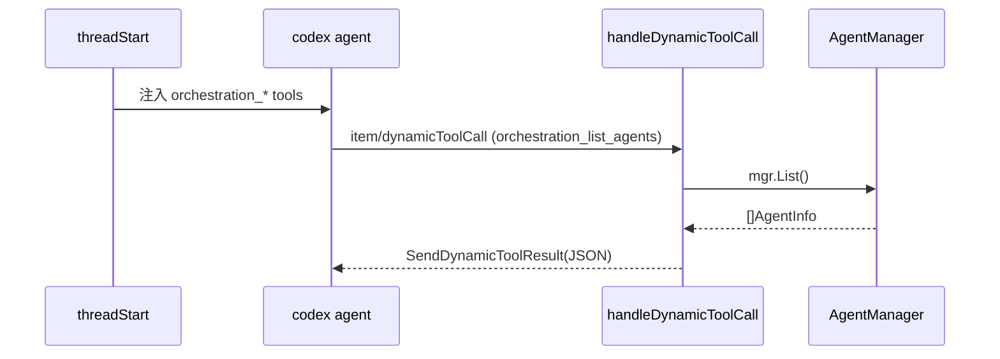

# Agent 编排工具 (Dynamic Tool Injection) 设计文档

## 目标

让 AI Agent 通过原生 tool_call 机制调用编排能力:
启动新 Agent、列出运行中 Agent、跨 Agent 通信、停止 Agent。

## 方案选择

| 方案 | 选中 | 理由 |
|------|------|------|
| **A. Dynamic Tool 注入** | ✅ | 复用 LSP 已验证路径，改动最小 |
| B. MCP Server | ✗ | 适合后期开放平台阶段 |
| C. outputSchema+prompt | ✗ | 脆弱，依赖 LLM 格式遵守 |

## 架构

## 工具定义

### orchestration_list_agents
- **描述**: 列出所有运行中的 Agent (ID、名称、状态、端口)
- **参数**: 无
- **返回**: `[{"id":"...", "name":"...", "state":"idle", "port":19836}]`

### orchestration_send_message
- **描述**: 向指定 Agent 发送消息
- **参数**: `agent_id` (string, required), `message` (string, required)
- **返回**: `{"success": true, "agent_id": "..."}`

### orchestration_launch_agent
- **描述**: 启动新 Agent 子进程
- **参数**: `name` (string, required), `prompt` (string, optional), `cwd` (string, optional)
- **返回**: `{"agent_id": "...", "status": "running"}`

### orchestration_stop_agent
- **描述**: 停止指定 Agent
- **参数**: `agent_id` (string, required)
- **返回**: `{"success": true, "agent_id": "..."}`

## 安全考量
- 编排工具只在本地服务内操作，不暴露外部端口
- `launch_agent` 自动注入编排工具（新 agent 也能编排）
- 参数 schema 强约束，防止注入
